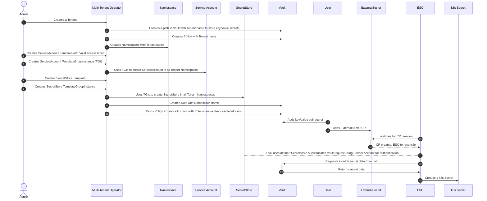
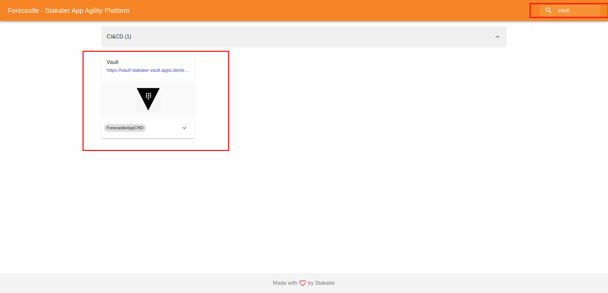
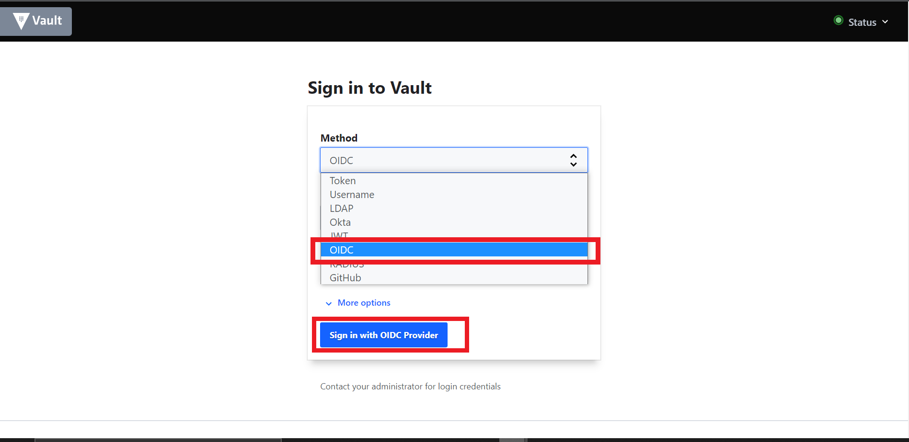
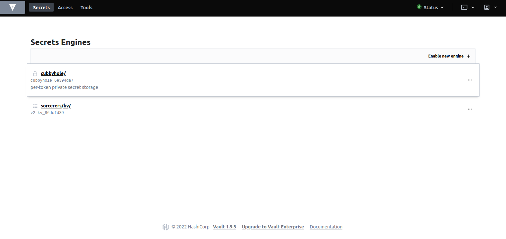
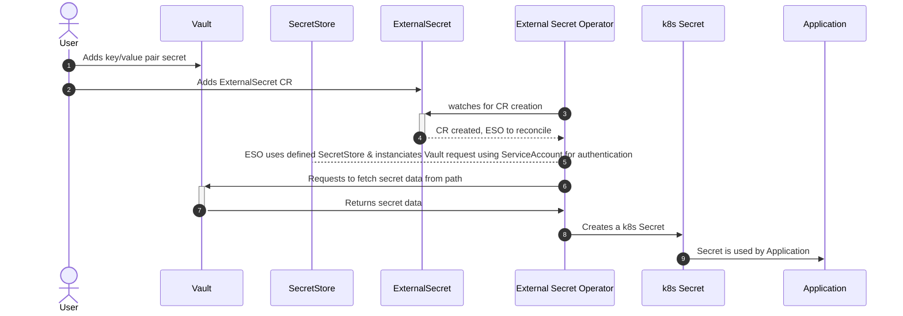
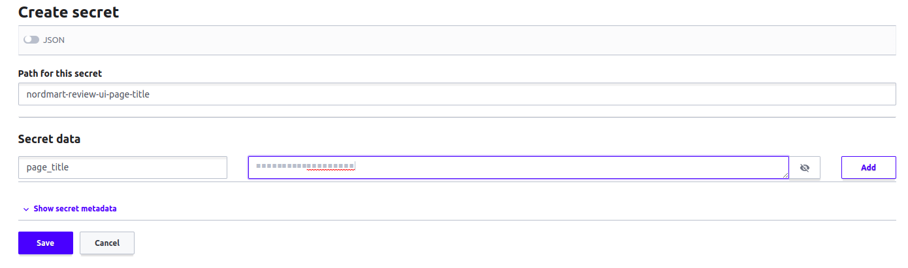

# Exercise 6 - SECRET MANAGEMENT 

In this section, we will walk through secret management workflow in SAAP. 

## Configuration - The role of Multi-Tenant Operator in piecing together the components for secrets management

Following is detailed step by step sequence diagram of MTO works together with Vault and ESO:



### Workflow

1. Administrator creates a Tenant on the cluster.
2. Multi Tenant Operator (MTO) enables a kv path for the Tenant. Login to Vault to view your tenant kv.
   - Access Vault from  [Forecastle](https://forecastle-stakater-forecastle.apps.devtest.vxdqgl7u.kubeapp.cloud) console, search `Vault` and open the `Vault` tile.

      
   - From the drop-down menu under `Method`, select `OIDC` and click on `Sign in with OIDC Provider` and select `workshop` identity Provider

      

   - You will be brought to the `Vault` console. You should see the kv path for your tenant.

      

3. Multi Tenant Operator (MTO) creates policies with read and admin permissions over the tenant kv.

       // Read Policy for ServiceAccounts named <TENANT_NAME>-read

       path "<TENANT_NAME>/*" {
          capabilities = ["read"]
       }
          
       // Admin Policy for Tenant Users named <TENANT_NAME>-admin

       path "<TENANT_NAME>/*" {
			capabilities = ["create", "read", "update", "delete", "list"]
        }
       path "sys/mounts/<TENANT_NAME>/*" {
            capabilities = ["create", "read", "update", "delete", "list"]
       }
       path "managed-addons/*" {
            capabilities = ["read", "list"]
       }      
4. Multi Tenant Operator (MTO) creates required Namespaces with tenant labels e.g. `stakater.com/kind`.

5. Admin creates a Template that contains a Service Account. This service account is used by Secret Store to access Vault. Notice the label `stakater.com/vault-access: "true"`.

         apiVersion: tenantoperator.stakater.com/v1alpha1
         kind: Template
         metadata:
           name: <TENANT_NAME>-vault-access
         resources:
            manifests:
            -  kind: ServiceAccount
               apiVersion: v1
               metadata:
                  name: tenant-vault-access
                  labels:
                    stakater.com/vault-access: "true"
         
   More Info on Template: https://docs.cloud.stakater.com/content/sre/multi-tenant-operator/usecases/template.html

6. Admin creates a TemplateGroupInstance which deploys Template (containing ServiceAccount) to namespaces based on selector. We specify tenant label `stakater.com/kind` in selector. This will deploy ServiceAccount in tenant namespaces. This ServiceAccount is required by SecretStore to access Vault.

         apiVersion: tenantoperator.stakater.com/v1alpha1
         kind: TemplateGroupInstance
         metadata:
         name: <TENANT_NAME>-vault-access
         spec:
            selector:
               matchExpressions:
               - key: stakater.com/kind
                  operator: In
                  values:
                     - <TENANT_NAME>
            sync: true
            template: <TENANT_NAME>-vault-access

   More Info on TemplateGroupInstance : https://docs.cloud.stakater.com/content/sre/multi-tenant-operator/usecases/deploying-templates.html
   
7. Multi Tenant Operator (MTO) deploys the Template resources to selector defined in TemplateGroupInstance.

8. Admin creates a Template that contains a Secret Store (external secrets custom resource). The SecretStore is namespaced and specifies how to access the external API which is Vault. Templates are used to share resources among namespaces.

         apiVersion: tenantoperator.stakater.com/v1alpha1
         kind: Template
         metadata:
         name: <TENANT_NAME>-vault-secret-store
         resources:
         manifests:
         - apiVersion: external-secrets.io/v1alpha1
            kind: SecretStore
            metadata:
               name: tenant-vault-secret-store
            spec:
               provider:
                 vault:
                  server: "http://vault.stakater-vault:8200"
                  path: "<TENANT_NAME>/kv"
                  version: "v2"
                  auth:
                     kubernetes:
                       mountPath: "kubernetes"
                       role: "${namespace}"
                       serviceAccountRef:
                         name: "tenant-vault-access"

   More Info on Secret Store: https://external-secrets.io/v0.5.7/api-secretstore/  
   More Info on Template: https://docs.cloud.stakater.com/content/sre/multi-tenant-operator/usecases/template.html

9. Admin creates a TemplateGroupInstance which deploys Template (containing SecretStore) to namespaces based on selector. We specify tenant label `stakater.com/kind` in selector. This will deploy SecretStore in tenant namespaces.

         apiVersion: tenantoperator.stakater.com/v1alpha1
         kind: TemplateGroupInstance
         metadata:
         name: <TENANT_NAME>-vault-secret-store
         spec:
         selector:
            matchExpressions:
            -  key: stakater.com/kind
               operator: In
               values:
                  - <TENANT_NAME>
         sync: true
         template: <TENANT_NAME>-vault-secret-store

   More Info on TemplateGroupInstance : https://docs.cloud.stakater.com/content/sre/multi-tenant-operator/usecases/deploying-templates.html

10. Multi Tenant Operator (MTO) deploys the Template resources to selector defined in TemplateGroupInstance.

11. Multi Tenant Operator (MTO) creates a role in Vault with namespace name. This role binds the read policy with service account on the cluster. This allows service account used by SecretStore to access Tenant key/value secret data. 

12. Multi Tenant Operator (MTO) binds Service Account (with `stakater.com/vault-access: 'true'` label) and Policy with Role. Later, External Secrets Operator uses this Service Account to instantiate request to Vault for secret data.

<b>Note</b>: Point 13 onwards are explained in next workflow.


## Creating Secrets



   ### Workflow 

   1. User adds a Key/Value pair secret data to a path in Vault.
   
      - In the path of your tenant, Click `Create Secret`, add path of secret, and add key-value pairs.

  

   2. Add ExternalSecret CR

      - Login to the `OpenShift console`.
      - Select the `+` sign in the top right corner of the console

      
      - Paste the following YAML and replace the `<TENANT_NAME>` and click `Create`

   ```
    apiVersion: external-secrets.io/v1alpha1
    kind: ExternalSecret
    metadata:
      name: review-ui-secret
      namespace: <TENANT_NAME>-build
    spec:
      secretStoreRef:
        kind: SecretStore
        name: tenant-vault-secret-store
      refreshInterval: "1m"
      target:
        name: review-ui
        creationPolicy: 'Owner'
        deletionPolicy: Retain
        template:
          type: Opaque
      dataFrom:
        - key: nordmart-review-ui-page-title

   ```
   3. External Secrets Operator (ESO) watches for ExternalSecret CR creation.

   4. When a new CR is created, External Secrets Operator (ESO) reconciles it from the provided spec.

   5. External Secrets Operator (ESO) uses the defined SecretStore from ExternalSecret CR and instantiates Vault request using ServiceAccount created, and bound to Vault role, to authenticate to Vault. 

      ```
      secretStoreRef:
         kind: SecretStore
         name: tenant-vault-secret-store     
      ```

   6. External Secrets Operator (ESO) requests to fetch secret data from the path specified in ExternalSecret CR.

      ```
         dataFrom:
            - key: nordmart-review-ui-page-title
      ```

   7. Vault returns the requested secret data to External Secrets Operator (ESO).

   8. External Secrets Operator (ESO) creates a Kubernetes Secret. 

   9. Kubernetes Secret is consumed by Application.

      - In your DevWorkspace, open stakater-nordmart-review-ui repository code, and navigate to deploy folder.
      - Open and edit values.yaml
      - Add the following yaml, and under `deployment.env`, add environment variable for the secret we added in previous step

      ```
         PAGE_TITLE:
            valueFrom:
               secretKeyRef:
                  name: nordmart-review-ui-page-title
                  key: page_title
      ```


## Updating Secrets

   ```mermaid
      sequenceDiagram
         autonumber
         actor User
         participant Vault
         participant ESO as External Secret Operator
         participant secret as k8s Secret
         participant Reloader
         participant App as Application 
         User->>Vault: Updates a key/value secret
         ESO->>+Vault: watches for updated secret data
         Vault-->>-ESO: Receives update, reconciles
         ESO->>secret: Updates k8s Secret
         Reloader->>+secret: watches for updated Secret
         secret-->>-Reloader: Receives update, reconciles
         Reloader->>App: Performs rolling upgrade
   ```

   ### Workflow

   1. User modifies the secret data in Vault.

   2. External Secrets Operator (ESO) polls the Vault API for update after a defined time interval. This time interval is defined in the ExternalSecret CR created previously. 

      ```
         refreshInterval: "1m"
      ```

   3. External Secrets Operator (ESO) receives the update and starts reconciliation.

   4. External Secrets Operator (ESO) updates the values of Kubernetes Secret with the new values user just added in Vault.

   5. Stakater Reloader is continously watching the Kubernetes Secret for change.

   6. It receives the update instantly.

   7. Stakater Reloader performs a rolling upgrade on Kubernetes resource(s). Application is up again with the updated secret values in no time! 

## Deprecating Secrets

   ```mermaid
      sequenceDiagram
         autonumber
         actor User
         participant Vault
         participant ESO as External Secret Operator
         participant Secret 
         User->>Vault: Removes a Secret
         ESO->>+Vault: watches for updated Secret
         Vault-->>-ESO: Update recieved
         ESO->>Secret: Removes k8s Secret
   ```

   ### Workflow

   1. User removes secret from path in Vault.

   3. External Secrets Operator (ESO) receives the update and starts reconciliation.

   4. External Secrets Operator (ESO) uses defined deletion policy from ExternalSecret CR to either retain or delete the Kubernetes Secret.

   ```
      deletionPolicy: Retain
   ``` 

   - If deletion policy is set to `Retain`, Kubernetes Secret will not be deleted even after secret data on the defined path is removed from Vault.
   - If deletion policy is set to `Delete`, Kubernetes Secret will be deleted and application will fall back to using default values.  


## 🖼️ Big Picture

## 🔮 Learning Outcomes

