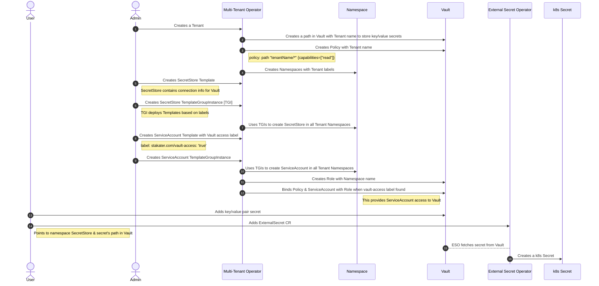
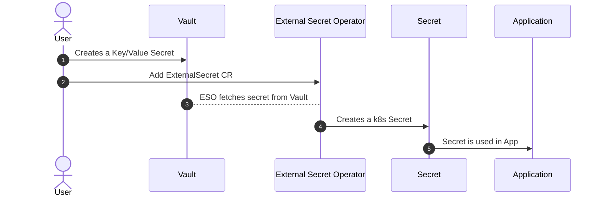
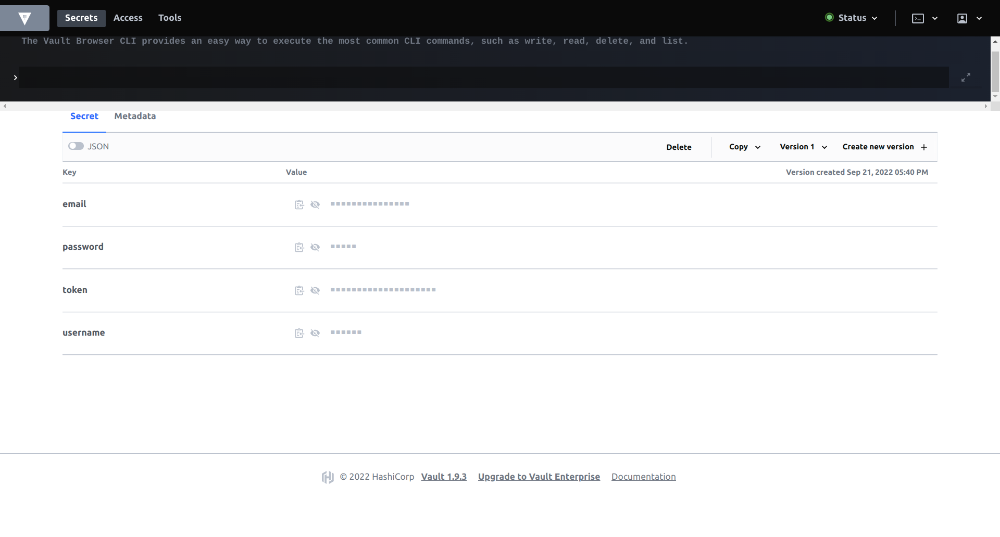

# Exercise 6 - SECRET MANAGEMENT 

In this section, we will walk through secret management workflow in SAAP. 

## Explain how MTO, Vault & ESO come together to serve Secrets Management (Secrets injection related setup configuration and workflow)

Following is detailed step by step sequence diagram of MTO works together with Vault and ESO:



### Workflow
1. Administrator creates a Tenant on the cluster.
2. Multi Tenant Operator (MTO) enables a kv path for the Tenant. Login to Vault to view your tenant kv.
   - Access Vault from  [Forecastle](https://forecastle-stakater-forecastle.apps.devtest.vxdqgl7u.kubeapp.cloud) console, search `Vault` and open the `Vault` tile.

      
   - From the drop-down menu under `Method`, select `OIDC` and click on `Sign in with OIDC Provider` and select `workshop` identity Provider

      

   - You will be brought to the `Vault` console. You should see the kv path for your tenant.

      

3. Multi Tenant Operator (MTO) creates policies with read and admin permissions over the tenant kv.

       // Read Policy for ServiceAccounts named <TENANT_NAME>-read

       path "<TENANT_NAME>/*" {
          capabilities = ["read"]
       }
          
       // Admin Policy for Tenant Users named <TENANT_NAME>-admin

       path "<TENANT_NAME>/*" {
			capabilities = ["create", "read", "update", "delete", "list"]
        }
       path "sys/mounts/<TENANT_NAME>/*" {
            capabilities = ["create", "read", "update", "delete", "list"]
       }
       path "managed-addons/*" {
            capabilities = ["read", "list"]
       }      
4. Multi Tenant Operator (MTO) creates required Namespaces with tenant labels e.g. `stakater.com/kind`.

5. Admin creates a Template that contains a Secret Store (external secrets custom resource). The SecretStore is namespaced and specifies how to access the external API. Templates are used to share resources among namespaces.

         apiVersion: tenantoperator.stakater.com/v1alpha1
         kind: Template
         metadata:
         name: <TENANT_NAME>-vault-secret-store
         resources:
         manifests:
         - apiVersion: external-secrets.io/v1alpha1
            kind: SecretStore
            metadata:
               name: tenant-vault-secret-store
            spec:
               provider:
                 vault:
                  server: "http://vault.stakater-vault:8200"
                  path: "<TENANT_NAME>/kv"
                  version: "v2"
                  auth:
                     kubernetes:
                       mountPath: "kubernetes"
                       role: "${namespace}"
                       serviceAccountRef:
                         name: "tenant-vault-access"

   More Info on Secret Store: https://external-secrets.io/v0.5.7/api-secretstore/  
   More Info on Template: https://docs.cloud.stakater.com/content/sre/multi-tenant-operator/usecases/template.html

6. Admin creates a TemplateGroupInstance which deploys Template (containing SecretStore) to namespaces based on selector. We specify tenant label `stakater.com/kind` in selector.

         apiVersion: tenantoperator.stakater.com/v1alpha1
         kind: TemplateGroupInstance
         metadata:
         name: <TENANT_NAME>-vault-secret-store
         spec:
         selector:
            matchExpressions:
            -  key: stakater.com/kind
               operator: In
               values:
                  - <TENANT_NAME>
         sync: true
         template: <TENANT_NAME>-vault-secret-store

   More Info on TemplateGroupInstance : https://docs.cloud.stakater.com/content/sre/multi-tenant-operator/usecases/deploying-templates.html

7. Multi Tenant Operator (MTO) deploys the Template resources to selector defined in TemplateGroupInstance.

8. Admin creates a Template that contains a Service Account. This service account is used by Secret Store to access Vault. Notice the label `stakater.com/vault-access: "true"`.

         apiVersion: tenantoperator.stakater.com/v1alpha1
         kind: Template
         metadata:
           name: <TENANT_NAME>-vault-access
         resources:
            manifests:
            -  kind: ServiceAccount
               apiVersion: v1
               metadata:
                  name: tenant-vault-access
                  labels:
                    stakater.com/vault-access: "true"
         
   More Info on Template: https://docs.cloud.stakater.com/content/sre/multi-tenant-operator/usecases/template.html

9. Admin creates a TemplateGroupInstance which deploys Template (containing ServiceAccount) to namespaces based on selector. We specify tenant label `stakater.com/kind` in selector.

         apiVersion: tenantoperator.stakater.com/v1alpha1
         kind: TemplateGroupInstance
         metadata:
         name: <TENANT_NAME>-vault-access
         spec:
            selector:
               matchExpressions:
               - key: stakater.com/kind
                  operator: In
                  values:
                     - <TENANT_NAME>
            sync: true
            template: <TENANT_NAME>-vault-access

   More Info on TemplateGroupInstance : https://docs.cloud.stakater.com/content/sre/multi-tenant-operator/usecases/deploying-templates.html
   
10. Multi Tenant Operator (MTO) deploys the Template resources to selector defined in TemplateGroupInstance.

11. Multi Tenant Operator (MTO) create a role in Vault with namespace name. This role binds the read policy with service account on the cluster. This allows service account used by secretstore to access tenant kv path. 

`All of this is Automated Thanks to MTO !!` :partying_face:

## Secrets creation workflow



   ### Workflow 

   1. In the path of your tenant, Click `Create Secret`, add path of secret, and add key-value pairs.

  

   2. Add ExternalSecret CR

      - Login to the `OpenShift console`.
      - Select the `+` sign in the top right corner of the console

      
      - Paste the following YAML and replace the `<TENANT_NAME>` and click `Create`

   ```
    apiVersion: external-secrets.io/v1alpha1
    kind: ExternalSecret
    metadata:
      name: gitlab-pat
      namespace: <TENANT_NAME>-build
    spec:
      secretStoreRef:
        name: tenant-vault-secret-store
        kind: SecretStore
      refreshInterval: "1m"
      target:
        name: gitlab-pat
        creationPolicy: 'Owner'
        template:
          type: kubernetes.io/basic-auth
          metadata:
            annotations:
              tekton.dev/git-0: 'https://gitlab.apps.devtest.vxdqgl7u.kubeapp.cloud'
      dataFrom:
        - key: gitlab-pat

   ```

   3. External Secrets Operator (ESO) fetches secrets from Vault using ExternalSecret CR. This CR has reference to SecretStore and secret path that is in the vault.

   4. External Secrets Operator (ESO) creates a Kubernetes Secret from the secret from Vault.

   5. This secret is then used in the application.


## Secrets update workflow

   ```mermaid
      sequenceDiagram
         autonumber
         actor User
         participant Vault
         participant ESO as External Secret Operator
         participant Secret
         participant Reloader
         participant App as Application 
         User->>Vault: Updates a Secret
         ESO->>+Vault: watches for updated Secret
         Vault-->>-ESO: Update received
         ESO->>Secret: Updates k8s Secret
         Reloader->>+Secret: watches for updated Secret
         Secret-->>-Reloader: Update recieved
         Reloader->>App: Performs rolling upgrade
   ```

   ### Workflow

   1. Modify the secret in Vault UI

   2. External Secrets Operator (ESO) polls the Vault API for update after a defined time interval. This time interval is defined in the ExternalSecret CR created previously. 

      ```
      refreshInterval: "1m"
      ```

   3. Update is received by External Secrets Operator (ESO).

   4. External Secrets Operator (ESO) updates the values of Kubernetes Secret with the new values you just added in Vault.

   5. Stakater Reloader is continously watching the Kubernetes Secret resource for change.

   6. It receives the update instantly.

   7. Stakater Reloader performs a rolling upgrade on Kubernetes resource(s). Application is up again with the updated secret values in no time! 

## Secrets depreciation workflow

   ```mermaid
   
   ```


## 🖼️ Big Picture

## 🔮 Learning Outcomes

