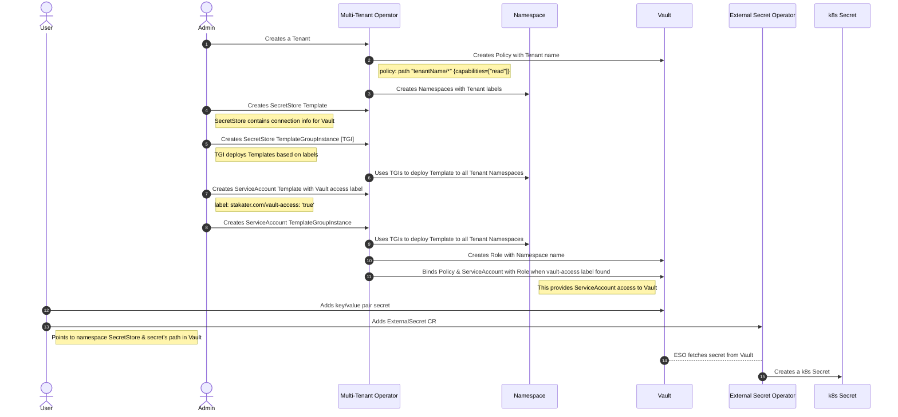

# Exercise 6 - SECRET MANAGEMENT 

In this section, we will walk through secret management workflow in SAAP. 

## Explain how MTO, Vault & ESO come together to serve Secrets Management (Secrets injection related setup configuration and workflow)

Following is detailed step by step sequence diagram of MTO works together with Vault and ESO:

When administrator creates a Tenant on the cluster, Multi Tenant Operator (MTO) performs the following steps :
- Enables a kv path for the Tenant (same as tenant name).
- Creates group (inside vault) for tenant and policies with read and admin permissions. 
- Creates role to attach policies to group in Vault. 
- Creates necessary role with tenant users against vault client in RHSSO.

`All of this is Automated Thanks to MTO !!` :partying_face:

1. To access Vault from  [Forecastle](https://forecastle-stakater-forecastle.apps.devtest.vxdqgl7u.kubeapp.cloud) console, click on the `Vault` tile.

   

2. From the drop-down menu under `Method`, select `OIDC` and click on `Sign in with OIDC Provider` and select `workshop` identity Provider

   

   

3. You will be brought to the `Vault` console. Upon creation of your tenant, a Key Value path belonging to your tenant is created as well.

   

We define templateGroupInstances in Tenant CR, which deploy SecretStore (pointing to KV path in Vault), Service Account (used by SecretStore to communicate with Vault) in all tenant namespaces. Define `spec.templateGroupInstances` in Tenant CR.

      templateGroupInstances:
      - spec:
            template: tenant-vault-access
            sync: true

TemplateGroupInstances deploy resources in Namespace based on selector. 

The `tenant-vault-access` contains a service account and secret store. 

     kind: ServiceAccount
     apiVersion: v1
     metadata:
        name: tenant-vault-access
        labels:
           stakater.com/vault-access: "true"
    ---
    apiVersion: external-secrets.io/v1alpha1
    kind: SecretStore
    metadata:
       name: tenant-vault-secret-store
    spec:
       provider:
       vault:
          server: "http://vault.stakater-vault:8200"
          path: "${tenant}/kv"
          version: "v2"
          auth:
             kubernetes:
             mountPath: "kubernetes"
             role: "${namespace}"
             serviceAccountRef:
                name: "tenant-vault-access"

Notice the label `stakater.com/vault-access: "true"`, Multi Tenant Operator (MTO) creates role inside vault binding the read policy with the service account.

## Secrets creation workflow

## Secrets update workflow
_TODO_

## Secrets depreciation workflow

## 🖼️ Big Picture

## 🔮 Learning Outcomes

