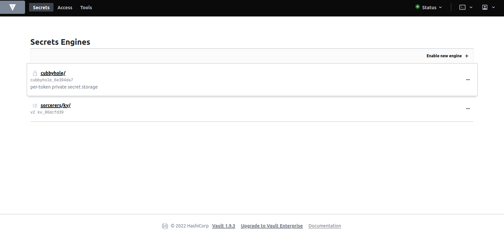

# Exercise 6 - SECRET MANAGEMENT 

In this section, we will walk through secret management workflow in SAAP. 

## Explain how MTO, Vault & ESO come together to serve Secrets Management (Secrets injection related setup configuration and workflow)

Following is detailed step by step sequence diagram of MTO works together with Vault and ESO:

### Workflow
1. Administrator creates a Tenant on the cluster.
2. Multi Tenant Operator (MTO) enables a kv path for the Tenant. Login to Vault to view your tenant kv.
   - Access Vault from  [Forecastle](https://forecastle-stakater-forecastle.apps.devtest.vxdqgl7u.kubeapp.cloud) console, click on the `Vault` tile.

      
   - From the drop-down menu under `Method`, select `OIDC` and click on `Sign in with OIDC Provider` and select `workshop` identity Provider

      

   - You will be brought to the `Vault` console. You should see the kv path for your tenant.

      

3. Multi Tenant Operator (MTO) creates policies with read and admin permissions over the tenant kv.

       // Read Policy for ServiceAccounts

       path "sorcerers/*" {
          capabilities = ["read"]
       }
          
       // Admin Policy for Tenant Users

       path "sorcerers/*" {
			capabilities = ["create", "read", "update", "delete", "list"]
        }
       path "sys/mounts/sorcerers/*" {
            capabilities = ["create", "read", "update", "delete", "list"]
       }
       path "managed-addons/*" {
            capabilities = ["read", "list"]
       }      
4. Multi Tenant Operator (MTO) creates required Namespaces with tenant labels eg. `stakater.com/kind`.

5. Admin creates a Template that contains a Secret Store (external secrets custom resource). The SecretStore is namespaced and specifies how to access the external API. Templates are used to share resources among namespaces.

         apiVersion: tenantoperator.stakater.com/v1alpha1
         kind: Template
         metadata:
         name: tenant-vault-access-secret-store
         resources:
         manifests:
         - apiVersion: external-secrets.io/v1alpha1
            kind: SecretStore
            metadata:
               name: tenant-vault-secret-store
            spec:
               provider:
                 vault:
                  server: "http://vault.stakater-vault:8200"
                  path: "sorcerers/kv"
                  version: "v2"
                  auth:
                     kubernetes:
                       mountPath: "kubernetes"
                       role: "${namespace}"
                       serviceAccountRef:
                         name: "tenant-vault-access-service-account"

   More Info on Secret Store: https://external-secrets.io/v0.5.7/api-secretstore/  
   More Info on Template: https://docs.cloud.stakater.com/content/sre/multi-tenant-operator/usecases/template.html

6. Admin creates a TemplateGroupInstance which deploys Template (containing SecretStore) to namespaces based on selector. We specify tenant label `stakater.com/kind` in selector.

         apiVersion: tenantoperator.stakater.com/v1alpha1
         kind: TemplateGroupInstance
         metadata:
         name: tenant-vault-access-secret-store
         spec:
         selector:
            matchExpressions:
            -  key: stakater.com/kind
               operator: In
               values:
                  - sorcerers
         sync: true
         template: tenant-vault-access-secret-store

   More Info on TemplateGroupInstance : https://docs.cloud.stakater.com/content/sre/multi-tenant-operator/usecases/deploying-templates.html

7. Multi Tenant Operator (MTO) deploys the Template resources to selector defined in TemplateGroupInstance.

8. Admin creates a Template that contains a Service Account. This service account is used by Secret Store to access Vault. Notice the label `stakater.com/vault-access: "true"`.

         apiVersion: tenantoperator.stakater.com/v1alpha1
         kind: Template
         metadata:
         name: tenant-vault-access-service-account
         resources:
         manifests:
         -  kind: ServiceAccount
            apiVersion: v1
            metadata:
               name: tenant-vault-access-service-account
               labels:
                 stakater.com/vault-access: "true"
      
   More Info on Template: https://docs.cloud.stakater.com/content/sre/multi-tenant-operator/usecases/template.html

9. Admin creates a TemplateGroupInstance which deploys Template (containing ServiceAccount) to namespaces based on selector. We specify tenant label `stakater.com/kind` in selector.

         apiVersion: tenantoperator.stakater.com/v1alpha1
         kind: TemplateGroupInstance
         metadata:
         name: tenant-vault-access-service-account
         spec:
         selector:
            matchExpressions:
            - key: stakater.com/kind
               operator: In
               values:
                  - sorcerers
         sync: true
         template: tenant-vault-access-service-account

   More Info on TemplateGroupInstance : https://docs.cloud.stakater.com/content/sre/multi-tenant-operator/usecases/deploying-templates.html
   
10. Multi Tenant Operator (MTO) deploys the Template resources to selector defined in TemplateGroupInstance.

11. Multi Tenant Operator (MTO) create a role in Vault with namespace name. This role binds the read policy with service account on the cluster. This allows service account used by secretstore to access tenant kv path. 

`All of this is Automated Thanks to MTO !!` :partying_face:

## Secrets creation workflow

## Secrets update workflow
_TODO_

## Secrets depreciation workflow

## 🖼️ Big Picture

## 🔮 Learning Outcomes

