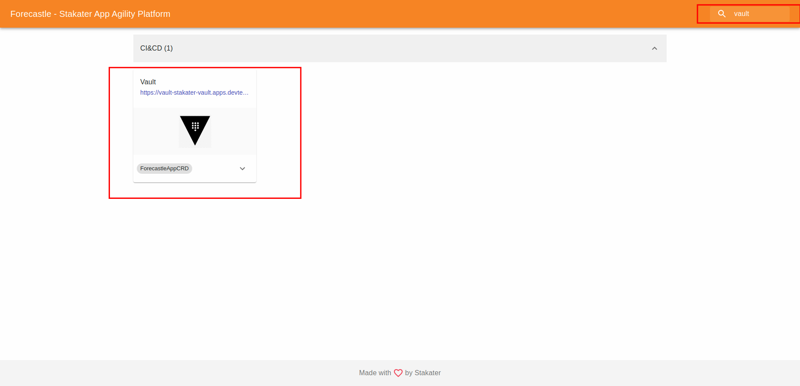

# Exercise 6 - SECRET MANAGEMENT 

In this section, we will walkthrough secret management workflow in SAAP. 

## Explain how MTO, Vault & ESO come together to serve Secrets Management (Secrets injection related setup configuration and workflow)

   

When the administrator creates Tenants in openshift cluster, Multi Tenant Operator (MTO) enables a KeyValue engine for the Tenant (same as tenant name) and it create groups, roles and policies required for tenant users inside Vault. In addition, Multi Tenant Operator (MTO) creates necessary roles with tenant users against vault client in RHSSO.

All of this is Automated Thanks to MTO !!

1. To access Vault from  [Forecastle](https://forecastle-stakater-forecastle.apps.devtest.vxdqgl7u.kubeapp.cloud) console, click on the `Vault` tile.

   

2. From the drop-down menu under `Method`, select `OIDC` and click on `Sign in with OIDC Provider` and select `workshop` identity Provider

   

  > Note: It can take a few minutes for your tenants resources to be provisioned in Vault, if you have errors please inform the workshop leads. The most likely solution will be to give it some more time so lets proceed!

3. You will be brought to the `Vault` console. Upon creation of your tenant, a folder belonging to your tenant for holding your secrets is created as well.

   

## Secrets creation workflow
_TODO_

## Secrets update workflow
_TODO_

## Secrets depreciation workflow

## 🖼️ Big Picture

## 🔮 Learning Outcomes

