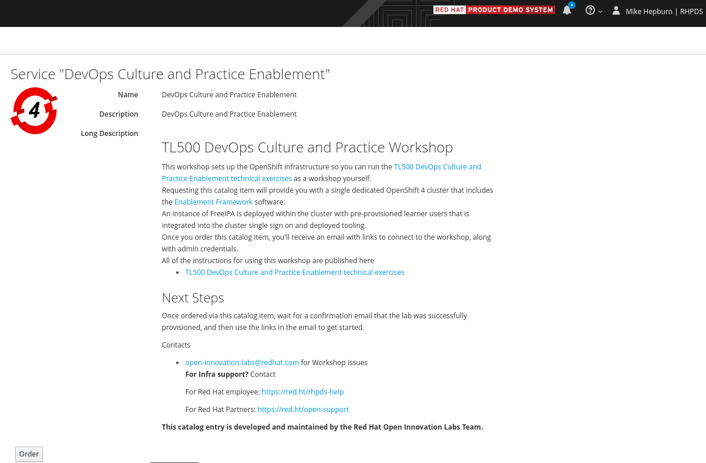

## TL500 Cluster Setup

<p class="warn">
    ⛷️ <b>NOTE</b> ⛷️ - You need an OpenShift 4.9+ cluster with cluster-admin privilege.
</p>

Just like we practice through out the course, we keep the cluster configuration as code in a GitHub repository: https://github.com/rht-labs/enablement-framework

This repository has two part:
- Helm charts to deploy some cluster-wide toolings to run the exercises
- Red Hat CodeReady Workspaces setup

## Helm Charts for Toolings

Here is the list of the tools and objects we deploy on OpenShift for TL500 setup:

* Red Hat CodeReady Workspaces - developer environment
* GitLab - as Git server
* SealedSecrets - for storing the secrets publicly safely. 
* StackRox - for image security exercises
* User Workload Monitoring - to enable application metrics gathering. It is needed for `Return of the Monitoring` section.
* Logging stack - it is not enabled by default in OpenShift. We enable it for `Return of the Monitoring` section.
* Some shared namespaces to install above components
* RBAC definition for `student` group

All of them are defined as helm charts in the repository. You can update `values.yaml` files locally if you'd like to change some naming or skip to install some components.

But before we installing the tooling, we need to talk about the user management.

## User Management
Students do not have cluster-admin privilege. We have an OpenShift user group called `student` which has an RBAC definition applied in order to run the exercises successfully.

You can choose to use your own user management system and create a group called `student` to add the students to it. We use IPA for this! An IPA helm chart can be found [here](https://github.com/redhat-cop/helm-charts/tree/master/charts/ipa).

If you'd like to use the same setup, steps are below. You need to pass cluster domain up front for IPA to work properly:

```bash
helm repo add redhat-cop https://redhat-cop.github.io/helm-charts
helm upgrade --install ipa . --namespace=ipa --create-namespace --set app_domain=<CLUSTER_DOMAIN> --set ocp_auth.enabled=true
```
FreeIPA takes some time to configure and launch the first time so be patient - or just go off and get a 🫖!

After the installation, you can use this trick to create users and group:

```bash
#!/bin/bash

IPA_NAMESPACE="${1:-ipa}"

# 1. On your host - get the admin passwd and connect to IPA 
oc project ${IPA_NAMESPACE}
export IPA_ADMIN_PASSWD=$(oc get secret ipa-password --template='{{ range .data }}{{.}}{{end}}' -n ipa | base64 -D)
echo ${IPA_ADMIN_PASSWD}
oc rsh `oc get po -l deploymentconfig=ipa -o name -n ${IPA_NAMESPACE}`

# 2. on the container running IPA Server, create `student` group and add users to it.
echo ${IPA_ADMIN_PASSWD} | kinit admin
export GROUP_NAME=student
ipa group-add ${GROUP_NAME} --desc "TL500 Student Group" || true
# in a loop add random users to the group 
for i in {1..24};do
  export LAB_NUMBER="lab$i"
  echo 'thisisthepassword' | ipa user-add ${LAB_NUMBER} --first=${LAB_NUMBER} --last=${LAB_NUMBER} --email=${LAB_NUMBER}@redhatlabs.dev --password
  ipa group-add-member ${GROUP_NAME} --users=$LAB_NUMBER
  printf "\n\n User ${LAB_NUMBER} is created"
done
```
## Enablement Framework Installation
Now let's go and install the tooling!!

First step is installing the base operators.

```bash
git clone https://github.com/rht-labs/enablement-framework.git
cd enablement-framework/tooling/charts/tl500-base
helm dep up
helm upgrade --install tl500-base . --namespace tl500 --create-namespace
```

When the above is successfull (which might take time up to 15 mins), you can run the following to complete the installation:

```bash
cd ../tl500-course-content
helm dep up
helm upgrade --install tl500-course-content . --namespace tl500 --create-namespace 
```
(again. this could also take some time 🙈)

## Verify The Installation
Log in to the cluster via UI and use `LDAP` login with your student username and password. You should only see `tl500-*` namespaces. 

We also have a tool called `tl500-teamster` to run exercises automatically for you to verify the installation. It is already bundled inside the installation of the toolings. Get the URL from the following command:

```bash
echo https://$(oc get route/tl500-base-tl500-teamsters -n tl500 --template='{{.spec.host}}')
```

..and follow the [README](https://github.com/rht-labs/tl500-teamsters) to see how to use it.

## Getting the Necessary Links
The exercises start with CodeReadyWorkspace link. So here is a one liner to get it:

```bash
echo https://$(oc get route/codeready -n tl500-workspaces --template='{{.spec.host}}')
```
## CodeReady Workspaces Setup

During the exercises, we use different commandlines like `oc`, `mvn`, `kube-linter` and many others. We have a container image that has all these necessary CLIs and, the configuration (Dockerfile) is under `codereadyworkspaces/stack/` folder.

We utilize GitHub Actions in order to build and store this image publicly. 

There is a `tl500-devfile.yaml` which is the _as code_ definition of our workspace. We refer to the container image inside the [devfile](https://github.com/rht-labs/enablement-framework/blob/main/codereadyworkspaces/tl500-devfile.yaml#L29):

```yaml
...
  - type: dockerimage
    alias: stack-tl500
    image: quay.io/rht-labs/stack-tl500:3.0.10
...
```

We have the explanation of how to get your own CodeReady Workspaces environment in the [first chapter](1-the-manual-menace/1-the-basics).

## Red Hat Product Demo System

This is currently only available to Red Hat Associates. You can order up your own TL500 environment in [RHPDS](https://rhpds.redhat.com). This will provision for you the latest OpenShift & TL500 workshop environment. You can select cluster size, number or users and region.


