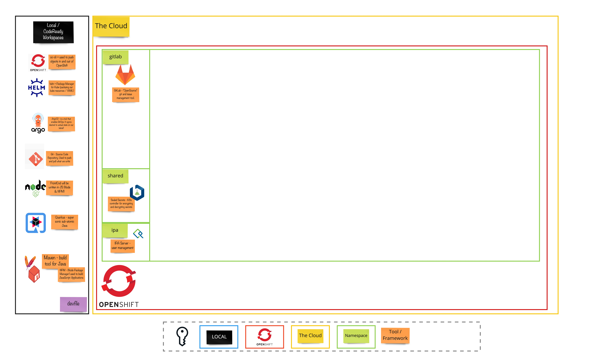

# Exercise X - The Rise of the Cluster

## 👨‍🍳 Exercise Intro

In this exercise, we will walk through the steps we take in order to have a ready cluster for all the other exercises. 

## 🖼️ Big Picture

## 🔮 Learning Outcomes

- [ ] Can install the components which are necessary to run the exercises

## 🔨 Tools used in this exercise!
* Openshift 4.9+
* [Helm](https://helm.sh/) - Helps us to define, install, and upgrade Kubernetes application.
