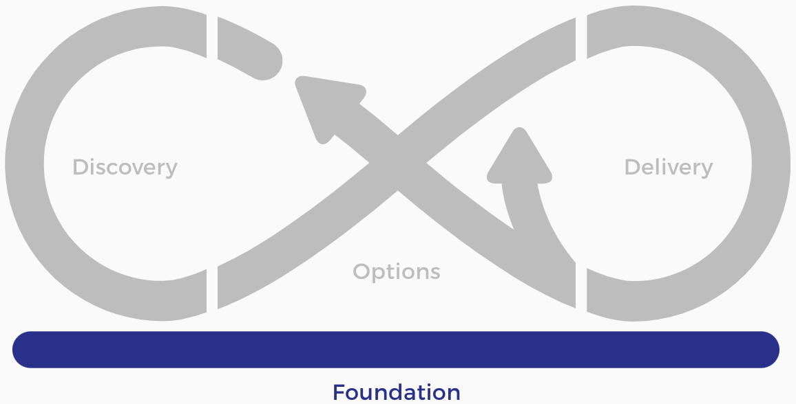
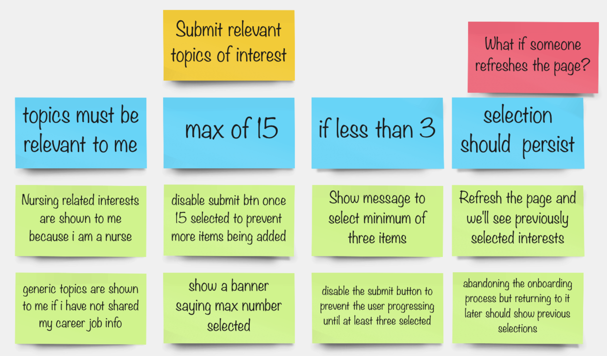
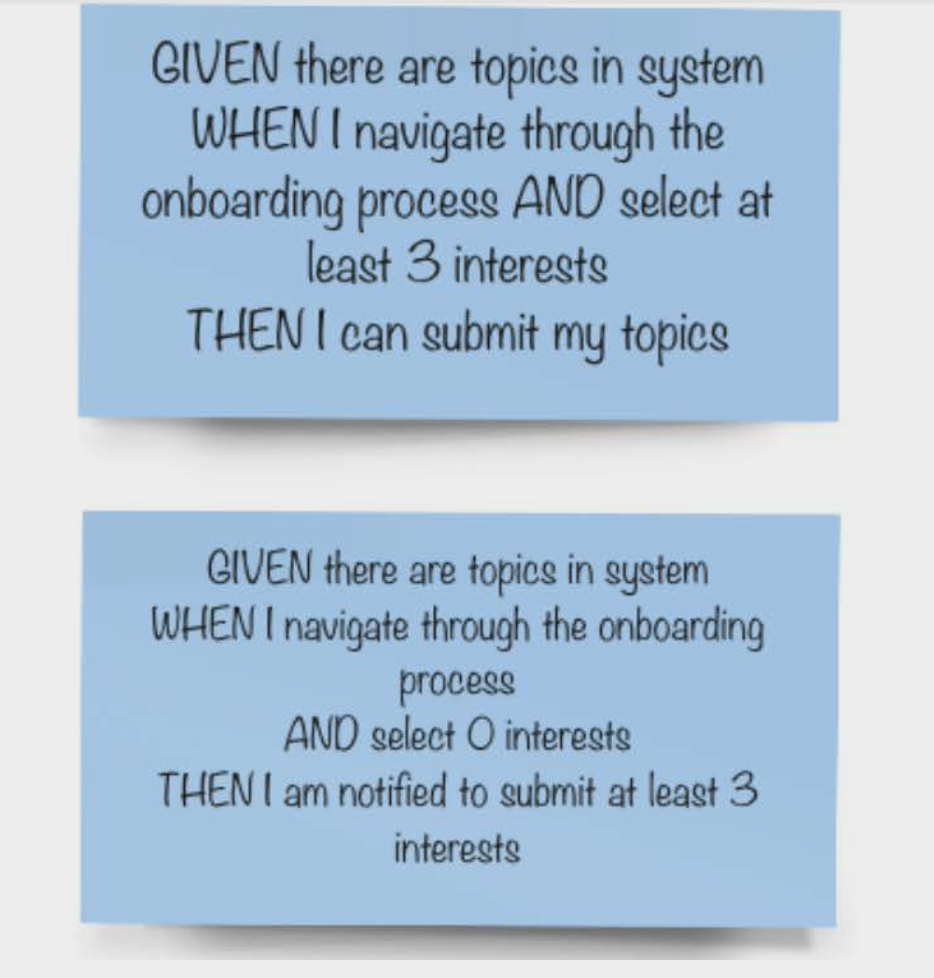
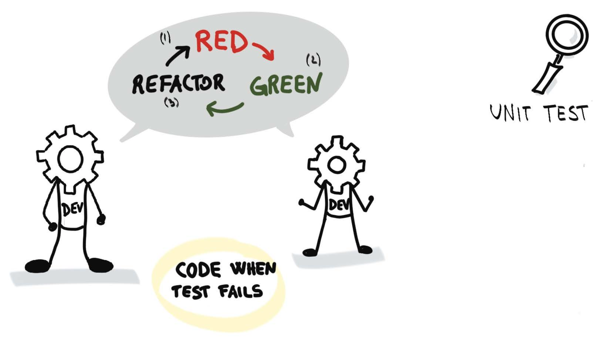
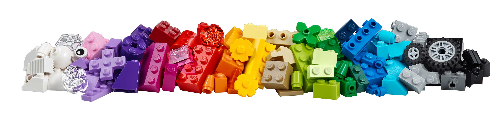
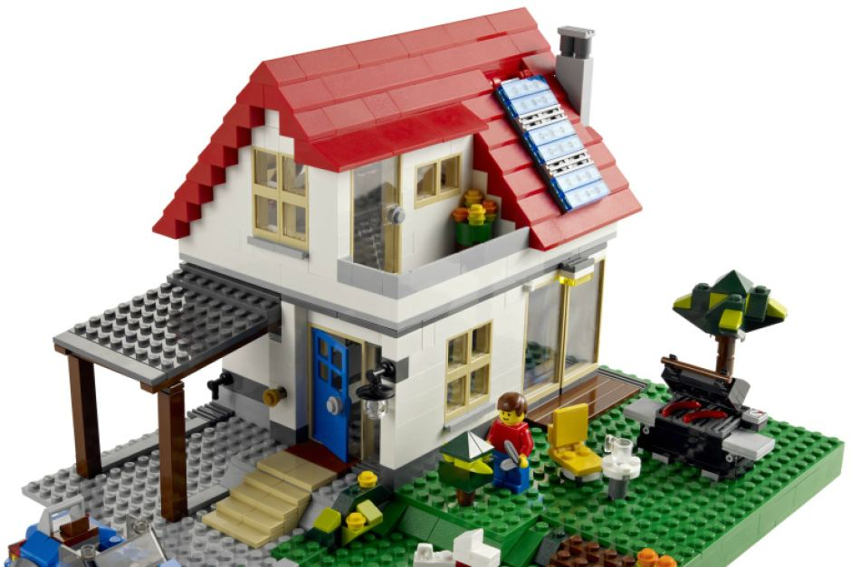

<!-- .slide: data-background-image="images/RH_NewBrand_Background.png" -->
## DevOps Culture and Practice <!-- {.element: class="course-title"} -->
### DDD, BDD & TDD (& DDT) <!-- {.element: class="title-color"} -->
TL500 <!-- {.element: class="title-color"} -->

  <h2>Open Practice Library</h2>
  

  <h2>Testing Testing Testing 🔨🔨</h2>
  

<!-- .slide: id="ddd" -->
## Domain Driven Design

### Domain Driven Design
#### _What Is It?_
Domain Driven Design (DDD) is an approach to developing software for complex 
needs that deeply connects the implementation to an evolving model of the core business concepts.

### Domain Driven Design
#### _How Does It Help?_
* Places the project's primary focus on the core domain and domain logic
* Bases complex designs on a model of the domain
* Initiates a creative collaboration between technical and domain experts to iteratively refine a conceptual model to address domain problems
* Bridges the gap between domain experts and developers by using the same language to create a shared understanding

<!-- .slide: id="bdd" -->
## Behavior Driven Development

### Behavior Driven Development
#### _What Is It?_
Behavior Driven Development (BDD) is a test-first, agile testing practice 
that provides built-in quality by defining (and potentially automating) tests before, or as part of, specifying system behavior.

### Behavior Driven Development
#### _How Does It Help?_
* Creates a shared understanding of requirements between the business and the Agile teams
* Helps guide development, decrease rework, and increase flow
* Creates business-facing scenarios that attempt to describe the behavior of a story, feature, or capability from a user's perspective.

#### Example Mapping
Example Mapping is based on the idea that multiple examples of specific cases convey information better than a single bad abstraction of a concept.

#### Example Mapping - World Health Organisation

#### Example Mapping Story A/Cs and Test Cases

<!-- .slide: id="tdd" -->
## Test Driven Development

### Test Driven Development
#### _What Is It?_
Test Driven Development (TDD) is a software development process that relies on short development cycles.
Requirements are turned into test cases and the software is developed to pass
the tests.

This practice is particularly powerful when combined with **Continuous Integration**.

### Test Driven Development
#### _How Does It Help?_
* Creates a detailed specification for the code
* Provides rapid feedback
* Indicates whether the most recent change broke previously working code
* Allows the design to evolve and adapt as understanding of the problem evolves

### DDD, BDD, and TDD

<!-- .slide: id="revenge-automated-testing-part-2" -->
## Revenge of the Automated Testing
### Part 2
Test Driven Development (TDD) in LEGO

Credit to [Gargoyle Software](http://www.gargoylesoftware.com/ex/lego_tdd)

### Intent
Demonstrate the concepts behind Test Driven Development.

How writing the test before we write code forces our design to emerge.

### TDD Lifecycle

Red - Write a small test that fails <!-- {.element: class="fragment" style="color: red" data-fragment-index="1"} -->

Green - Do the minimum to make the test pass <!-- {.element: class="fragment" style="color: green" data-fragment-index="2"} -->

Refactor - Eliminate duplication and make it beautiful <!-- {.element: class="fragment" data-fragment-index="3"} -->

### TDD Lifecycle
  <!-- {.element: class="" style="height:450px"} -->

### Prepare your environment
Our program is made of Lego. Get your equipment ready for coding

### Two Simple Rules for Lego TDD
KISS - Keep It Simple Stupid  <!-- {.element: class="fragment"  data-fragment-index="1"} -->

YAGNI - You Ain't Gonna Need It!  <!-- {.element: class="fragment"  data-fragment-index="2"} -->

  <!-- {.element: class="fragment"  data-fragment-index="1" style="height:250px"} -->
  <!-- {.element: class="fragment" style="height:250px"  data-fragment-index="2"} -->

### Pair Builds
 <!-- {.element: class="" style="height:450px"} -->

### The Steps
1. One person in the pair writes a test, in the form of a **DESCRIPTION** on a sticky note and places it on the table. For example, "It should be a person" <!-- {.element: class="fragment"  data-fragment-index="1"} -->
2. The second person then implements something in LEGO that passes the test. <!-- {.element: class="fragment" data-fragment-index="2"} -->
3. When the first person is satisfied that the test passes, the two switch positions. <!-- {.element: class="fragment" data-fragment-index="3"} -->
4. Now, the second person writes a test, puts it on the table, and the first person implements it in LEGO. <!-- {.element: class="fragment" data-fragment-index="4"} -->

### Some example tests

 <!-- {.element: class="inline-image"} -->
**Describe("The House")**
- It should have a roof <!-- {.element: class="fragment" data-fragment-index="1"} -->
- It should have a door <!-- {.element: class="fragment" data-fragment-index="2"} -->
- It should have a window in a wall of the house <!-- {.element: class="fragment" data-fragment-index="3"} -->
- It should have a person smaller inside <!-- {.element: class="fragment" data-fragment-index="4"} -->
- It should have at least two connected walls <!-- {.element: class="fragment" data-fragment-index="6"} -->

### The Game Begins!

 - The business requirement is to include the following in our program:
       1. a person
       2. an animal
       3. a plant
       4. a vehicle
       5. a building.
 - There can be only one "broken" test at a time. All previous tests must continue to pass. <!-- {.element: class="fragment" data-fragment-index="1"} -->
 - Nothing must be built in LEGO unless a failing test required it. <!-- {.element: class="fragment" data-fragment-index="2"} -->
 - After each test passes, participants must switch roles. <!-- {.element: class="fragment" data-fragment-index="4"} -->

### Debrief
<!-- speaker info
Sometimes people will build something new that breaks an existing test and they either won't have noticed or won't have cared. If this is the case then discuss why tests must always be passing.

Generally not everyone will have done this. They'll be so busy creating interesting requirements that they don't have time to build the five things that the customer actually asked for. Discuss this.

Have each pair demo two or three of their features. Have them read out the test first and then point out how that was implemented in their model. Stress the fact that if there isn't a test for a given feature, we don't care about it.
Many times people will have built cool things that they didn't have tests for. We stress again that in TDD, we don't build anything until the test has forced us to do that.
 -->
 - What did you observe? How did that feel?
 - Did everyone complete the five listed requirements?
 - Do all tests currently pass?

### Team Builds

### The Game Begins Again!

 <!-- {.element: class="inline-image" style="height:500px"} -->
 - As a table group, pick a project to build. Projects must be something complex that has lots of different elements in it. Some examples could be: _a zoo_, _a shopping center_, _a spaceship_, or _city_.
 - Spend 2 mins creating a backlog of features for you to build ...  <!-- {.element: class="fragment" data-fragment-index="1"} -->
 - All tests at the table must continue to pass at all times, regardless of which pair wrote them - this is your CI environment  <!-- {.element: class="fragment" data-fragment-index="2"} -->
 - All features and tests must be integrated with the main project in the center of the table. <!-- {.element: class="fragment" data-fragment-index="2"} -->

### Debrief

<!-- Speaker notes
What did you observe?
A wide open question like this will often bring out observations we didn't anticipate.
Look around your table. Are all the tests still passing? If not, discuss.
Often people will now realize that something is broken and they hadn't noticed. This can lead into a discussion of continuous integration servers.
Are there tests that you should have that are missing?
Once a team built a zoo and then didn't complete the fencing around the lion enclosure. Perhaps they'd needed a test to ensure the lions couldn't get out to eat all the other animals.
Did you have any conflicts where a new feature from one pair broke a test from another? What did you do about that?
Was your final design different than you expected? Discuss.
 -->
 - What did you observe?
 - Look around your table. Are all the tests still passing?
 - Are any necessary tests still missing?
 - Did you encounter any conflicts between a new feature from one pair that broke a test from another? How did you resolve these conflicts?
 - Was your final design different from what you expected?

## A Little Competition

<!-- .slide: id="revenge-automated-testing-part-2" -->
## Revenge of the Automated Testing
### Part 2
Test Driven Development (TDD) in Virtual Blocks!!!

(Virtual Edition)

### Intent
Demonstrate the concepts behind Test Driven Development.

How writing the test before we write code forces our design to emerge.

### TDD Lifecycle

Red - Write a small test that fails <!-- {.element: class="fragment" style="color: red" data-fragment-index="1"} -->

Green - Do the minimum to make the test pass <!-- {.element: class="fragment" style="color: green" data-fragment-index="2"} -->

Refactor - Eliminate duplication and make it beautiful <!-- {.element: class="fragment" data-fragment-index="3"} -->

### TDD Lifecycle
  <!-- {.element: class="" style="height:450px"} -->

### Prepare your environment
Our program is made of virtual blocks. Get your equipment ready for coding

### Rules for Virtual Blocks TDD
1. The library is closed, you can't duplicate or add more blocks. <!-- {.element: class="fragment"  data-fragment-index="1"} -->
2. You can't modify the blocks (rotate, extend, change colors). <!-- {.element: class="fragment"  data-fragment-index="2"} -->
3. Blocks must be inside of your workspace. <!-- {.element: class="fragment"  data-fragment-index="3"} -->
4. You can only add 2 blocks per round. <!-- {.element: class="fragment"  data-fragment-index="4"} -->
5. Refactor when you need it, or you want it. <!-- {.element: class="fragment"  data-fragment-index="5"} -->
6. There can be only one "broken" test at a time. All previous tests must continue to pass. <!-- {.element: class="fragment"  data-fragment-index="6"} -->
7. Nothing must be built unless a failing test required it. <!-- {.element: class="fragment"  data-fragment-index="7"} -->

### Two Simple Rules for TDD
KISS - Keep It Simple Stupid  <!-- {.element: class="fragment"  data-fragment-index="1"} -->

YAGNI - You Ain't Gonna Need It!  <!-- {.element: class="fragment"  data-fragment-index="2"} -->

  <!-- {.element: class="fragment"  data-fragment-index="1" style="height:250px"} -->
  <!-- {.element: class="fragment" style="height:250px"  data-fragment-index="2"} -->

### The Game Begins!

### Debrief
<!-- speaker info
Sometimes people will build something new that breaks an existing test and they either won't have noticed or won't have cared. If this is the case then discuss why tests must always be passing.

Generally not everyone will have done this. They'll be so busy creating interesting requirements that they don't have time to build the five things that the customer actually asked for. Discuss this.

Have each pair demo two or three of their features. Have them read out the test first and then point out how that was implemented in their model. Stress the fact that if there isn't a test for a given feature, we don't care about it.
Many times people will have built cool things that they didn't have tests for. We stress again that in TDD, we don't build anything until the test has forced us to do that.
 -->
 - What did you observe? How did that feel?
 - Did everyone complete all listed requirements?
 - Do all tests currently pass?

<!-- .slide: data-background-image="images/book-background.jpeg", class="black-style"  data-background-opacity="0.3" -->
### Related & Used Practices
- [Test Driven Development](https://openpracticelibrary.com/practice/test-driven-development/)
- [Continuous Integration](https://openpracticelibrary.com/practice/continuous-integration/)
- [Example Mapping](https://openpracticelibrary.com/practice/example-mapping/)
