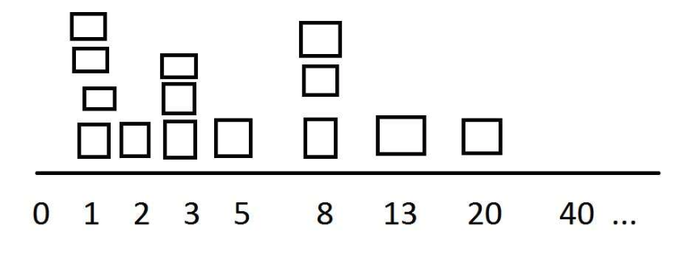

<!-- .slide: data-background-image="images/RH_NewBrand_Background.png" -->
## DevOps Culture and Practice <!-- {.element: class="course-title"} -->
### Estimation <!-- {.element: class="title-color"} -->
TL500 <!-- {.element: class="title-color"} -->

<!-- .slide: data-background-size="stretch" data-background-image="images/opl-logo.png", class="white-style" -->

  <h2>Open Practice Library</h2>
  

  <h2>Estimation 🍇⚖️🍍</h2>
  

##### Example - WHO <!-- .element: class="title-bottom-left" -->
<!-- .slide: data-background-size="contain" data-background-image="images/estimation/example-who.png", class="white-style" -->

#### _What is it?_

* A mechanism for sizing different work items *relative* to each other
* A tool to facilitate conversations, especially where there are different views on relative sizes
* Common formats to call it: relative estimation, planning poker, count number of work items

#### _Why use it?_

* Facilitates conversation
* Helps align groups of people to reach consensus on their understanding regarding the size of complexity and/or value of an item
* Avoids the emotion, buffering and other negative side effects of absolute estimation

#### _How do we do it?_
_Things to consider before starting:_ <!--{.element: style="font-size: smaller; font-weight: 100;"} -->
* First we need to have done the product backlog refinement and the sprint planning
* After we picked the user stories for the next sprint and put them into the Relative Estimation board

#### _How do we do it?_
1. We draw a ladder and agree on the points we are going to use. A common practice is to use the Fibonacci series or T-Shirt sizes

<!-- {.element: class="" style="border:none; box-shadow:none; max-width:40%;" } -->

2. Then we start the sizing for the stories: the first step is to identify the 1-pointer and the 13-pointer
3. From there we then compare the other user stories to the previous items:
    - Maybe the second user story is a bit harder, so let's call that a 2-pointer
    - Then the next user story we need to ask ourselves how much harder or easier it is compared to the others

#### _How do we do it?_
_An example_ <!--{.element: style="font-size: smaller; font-weight: 100;"} -->
* 'Okay we have story A, is this bigger than the 3 points we have here?'
* Assuming yes - 'Okay is it bigger than the 8 pointer? Or is it roughly the same size'
* Assuming no - 'Okay so we'll say it is a 5 pointer then'

### Exercise - Fruit Salad 🥗
#### _Relative Estimation_
In 60 seconds ⏱...

* Individually - write as many fruits as you can think of the wilder and weirder the better

### Exercise - Fruit Salad 🥗
#### _Relative Estimation_
* As a Team
  * Move the fruit to one single list and remove duplicates
  * Create rows on a board and label them 1,2,3,5,8,13
  * Relative Estimate your fruit based in how hard is to peel and cut each fruit

### Real World Examples

#### Estimation Ladder <!-- .element: class="title-bottom-left" -->
<!-- .slide: data-background-size="contain" data-background-image="images/estimation/example-who.png", class="white-style" -->

#### Burndown <!-- .element: class="title-bottom-left" -->
<!-- .slide: data-background-size="contain" data-background-image="images/estimation/burndown.png", class="white-style" -->

#### Burnup <!-- .element: class="title-bottom-left" -->
<!-- .slide: data-background-size="contain" data-background-image="images/estimation/burnup.png", class="white-style" -->

#### Key Takeaways
 
As we go through these estimations, conversations will occur within the team and you'll discover more with understandings beginning to align.

In this exercise this might include things like:
  - Perhaps someone has a tool that makes opening coconuts easier so maybe it doesn't require as much effort as we thought?
  - Maybe the orange has pips in it and also it's more difficult than the banana?
<!-- {.element: class="" style="border:none; box-shadow:none; max-width:100%;" } -->

#### Facilitation Tips
A helpful tool for big planning:
* The relative estimation line is one technique that can help with this sort of thing allowing for quick and easy estimation based on past experience
* It is important to avoid stories too big that are brought into the sprint and they are carried over multiple sprints. Because the story is never "done" the points cannot be cashed in.

<!-- .slide: data-background-image="images/chef-background.png", class="white-style" -->
### Related & Used Practices
- [Relative Estimation](https://openpracticelibrary.com/practice/relative-estimation/)
- [Cost of Delay and WSJF(_Weighted Shortest Job First_)](https://openpracticelibrary.com/practice/weighted-shortest-job-first/)
- [T-shirt Sizing](https://openpracticelibrary.com/)
- [Planning Poker](https://openpracticelibrary.com//)
- [Product Backlog Refinement ](https://openpracticelibrary.com/practice/backlog-refinement/)
- [Acceptance Criteria ](https://openpracticelibrary.com/)