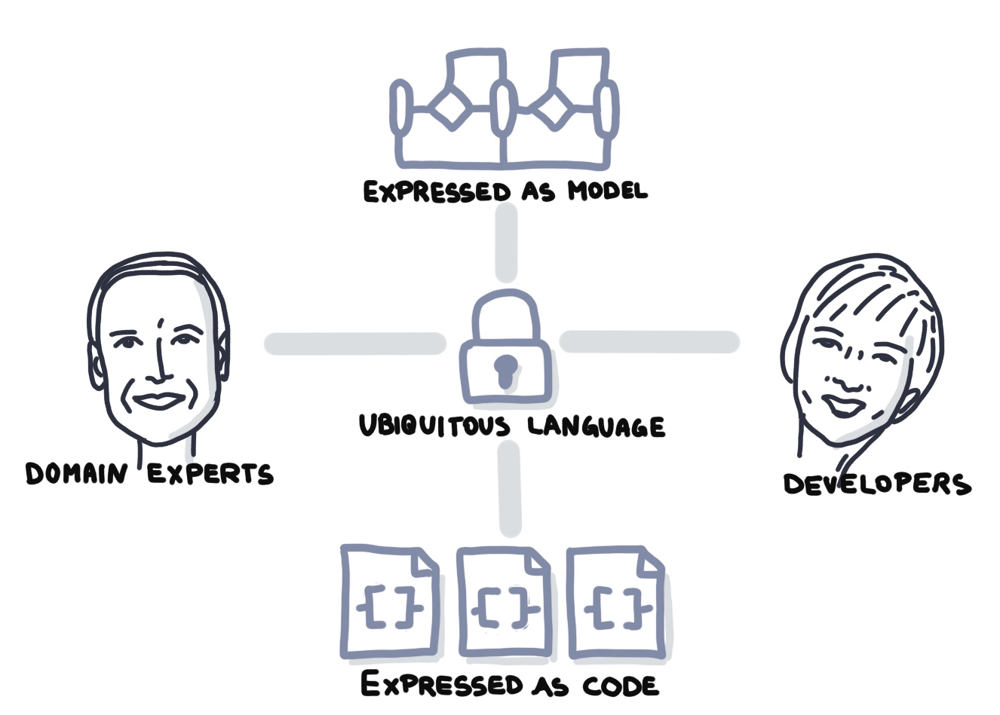
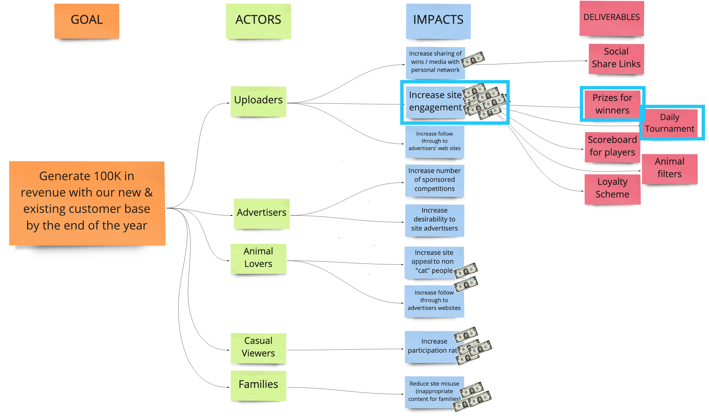
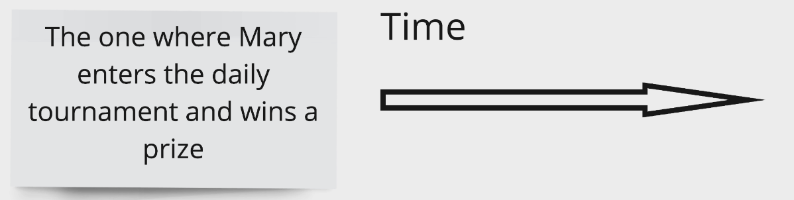
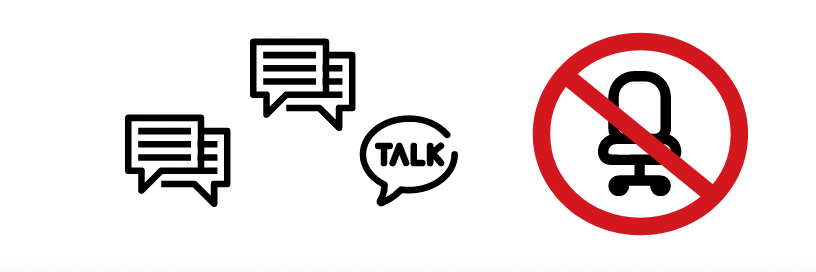

<!-- .slide: data-background-image="images/RH_NewBrand_Background.png" -->
## DevOps Culture and Practice <!-- {.element: class="course-title"} -->
### Event Storming <!-- {.element: class="title-color"} -->
TL500 <!-- {.element: class="title-color"} -->

  <h2>Open Practice Library</h2>
  

  <h2>Event Storming</h2>
  

##### <!-- .element: class="title-bottom-left" -->
<!-- .slide: data-background-size="contain" data-background-image="images/event-storming/example-who.png", class="white-style" -->

### Event Storming
#### _What is it?_
_Event Storming is a rapid, interactive approach to business process discovery and design that yields high-quality models._

It provides a repeatable, teachable technique for modeling:
  * Event-driven systems
  * Large microservice-based systems

#### The Knowledge Distribution <!-- .element: class="title-bottom-left" -->
<!-- .slide: data-background-size="contain" data-background-image="images/event-storming/knowledge-distribution.png", class="white-style" -->

#### _What is it?_
At the end of the event storm, you should have:
* A shared understanding of the business process you are building as part of the project, including:
<!-- .element: class="image-no-shadow " -->
* A physical diagram with the above information that can be transferred to a digital format
<!-- ### Event Storming
#### _What is it?_
* Who: key business stakeholders and techies
* There will be lots of talking, a fair bit of squabbling, and periodically
some **very** heated debate
* No chairs!
* Expect a tiring but fun day that achieves a great deal from the most basic of tools -->

#### _Where did it come from?_
 <!-- {.element: class="inline-image" style="max-width:300px;"} -->
It was introduced in 2013 in a blog by Alberto Brandolini.
 <!-- {.element: class="" style="max-width:450px;"} -->

It provides a kind of Domain Driven Design (DDD) "Lite," but with more business focus and less jargon and complexity.

#### _Why do we use it?_
* Very simple modeling practice that is accessible to all business people
* Engages all stakeholders and removes technical barriers:
  * Non-technical people can actively contribute
  * Builds a shared understanding
  * Fails fast to solve complex problems
  * Delivers meaningful design artifacts

### Event Storming
#### _Artifacts_
* **Big Picture**: Quickly build a shared understanding of a problem space
* **Process Diagram**: Model business processes
* **Aggregate Modeling**: Find the key microservices, operations, and a retrospective event model
* **UI Modeling**: Model the flow of pages in an application

### 
<!-- .slide: data-background-size="contain" data-background-image="images/event-storming/vision-to-detail.png", class="black-style" -->

#### Event Storming - How
The Event Storming Key is specific set of colored sticky notes.

<!-- .slide: data-background-size="contain" data-background-image="images/event-storming/es-flow.png", class="black-style" -->

<!-- .slide: data-background-size="contain" data-background-image="images/event-storming/es-events.png", class="black-style" -->

<!-- .slide: data-background-size="contain" data-background-image="images/event-storming/es-commands-actors.png", class="black-style" -->

<!-- .slide: data-background-size="contain" data-background-image="images/event-storming/es-readmodel.png", class="black-style" -->

<!-- .slide: data-background-size="contain" data-background-image="images/event-storming/es-systems-quests.png", class="black-style" -->

<!-- .slide: data-background-size="contain" data-background-image="images/event-storming/es-policies.png", class="black-style" -->

<!-- .slide: data-background-size="contain" data-background-image="images/event-storming/es-aggregates.png", class="black-style" -->

<!-- .slide: data-background-size="contain" data-background-image="images/event-storming/es-extras.png", class="black-style" -->

<!-- .slide: data-background-size="contain" data-background-image="images/event-storming/es-flow.png", class="black-style" -->

<!-- # complete -->
<!-- .slide: data-background-size="contain" data-background-image="images/event-storming/es-complete.png", class="black-style" -->

### Class Exercise

#### Context - PetBattle
* The PetBattle team decides to use event storming to design part of their system. As with all great teams, they started by defining the example they will map out. This important step frames the end-to-end journey and stops them from modeling too big a piece of the application.

#### Context - PetBattle
* Take a deliverable or two from the highest voted impact on the _Impact Map_ ...

<small>(The highest voted impact was the one with the most amount of dollars - "Increase Site Engagement")
</small>

#### Context - PetBattle
* ...and reframe the deliverables using the _Friends Notation_ (`The One Where..`) to drill down into the system design.
* Using this notation will help to establish the boundaries of the Event Storm exploration

#### Create the Event Storm for _"THE ONE WHERE: Mary enters the daily tournament and wins a prize"_
 <!-- {.element: class="inline-image"} -->

1. Begin by creating the spine of the `Events`.
2. Add the information needed to make a decision with the `Commands`, `Users` and `Read Models`.
3. Are there any `policies` or `procedures` that you can identify?
4. Are there new `Systems` (external) or `Aggregates`?

&nbsp;

#### Questions to help guide you
* Who is Mary? Does she need to authenticate to enter the competition?
* What is the daily prize? How does Mary know about it?
* How will Mary know that she's won the competition? Does she get notified? Is there a leaderboard?

### Exercise Wrap Up

##### Pet Battle - No Systems or Policies<!-- .element: class="title-bottom-left" -->
<!-- .slide: data-background-size="contain" data-background-image="images/event-storming/es-pb-no-systems.jpg", class="white-style" -->

##### <!-- .element: class="title-bottom-left" -->
<!-- .slide: data-background-size="contain" data-background-image="images/event-storming/example-who.png", class="white-style" -->

##### <!-- .element: class="title-bottom-left" -->
<!-- .slide: data-background-size="contain" data-background-image="images/event-storming/example-who-systems.png", class="white-style" -->

##### <!-- .element: class="title-bottom-left" -->
<!-- .slide: data-background-size="contain" data-background-image="images/event-storming/es-emerging-arch.png", class="white-style" -->

##### <!-- .element: class="title-bottom-left" -->
<!-- .slide: data-background-size="contain" data-background-image="images/event-storming/es-emerging-arch2.png", class="white-style" -->

### Event Storming: Key Takeaways
* Builds a shared understanding of a problem space
* Models business processes
* Aggregate modeling to find key microservices and event model
* Models the flow of pages in an application
* Aligns stakeholders and IT groups

#### _Tips for Success_
* Invite the right people: Business stakeholders, IT, and User Experience (UX).
* Provide unlimited modeling space with a surface, markers, and sticky notes.
* Keep people refreshed and hydrated! (🥝 🍫 🍌 / 🚰 / 🫖 ☕️)
* Frame the discussion to limit off-topic conversation using TOWs
* If remote, use breakout sessions with regular regrouping to encourage more conversation.
 <!-- {.element: class="image-no-shadow"} -->
* Set up the environment with a Social Contract to ensure psychological safety.
* Watch out for the Dungeon Master!

<!-- .slide: data-background-image="images/book-background.jpeg", class="black-style"  data-background-opacity="0.3" -->
### Related & Used Practices
_An Event Storm focuses on the function design of the system. However when building a backlog we should take into account other aspects of system design such as:_  <!--{.element: style="font-size: smaller; font-weight: 400;"} -->

* [Value Slice](https://openpracticelibrary.com/practice/user-story-mapping/) - The "commands" naturally become user stories as they're often initiated by a "user". These can be brought into the value slicing process to build the product Backlog.
* [Impact Map](https://openpracticelibrary.com/practice/impact-mapping/) - Forms an input for the scope of the modeling
* [Non Functional Map](https://openpracticelibrary.com/practice/non-functional-requirements-map/) - to give us all the things we need to build to support the SDLC
* [Metrics-Based Process Map](https://openpracticelibrary.com/practice/metrics-based-process-mapping/) - a great tool to measure the throughput of our SDLC
