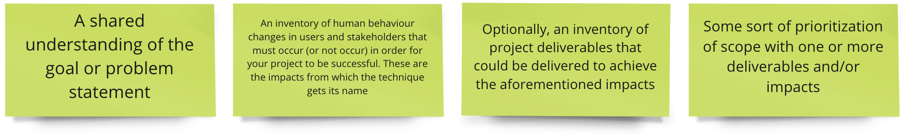
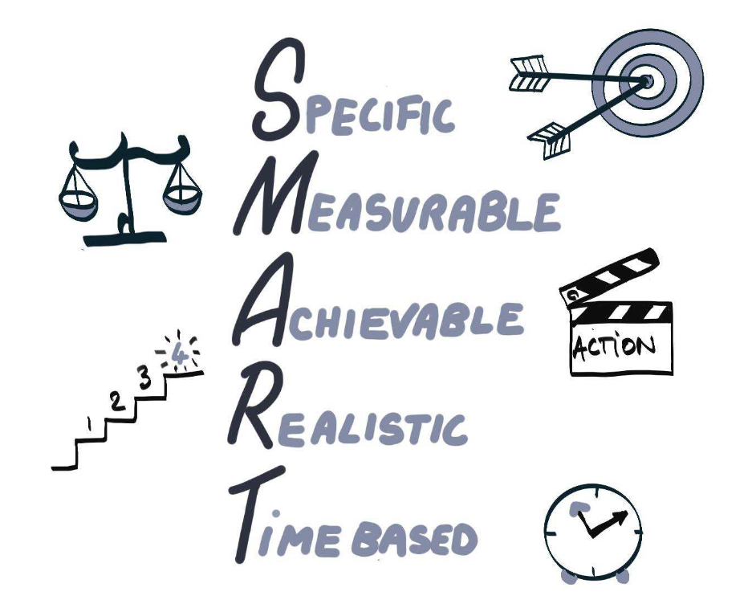
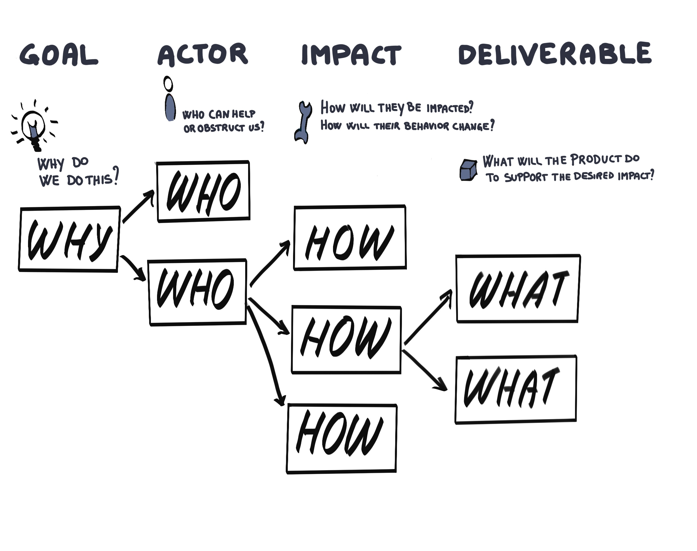
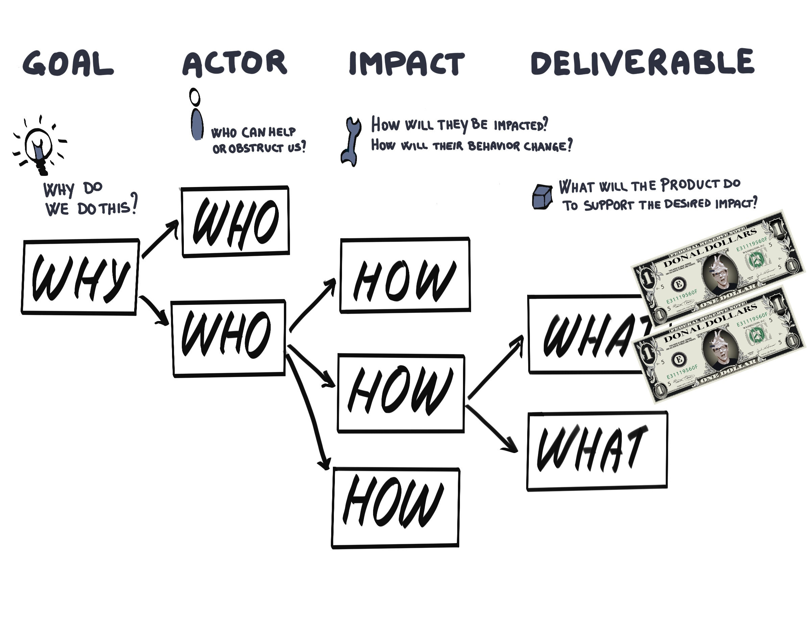
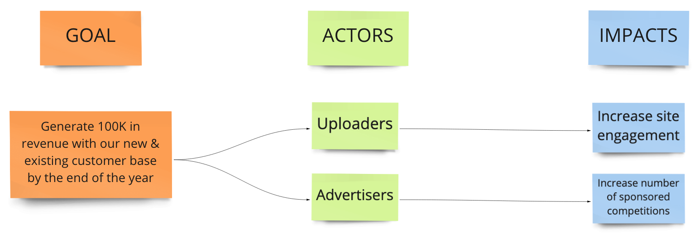

<!-- .slide: data-background-image="images/RH_NewBrand_Background.png" -->
### DevOps Culture and Practice <!-- {.element: class="course-title"} -->
## Impact Mapping <!-- {.element: class="title-color"} -->
TL500 <!-- {.element: class="title-color"} -->

<!-- .slide: data-background-size="stretch" data-background-image="images/opl-logo.png", class="white-style" -->

  <h2>Open Practice Library</h2>
  

  <h2>Impact Mapping</h2>
  

#### Impact Map - World Health Organization <!-- .element: class="title-bottom-left" -->
<!-- .slide: data-background-size="contain" data-background-image="images/impact-mapping/example-who.png", class="white-style" -->

#### _What is it?_
Impact mapping is a technique that helps build shared understanding and alignment between organizational strategy leaders and product delivery teams.

 

#### At the end of the Impact Mapping exercise, you should have:
<!-- .element: class="image-no-shadow image-full-width" -->
<!--  
#### _What is it?_
At the end of the Impact Mapping exercise, you should have:

* A shared understanding of the goal or problem statement.
* An inventory of human behavior changes in users and stakeholders that must occur (or not occur) for your project to be successful. These are the impacts from which the technique gets its name.
* Optionally, an inventory of project deliverables that could be delivered to achieve the aforementioned impacts.
* Some prioritization of scope, including one or more deliverables and/or impacts.
-->

####

   

_Impact mapping is a lightweight, collaborative planning technique for teams that want to make a big impact with software products_.

_It helps delivery teams and stakeholders visualize roadmaps, explain how deliverables connect to user needs, and communicate how user outcomes relate to higher-level organizational goals_.

~ Gojko Adzic

#### Why do we use it?
<!-- .element: class="image-no-shadow " -->
<!--
#### Why do we use it?
* Enables focusing on business objectives and orienting product teams toward delivering business value, instead of delivering more and more features.
* Brings business and technology together, thereby improving communication and purpose.
* Visualizes how strategic goals link to the team's work.
* Creates hypotheses and shows the ones most valuable to accomplishing the goal.
* Results in a graphical mind map that is easy to facilitate and has a low entry barrier.
--->

  
  
  
  
  
  

#### Impact Map - World Health Organization <!-- .element: class="title-bottom-left" -->
<!-- .slide: data-background-size="contain" data-background-image="images/impact-mapping/example-who.png", class="white-style" -->

### Class Exercise - Setting the Scene

#### Setting the Scene: Pet Battle Industries
Pet Battle Industries (PBI) is a silly app that allows users to upload pictures of their 🐈 or 🐕 and enter them into a competition.
<!-- .element: class="image-no-shadow" -->
<!-- 
* PBI started as a hobbyist application built by a few friends over a weekend.
* Initially, they deployed it as a single VM running on a free host. One day, a famous person tweeted about the app and it's usage exploded, however, the application failed and crashed under the load.
* The team behind the hobbyist app decided to quit their jobs and go all in on PBI&trade;.
* PBI&trade; is looking to monetize their application.
-->

### The Goal & Actors
#### *As a class*

1. The _`Goal`_ - Is this a good goal?
   * _Generate 100K in revenue with our new and existing customer base by the end of the year_.
  
2. The _`Actors`_ - Diverge <> Converge:
   * Who are the **all** the actors that can help get us to our goal?
   * Who are the actors to focus on? Pick one to two actors per table.

### The Impacts
#### *As a class*
1. Walk through creating the _`Impacts`_ for one _`Actor`_.

#### *In your team*
1. Determine _`Impacts`_ for your _`Actors`_.

### The Deliverables & Voting
#### *In your team*
1. Determine some _`Deliverables`_ for the _`Impacts`_ on your _`Actors`_.
2. Issue your Donal Dollars&trade; and place your bets on the _`Impacts`_

# Exercise Wrap Up

[PetBattle Miro Board](https://app.mural.co/t/warhw2023/m/warhw2023/1580744046908/05e98ef35312102d27aa494ff5e92b4ecb1ecc17?sender=dspring0331)

#### Impact Map - Pet Battle <!-- .element: class="title-bottom-left" -->
<!-- .slide: data-background-size="contain" data-background-image="images/impact-mapping/pb-full-example.png", class="white-style" -->

#### Facilitation Tips

* Don't spend too long on the goal - get it to good enough and move on.
* Have a goal preprepared in advance to really speed up the workshop.
* If time is a constraint, forget about deliverables and focus just on the impacts.
 

#### Tips For Remote

* Break the practice into many sessions.
* Use breakout rooms to ideate in smaller size groups.
* Do not rely on the facilitator alone to update the board.

<!-- .slide: data-background-image="images/book-background.jpeg", class="black-style"  data-background-opacity="0.3" -->
### Related & Used Practices
- [Start at the End](https://openpracticelibrary.com/practice/start-at-the-end/) - a simple exercise to identify a set of assumptions which must be tested in order achieve a long term goal
