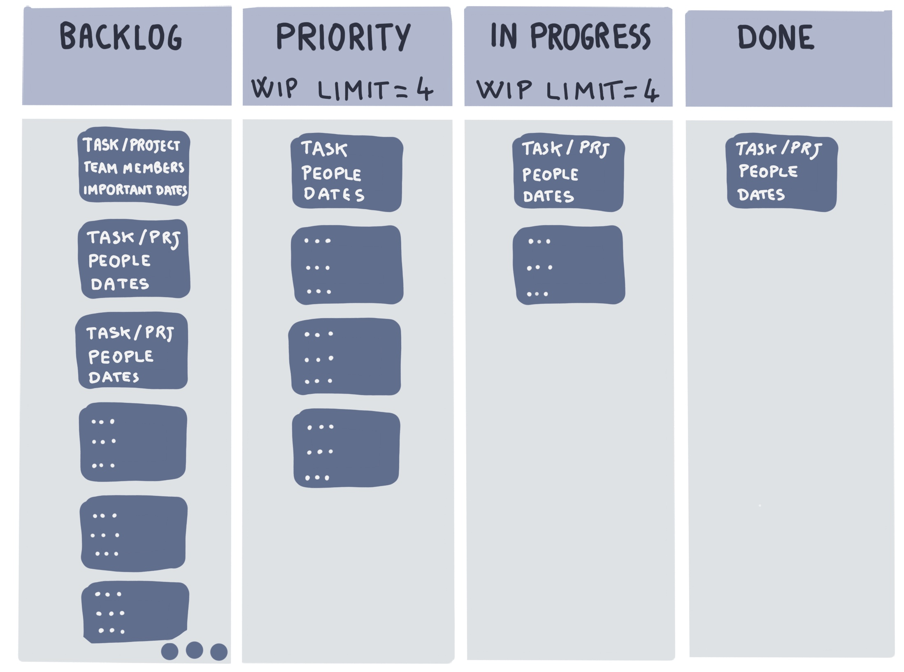
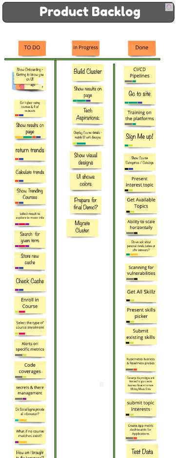
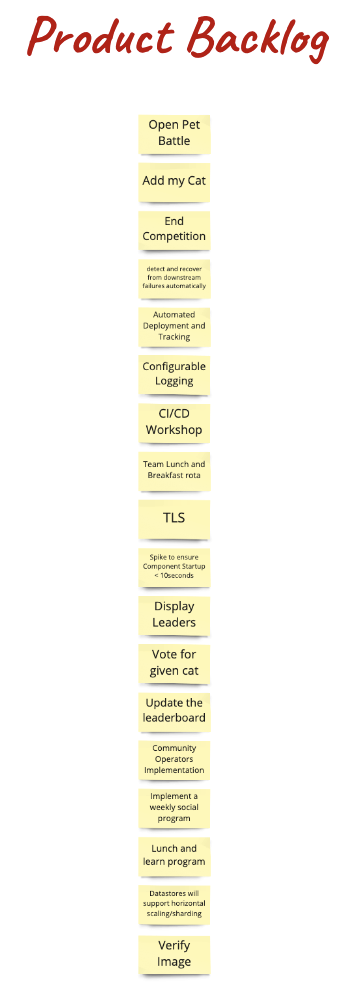

<!-- .slide: data-background-image="images/RH_NewBrand_Background.png" -->
## DevOps Culture and Practice <!-- {.element: class="course-title"} -->
### Kanban <!-- {.element: class="title-color"} -->
TL500 <!-- {.element: class="title-color"} -->

<!-- .slide: data-background-size="stretch" data-background-image="images/opl-logo.png", class="white-style" -->

  <h2>Open Practice Library</h2>
  

  <h2>Kanban</h2>
  

### Origins of Kanban
 <!-- {.element: class="inline-image"} -->
* Kanban is a Japanese word that means the _card you can see_.
* In 1950, Taiichi Onho defined the [Toyota Production System](http://www.toyota-global.com/company/vision_philosophy/toyota_production_system/origin_of_the_toyota_production_system.html) based on customer demands (Just in Time)
* In 2007, David J. Anderson introduced Kanban as method for software development.

##### Example - WHO<!-- .element: class="title-bottom-left" -->
<!-- .slide: data-background-size="contain" data-background-image="images/kanban/who-kanban.png", class="white-style" -->

### Kanban Practices

#### Kanban is a framework used to implement agile software development based on the following practices:
* Visualize the Workflow
* Limit Work in Progress
* Manage Flow
* Make Process Policies Explicit
* Feedback Loops

### Visualize the Workflow - Kanban Card

* Visual representation of a work item (requested or already in progress)
* Review details at a glance
* Contains valuable information about the task and its status (for example, summary, responsible person, deadline, etc.)
* Identify opportunities for collaboration

### Limit Work in Progress (WIP)

* The number of task items that a team is currently working on in each stage
* Frames the capacity of the team's workflow at any moment
* Does not mean doing fewer tasks overall, but working fewer tasks at any one time, or **simultaneously**
* Helps to identify bottlenecks
* Prevents constant context switching between tasks
* Defines a stable workflow resulting in a predictable delivery

### Manage Flow

* Flow means the movement of work items through the process
* Manages the work but not the people
* The goal is to create a smooth, healthy flow.
* Focus on managing the work processes and ways to improve it to work faster
* Deliver value to end customers as quickly as possible

### Make Process Policies Explicit

* Your process should be clearly defined, published, and socialized
* Declare explicit policies for:
  - Moving a work item from one column to the next
  - Prioritizing work items
  - Managing urgent work items
* Policies enable the team to make decisions quickly without doubts or queries

### Feedback Loops

* Ensure that we adequately respond to potential changes
* Defined with a frequency and a fixed time, they are straight to the point and never unnecessarily long

| Event | Purpose |
| --- | --- |
| **Daily Standup** | Daily sync to share a common understanding of the goals, coordinate the team effort, report on the work progress, and communicate problems and improvements. Starts from the right column (those work items closest to completion) |
| **Delivery Review** | Follow the workflow or delivery process
| **Risk Review** | Check, identify, and mitigate risk in our process |

#### _Why use it?_

* Kanban applies in situations where work arrives unpredictably, or when you must deploy work items as soon as they are ready instead of waiting for other work items.
* This framework helps you to:
  - Visually see work in progress
  - Identify bottlenecks or impediments and take steps to remove them
  - Improve team collaboration
  - Increase efficiency and productivity, reducing the time it takes to complete a project or user story from start to finish.
  - Reduce waste

### Kanban Metrics
Kanban provides you with a set of metrics to measure your process. These metrics are very useful to improve your flow and identify points of failure.

* **Lead Time**: Measures how much time a task spends in the Kanban board, since get in and get out. Provides a measure for our customers.
<!--TechEdit: "get in and get out" is not defined anywhere as to what that means. Time on the board since what exactly? Please confirm that this will be well understood by students and instructors. It's oddly constructed. If it's a known term should we put it it quotes? -->
* **Cycle Time**: Measures how much time a task spends going through the process from when the task started.
* **Throughput**: Measures the total amount of work delivered (completed work items)
* Cycle time, throughput, and WIP are connected by **[Little's Law](https://en.wikipedia.org/wiki/Little%27s_law)**

* Be focus to **reduce the Lead Time**

<!--TechEdit: This last one has a grammar problem and I'm not sure what is intended. Should this say "Be focused to reduce lead time? Be focused on what? Maybe this relates to my question about "get in get out" in the same bullet? -->

#### _How do we use it?_

* Visualize the process in columns and cards (always visible)
* A **Column** is a step of the workflow and a **card** is a work item
* All tasks must be on the board
* Designed by the Team (physical or virtual)

 <!-- {.element: class="" style="height:350px"} -->

### Real World Examples

### Kanban - Pet Battle

<!-- .slide: data-background-image="images/book-background.jpeg", class="black-style"  data-background-opacity="0.3" -->
### Related & Used Practices
- [Kanban](https://openpracticelibrary.com/practice/kanban/)
- [Kanban Picture](https://openpracticelibrary.com/practice/kanban-picture/)
- [Scrum](https://openpracticelibrary.com/practice/)
- [Prioritisation practices](https://openpracticelibrary.com/practice/)
- [Definition of Ready](https://openpracticelibrary.com/practice/definition-of-ready/)
- [Definition of Done](https://openpracticelibrary.com/practice/definition-of-done)
- [Product Backlog](https://openpracticelibrary.com/practice/)