<!-- .slide: data-background-image="images/RH_NewBrand_Background.png" -->
## DevOps Culture and Practice <!-- {.element: class="course-title"} -->
### Metric-Based Process Mapping <!-- {.element: class="title-color"} -->
TL500 <!-- {.element: class="title-color"} -->

### Batch Processing
#### _What is it?_
* Work is done concurrently
* Typically performed on a schedule or within a specific time frame

#### _How can it be used?_
* Helps identify Work In Progress limits
* Shows the flow of work through the team or system

#### [The Penny Game](https://www.leanagiletraining.com/better-agile/agile-penny-game-rules/)
1. Break out into teams and experiment with batch processing by using poker chips.
2. Follow the facilitator's instructions.

  <h2>Open Practice Library</h2>
  

  <h2>Metric-Based Process Mapping</h2>
  <a target="_blank" href="https://openpracticelibrary.com/practice/metrics-based-process-mapping/">
  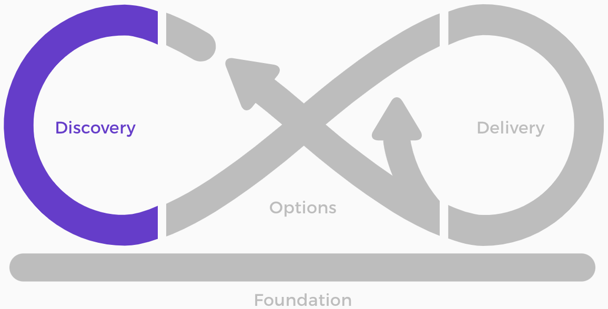
  </a>

### Value Streams 
Each table picks a sector and a business use case, for example:
* **Telco** - Ordering a new Broadband package
* **Finance** - Creating new account
* **Government** - Paying a Council Tax
* **Energy** - Switching energy providers

#### Some questions to lead the discussions:
What is the trigger for the stream?
What is end business value?
What are all the steps in between?
What are the technologies or systems that help with these steps?

_DevOps is focused on speeding up the value chain. Metric-Based Process Mapping (MBPM) is a practice that helps visualize all these steps and capture some metrics about how long they take to complete._

### Metric-Based Process Mapping

#### MBPM - Pet Battle <!-- .element: class="title-bottom-left" -->
<!-- .slide: data-background-size="contain" data-background-image="images/mbpm/example-pb.png", class="white-style" -->

#### _What is it?_
* A detailed process mapping practice that captures process steps, responsible actors, and key time and quality metrics.
* Heavily influenced by Karen Martin's work in this area.
* Designed to view the detailed, micro picture and make tactical improvements with front line workers.

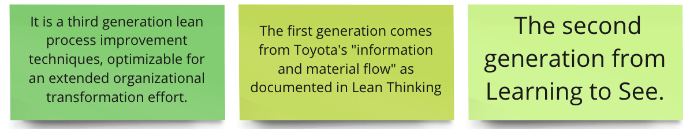<!-- .element: class="image-no-shadow " -->
<!--
It is a third generation lean process improvement techniques, optimizable for an extended organizational transformation effort.
The first generation comes from Toyota's "information and material flow" as documented in Lean Thinking.
The second generation from Learning to See.
-->

#### _Why use it?_
* Holistically analyze and optimize "brownfield" delivery processes, including everything from requirements definition to infrastructure provisioning and application development.
* Visually represent the way work flows through an organization.
* Build a shared understanding throughout the various levels of an organization
about how the work is actually done.
* Formulate specific, data driven improvement plans.

### Metrics of Velocity
<!-- {.element: class="" style="border:none; box-shadow:none; height:200px; float:left;"} -->

* Frequency of deployments (more frequent is better)
* Lead time for new features from ideation through delivery (shorter is better)
* Frequency of change failures (fewer failures are better)
* Mean-time-to-repair, or MTTR (shorter recovery times are better)

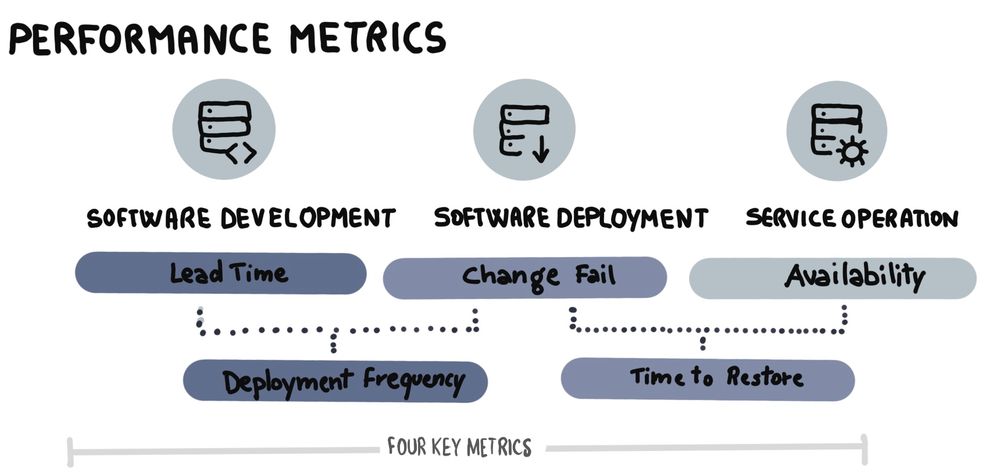<!-- .element: class="image-no-shadow image-full-width " -->

#### Flow Metrics
* **Throughput** — the number of work items finished per unit of time.
* **Work in progress (WIP)** — the number of work items started but not finished. The team can use the WIP metric to provide transparency about their progress towards reducing their WIP and improving their flow.
* **Cycle Time** — the amount of elapsed time between when a work item starts and when a work item finishes.
* **Work Item Age** — the amount of time between when a work item started and the current time. This applies only to items that are still in progress.

### Metric-Based Process Mapping
How To ...

  
 
    <h4 class="fragment fade-out" data-fragment-index="1">Create the swimlanes</h4>
    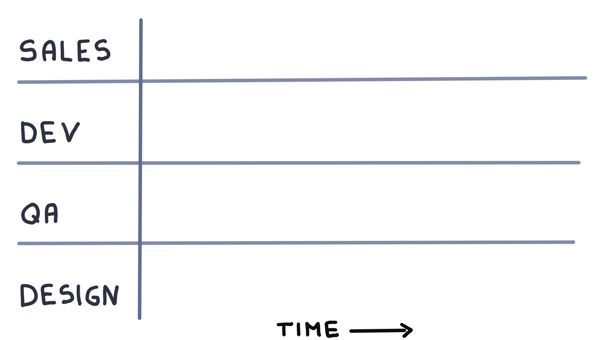
  

  
 
    <h4>Add activities / steps over time</h4>
    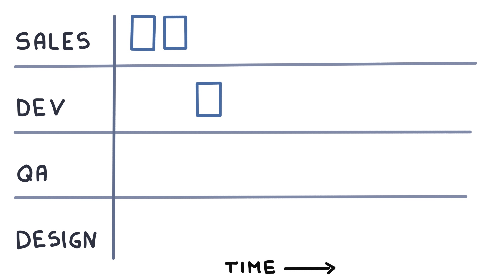
  

  
 
    <h4>Some activities / steps could be in parallel</h4>  
    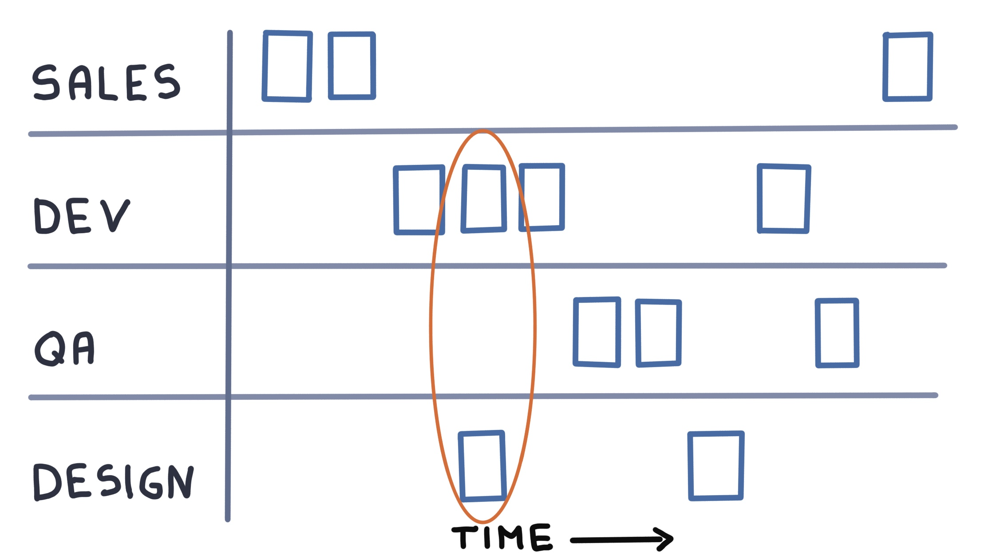
  

### Metric-Based Process Mapping
Document all activities and steps (the things)

  
 
    <h4 class="fragment fade-out" data-fragment-index="1" >The Activity</h4>
    
  

  
 
    <h4>Name the activity and who's involved</h4>
    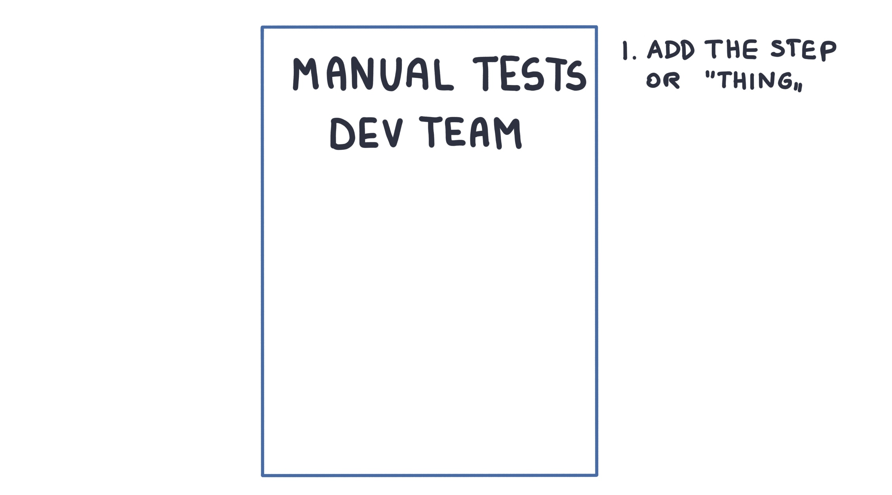
  

  
 
    <h4>Add the number of people</h4>  
    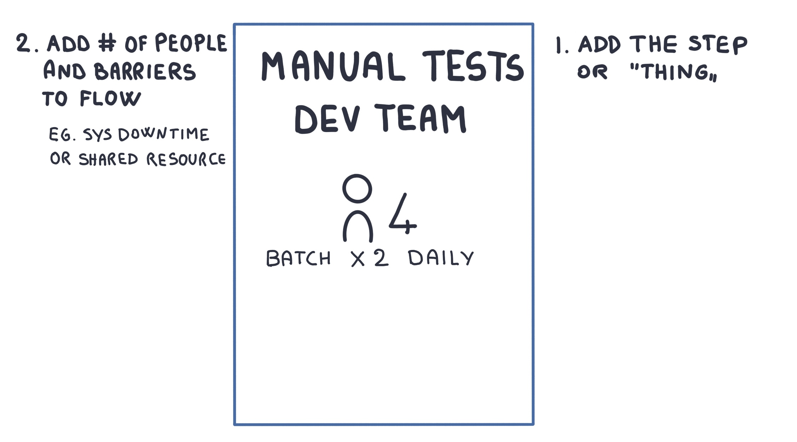
  

  
 
    <h4>Add the accuracy</h4>  
    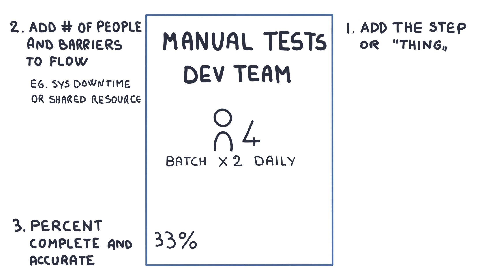
  

  
 
    <h4>Process Time / Lead Time</h4>  
    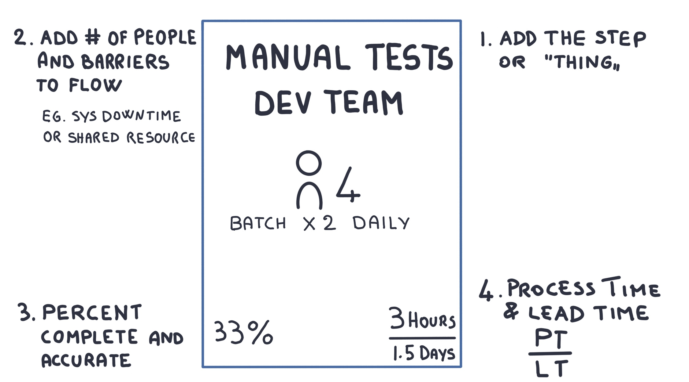
  

  
 
    <h4 class="fragment fade-out" data-fragment-index="1">The time spent doing the activity</h4>
    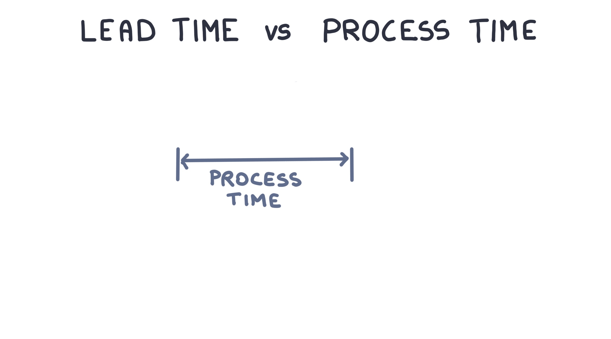
  

  
 
    <h4>Lead Time includes Process Time</h4>
    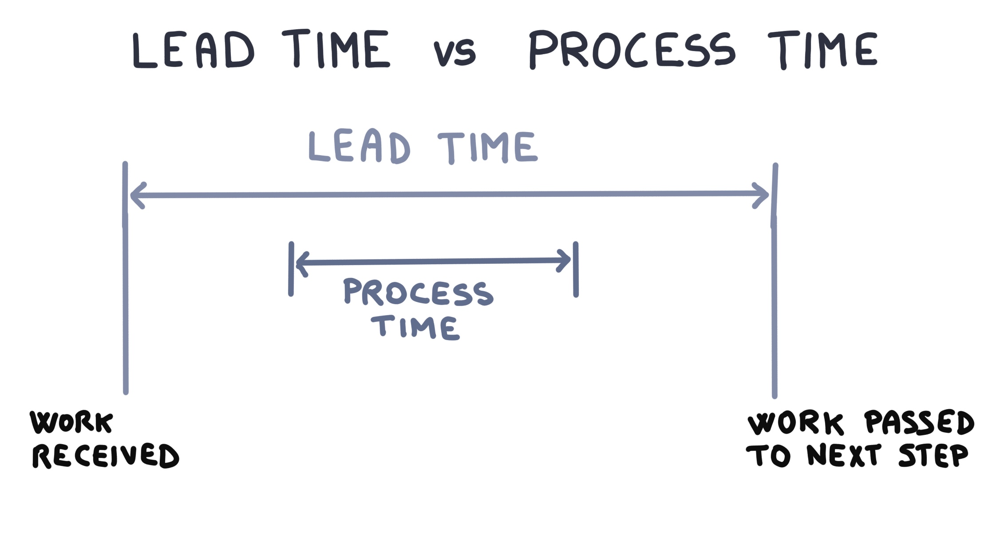
  

  
 
    <h4>Lead Time includes Process Time and all other delays</h4>  
    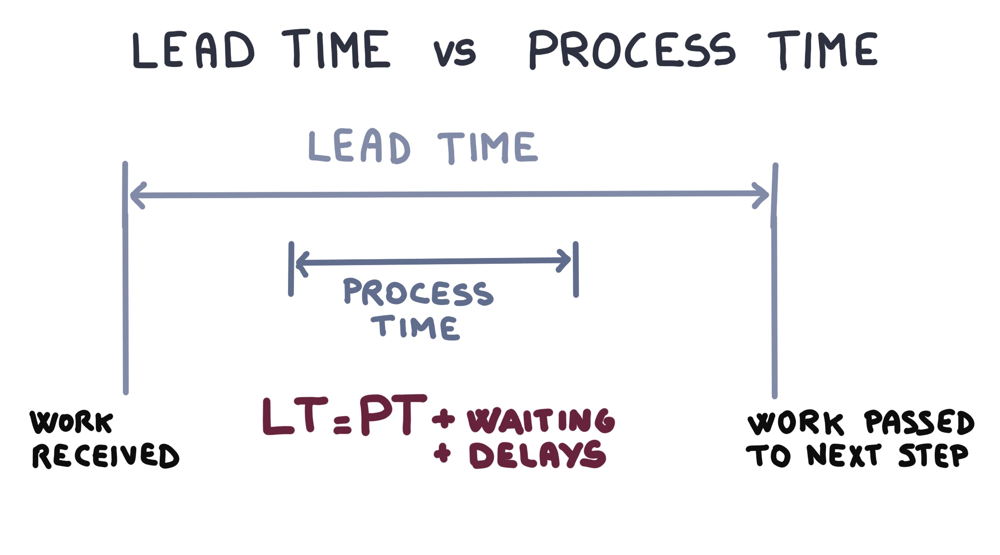
  

#### Define the _Timeline Critical Path_
<!-- .element: class="image-no-shadow image-full-screen" -->

#### Summary of the Steps
1. Label the map and create Swim Lanes.
2. Add time.
3. Add the activities (the steps) to the map (some could be in parallel).
4. Document all the activities (the steps). On each sticky note track the activity:
   * Name the activity and who's involved
   * Add the number of people
   * Add the Accuracy (% complete and accurate)
   * Add process / Lead Time

### What To Do Next?
* Identify hand-offs
* Create summary metrics
* Identify improvement areas
* Validate the improvements with a future state MBPM

### Exercise 
#### As a class
1. Walk through the *as-was* MBPM.

<!-- .slide: data-background-size="contain" data-background-image="images/mbpm/pb-as-was.png", class="white-style" -->

#### In your team
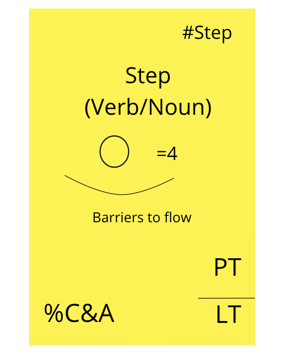 <!-- {.element: class="inline-image"} -->
1. Identify improvements to the steps and whether it's possible to reduce hand-offs or remove any of the existing steps.
2. Document any new activities (the steps). On each sticky note track the activity:
     * Name the activity and who's involved
     * Add the number of people
     * Add the Accuracy (% complete and accurate)
     * Add process / Lead Time

### Real World Examples

<!-- .slide: data-background-size="contain" data-background-image="images/mbpm/mbpm-cars1.png", class="white-style" -->

<!-- .slide: data-background-size="contain" data-background-image="images/mbpm/mbpm-cars2.png", class="white-style" -->

<!-- .slide: data-background-size="contain" data-background-image="images/mbpm/mbpm-cars3.png", class="white-style" -->

<!-- .slide: data-background-size="contain" data-background-image="images/mbpm/metrics-car-co.png", class="white-style" -->

<!-- .slide: data-background-size="contain" data-background-image="images/mbpm/pelorus.png", class="white-style" -->

### Facilitation Tips

* You can map the MBPM steps with the Big Picture flow and improvements for a better visualization of work.
* Use a spreadsheet to calculate numbers for metrics because it's much easier.
* Iterate Iterate Iterate! Start with small teams and compare over and over again.
* If psychological safety is low, postpone gathering the numbers until trust is established.
* Tools with numbers on them can be very intimidating to people.
* Don't be too specific about the numbers, just use them as a gauge. It's not about the seconds, it's bigger than that.

<!-- .slide: data-background-image="images/book-background.jpeg", class="black-style"  data-background-opacity="0.3" -->
### Related & Used Practices

Related practices:

* [Metrics Based Process Mapping](https://openpracticelibrary.com/practice/metrics-based-process-mapping/)
* [Value Stream Mapping](https://openpracticelibrary.com/practice/vsm-and-mbpm/)
* [User Story Mapping & Value Slicing](https://openpracticelibrary.com/practice/user-story-mapping/)
* [Team Topologies](https://teamtopologies.com)
