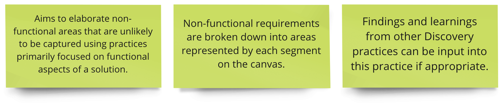
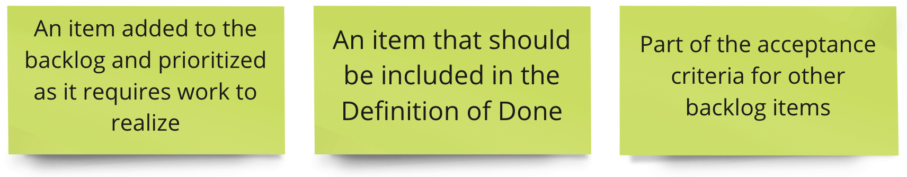
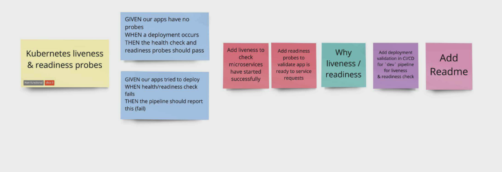

<!-- .slide: data-background-image="images/RH_NewBrand_Background.png" -->
### DevOps Culture and Practice <!-- {.element: class="course-title"} -->
## Non-Functional Requirements Map <!-- {.element: class="title-color"} -->
TL500 <!-- {.element: class="title-color"} -->

  <h2>Open Practice Library</h2>
  

  <h2>NFR Map</h2>
  

##### NFR Map - World Health Organization <!-- .element: class="title-bottom-left" -->
<!-- .slide: data-background-size="contain" data-background-image="images/nfr-map/example-who-nfr-map.png", class="white-style" -->

#### _What is it?_
A tool to capture and articulate the non-functional requirements of a solution that a team is striving to deliver

 

<!-- .element: class="image-no-shadow image-full-width" -->
<!--  
#### _What is it?_
* Aims to elaborate non-functional areas that are unlikely to be captured using practices primarily focused on functional aspects of a solution.
* Non-functional requirements are broken down into areas represented by each segment on the canvas.
* Findings and learnings from other Discovery practices can be input into this practice if appropriate.
-->

#### Why do we use it?
* To gain a shared understanding of the non-functional aspects of a system in a visually structured representation. 

* On completion, you should have a good view on the key non-functional considerations for the solution and the work required to achieve them.
<!--
--->

## How do we do it?
<!-- .slide: data-background-size="contain" data-background-image="https://openpracticelibrary.com/images/non-functional-requirements-map.jpg", class="black-style" -->

#### How do we do it?
1. Ensure that everyone participating is comfortable with the headings and what they mean. <!-- .element: class="fragment" -->
2. For each heading, capture important considerations or requirements for the system or solution on sticky notes. Depending on the number of participants, you could use facilitation techniques such as 1-2-4-all or splitting into smaller groups to capture items. <!-- .element: class="fragment" -->
<!-- .slide: data-background-size="contain" data-background-image="https://openpracticelibrary.com/images/non-functional-requirements-map.jpg", class="black-style" data-background-opacity="0.2"	 -->

#### How do we do it?
<!-- .slide: data-background-size="contain" data-background-image="https://openpracticelibrary.com/images/non-functional-requirements-map.jpg", class="black-style" data-background-opacity="0.2"	 -->
3. For each heading, play back the stickies as a group.  <!-- .element: class="fragment" data-fragment-index="0" -->
<!--TechEdit: "play back" seems an odd action for a sticky note, it's more for a video or recording. If participants are reading the stickies out, say "read out" or "read aloud"; "For each heading, read the sticky notes aloud as a group." This phrasing is used again later so if changed here we should change all.-->
4. During the playback, think about whether each sticky should be:  <!-- .element: class="fragment" data-fragment-index="1" -->

<!-- .element: class="fragment image-no-shadow image-full-width" data-fragment-index="1"-->

#### NFR - World Health Organization <!-- .element: class="title-bottom-left" -->
<!-- .slide: data-background-size="contain" data-background-image="images/nfr-map/example-who-nfr-map.png", class="white-style" -->

### Class Exercise - Setting the Scene

#### Setting the Scene: Pet Battle Industries

Pet Battle Industries have a good handle on the functional design of their applications. Now, let's think of all the _other_ things they need to do to harden their application.

### Create the NFR Map
#### *As a class*

1. Ensure that everyone participating is comfortable with the headings and what they mean by drawing the map on the wall
2. Have a volunteer from each team come forward and pick two headings off the map back.
#### *In your team*
3. For each heading your team has chosen, capture important considerations or requirements for the system or solution and add sticky notes for each item.

# Exercise Wrap Up
#### *As a class*
3. Merge all the map areas together.
4. For each heading, play back the top two or three sticky notes as a group.
5. During the playback, think about whether each sticky would update the DoD / ACs on a story or form an experiment for the sprint.

#### NFR Map - Finance Co <!-- .element: class="title-bottom-left" -->
<!-- .slide: data-background-size="contain" data-background-image="images/nfr-map/nfr-example-2.png", class="white-style" -->

#### NFR Map to Backlog

### Facilitation Tips
As you review items on the map, define if any sticky notes could be:

- Added to the backlog and prioritized because it requires work to realize
- Be included in the Definition of Done
- Be a part of the acceptance criteria for any backlog items

<!-- .slide: data-background-image="images/book-background.jpeg", class="black-style"  data-background-opacity="0.3" -->
### Related & Used Practices
- [Definition of Done](https://openpracticelibrary.com/practice/definition-of-done/)
- [Kanban](https://openpracticelibrary.com/practice/kanban)
- [Product Backlog](https://openpracticelibrary.com/practice/)
- [Big Picture](https://openpracticelibrary.com/practice/big-picture)
- [Priority Matrix](https://openpracticelibrary.com/practice/impact-effort-prioritization-matrix/)
