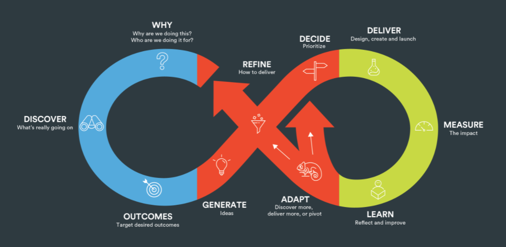
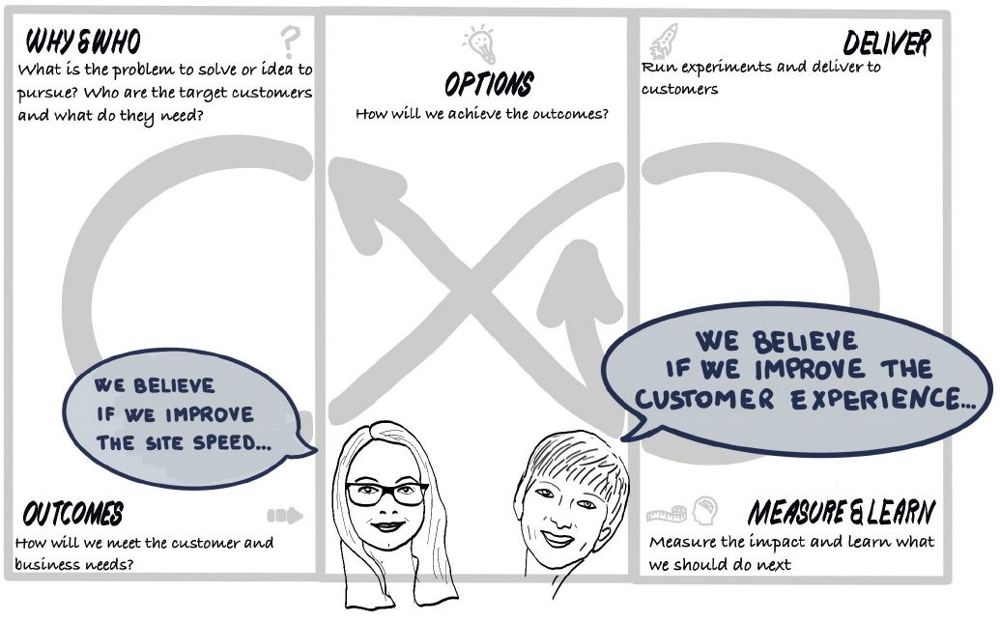

<!-- .slide: data-background-image="images/RH_NewBrand_Background.png" -->
## DevOps Culture and Practice <!-- {.element: class="course-title"} -->
### Open Practice Library <!-- {.element: class="title-color"} -->
TL500 <!-- {.element: class="title-color"} -->

<!-- .slide: data-background-image="images/RH_NewBrand_Background.png" -->
<!-- .slide: data-background-size="stretch" data-background-image="images/opl-logo.png", class="white-style" -->

  <h2>Open Practice Library</h2>
  

<!-- .slide: data-background-size="contain" data-background-image="images/opl/homepage.png" -->

###  <!-- {.element: class="image-no-shadow" style="max-height: 90px"} -->
 

#### _What is it?_
* Open source community-driven repository of practices and tools
* Practices are created by people currently using them on daily basis

#### _What is it not?_
* It is not a methodology or framework. It does not tell you exactly which practice to use when and where
* We will not say there is one right way to do things because it does not exist. Our approach is to adapt based on context, learning, and experience

#### Open Practice Library Core Values
<!-- {.element: class="image-no-shadow image-full-width" } -->

#### Open Practice Library in a Nutshell
<iframe width="600" height="480" src="https://www.youtube.com/embed/N4mBIZg8MnQ" frameborder="0" allow="accelerometer; autoplay; encrypted-media; gyroscope; picture-in-picture" allowfullscreen></iframe>

 <!-- {.element: class="inline-image"} -->
#### _Why use it?_
Practices are created by people currently using them on daily basis for people looking to be inspired with new ideas and experience

#### How do we use it?
The Open Practice Library uses the Mobius loop model on a foundation of Culture and Technology to navigate between an evolving number of open practices<!--{.element: style="font-size: smaller; font-weight: 100;"} -->

It is an iterative process model for rapidly developing digital products<!--{.element: style="font-size: smaller; font-weight: 100;"} -->

[Mobius Loop Site](https://www.mobiusloop.com/)<!--{.element: style="font-size: smaller; font-weight: 100;"} -->

<!-- .slide: data-background-size="contain" data-background-image="images/opl/mobius-canvas.png" -->

#### Tips

Which practices you choose is up to you but, in nearly all cases, we strongly recommend using practices that allow fast delivery, rapid feedback, and continuous learning throughout.<!--{.element: style="font-size: smaller; font-weight: 100;"} -->

<!-- {.element: class="image-no-shadow" } -->

#### Seeking Contributions
Head over to https://openpracticelibrary.com/ and use a practice or contribute your own
