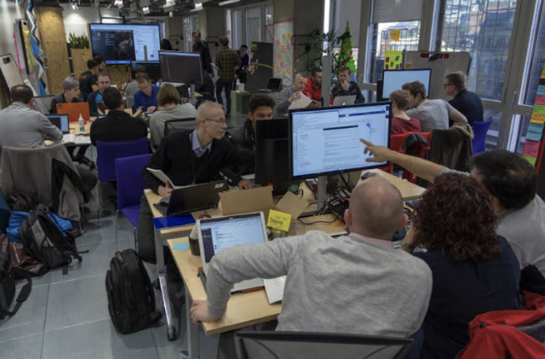
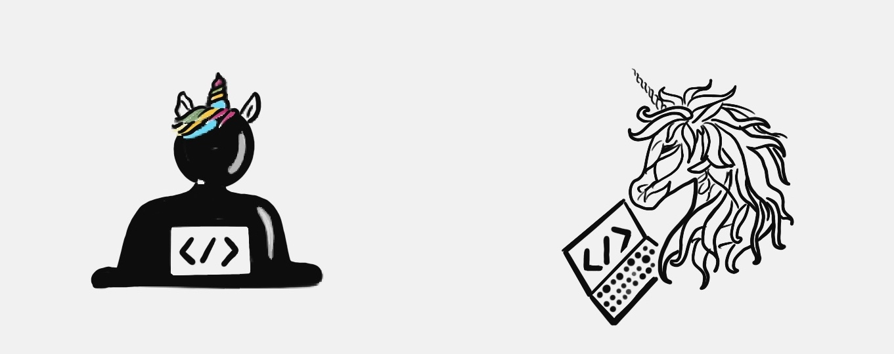

<!-- .slide: data-background-image="images/RH_NewBrand_Background.png" -->
## DevOps Culture and Practice <!-- {.element: class="course-title"} -->
### Pair and Mob Programming <!-- {.element: class="title-color"} -->
TL500 <!-- {.element: class="title-color"} -->

<!-- .slide: data-background-size="stretch" data-background-image="images/opl-logo.png", class="white-style" -->

  <h2>Open Practice Library</h2>
  

  <h2>Pair Programming 👬</h2>
  

  <h2>Mob Programming 👭👫👬</h2>
  

### Mob Programming in Action

### Pair Programming
 <!-- {.element: class="inline-image"} -->
 
 
**Pair programming** is a practice used in e**X**treme **P**rogramming in which
two programmers work together at one computer.

### Mob Programming
 <!-- {.element: class="inline-image"} -->
 
**Mob programming** is a software development approach where the whole team
works on the same thing concurrently, and at the same computer.

##### Why do it?
#### Pair Programming
* Enables knowledge sharing between team members
* Increases the quality of work because it is reviewed and improved simultaneously
* Builds trust between team members
 
 

#### Mob Programming
* Ensures that the whole team understands how a specific feature is implemented or a problem is solved
* Provides a quick way to onboard new team members

##### How do we do it?
#### Pair Programming
* The team member behind the keyboard and mouse is the driver. The driver focuses on performing the actual work.
* The other team member is the navigator or observer. The navigator focuses on the strategic outcome of the work the driver is performing.
* The navigator reviews the driver's work while it is done.
* While reviewing, the navigator focuses on the end goal and ensures the current task is working towards it.
* Switch the roles often, for example, every 15 minutes, so that the team members experience the different aspects of the work.

##### How do we do it?
#### Mob Programming
* Mob programming involves the whole team working on a single piece of functionality simultaneously. The easiest way to mob program is to have one team member driving a laptop that is connected to a large screen or projector.
* The person behind the keyboard and mouse is the driver and the other team members are the navigators. 
* Rotate the roles frequently while working on implementations. If you use this practice for knowledge sharing, then rotation is not necessary.
* Finally, the whole team implements the feature together by talking through the development.

### Class Exercise
⏰🎨👨‍🎨🖼

#### Individual Drawing

1. Everyone grab a small sticky note.
2. Each person grab a different color pen.
3. Draw Steven Tyler on your own sticky note.

#### Pair Drawing

1. Assemble in pairs (or trios if there is an odd number).
2. Each pair grab a medium sticky note.
3. Take turns drawing an element of Steven Tyler.

#### Mob Drawing

1. Assemble in table groups.
2. Each table grab an easel pad.
3. Take turns drawing an element of Steven Tyler.

### Real World Examples

#### WHO - Remote Pair and Mob Programming <!-- .element: class="title-bottom-left" -->
<!-- .slide: data-background-size="contain" data-background-image="images/pair-and-mob-programming/example-who-2.png", class="white-style" -->

#### WHO - Remote Pair and Mob Programming <!-- .element: class="title-bottom-left" -->
<!-- .slide: data-background-size="contain" data-background-image="images/pair-and-mob-programming/pair-and-mob-1.png", class="white-style" -->

### A Day of Mob Programming
<iframe width="1200" height="900" src="https://www.youtube.com/embed/dVqUcNKVbYg" frameborder="0" allow="accelerometer; autoplay; encrypted-media; gyroscope" allowfullscreen></iframe>

##### Key Takeaways
- **Mentoring of team members:** Sharing tips and tricks or shortcuts can widen both pairs' skill depth. This sharing can also bring junior associates up to speed very rapidly.
- **Half the code:** Two minds working on the same problem makes for more efficiently written code, so less spaghetti.
- **No pull requests:** Code is reviewed as it's written, avoiding superficial reviews. The temptation to cut corners is reduced when pairing because someone is watching.
- **Team bonding:** Pair and mob programming facilitates interactions. Instead of sitting in a room with headphones on, ignoring the world around, developers in pairs or mobs look engaged and happier. Happy coders lead to better code.

##### Key Takeaways
- **The knowledge stays in the team:**  When holidays or flu season take over, the team can still continue to work at pace knowing the Unicorn is not leaving with key information.
 

<!-- {.element: class="image-no-shadow"} -->

<!-- .slide: data-background-image="images/book-background.jpeg", class="black-style"  data-background-opacity="0.3" -->
### Related & Used Practices
- [Pair Programming](https://openpracticelibrary.com/practice/pair-programming/)
- [Mob Programming](https://openpracticelibrary.com/practice/mob-programming/)
