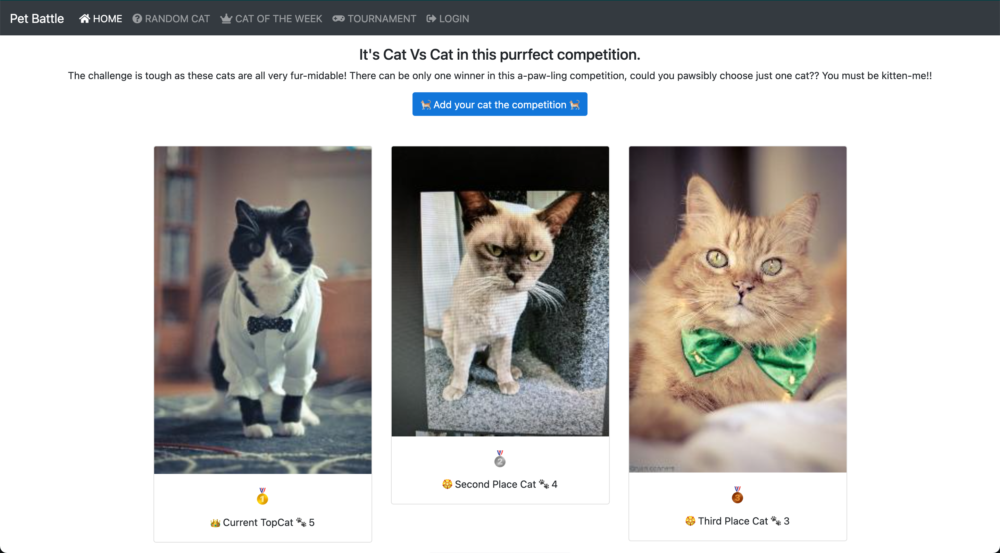
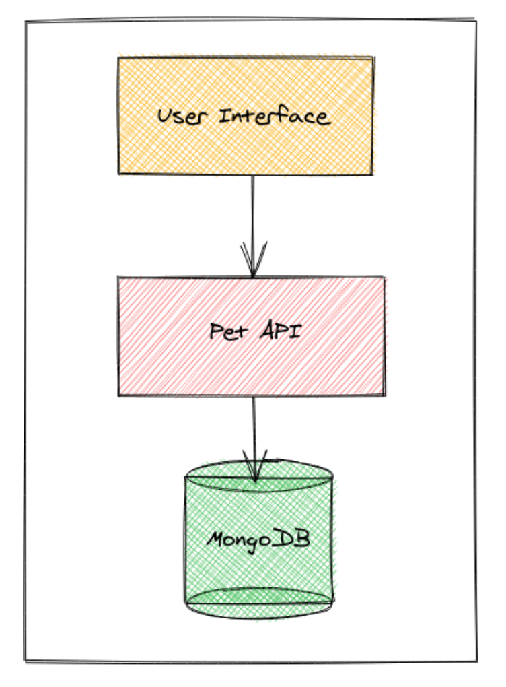
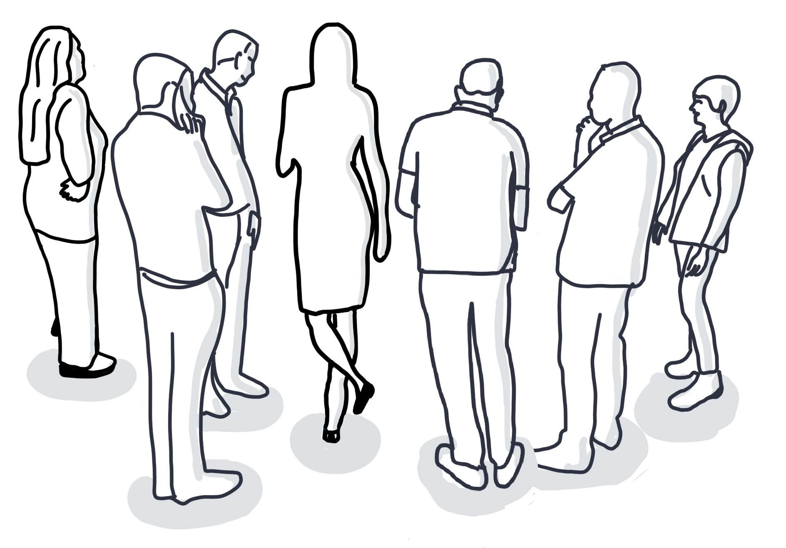

<!-- .slide: data-background-image="images/RH_NewBrand_Background.png"  -->
## DevOps Culture and Practice <!-- {.element: class="course-title"} -->
### Pet Battle <!-- {.element: class="title-color"} -->
TL500 <!-- {.element: class="title-color"} -->

#### The Backstory 
Pet Battle is a silly app a few friends threw together as a hobby one weekend to learn some new tech and share the game with their families.

It's a simple web app where users can upload and vote on the _Best In Show_ cat for the week
 <!-- .element: class="image-no-shadow image-full-width"-->

There are very few bells and whistles to the initial architecture. It has a simple web-based user interface and an API layer with a NoSQL database.<!--{.element: style="font-size: smaller; font-weight: 100;"} -->

 <!-- {.element: class="" style="height:550px"} -->

#### One day this happened ...
One day, there was a drastic increase in the number of players!

The Pet Battle server crashed, not able to scale and malicious pictures of not cats start appearing on the child-friendly application 😱

#### Because...

#### And then this happened ...
With no alerting, monitoring or automation in place it took the hobbyists a few days to diagnose what went wrong and how to fix it ...

This surge in popularity has lead the creators of Pet Battle app to give up their day jobs and try to make money from Pet Battle... 

#### Pet Battle Industries is born
Pet Battle became a hit! And as a team, you decided to develop a business and a production-ready version of this hobbyist app!

And here your journey of embracing *_DevOps Culture and Practices_* begins! 
<iframe src="https://giphy.com/embed/HVr4gFHYIqeti" width="480" height="192" frameBorder="0" class="giphy-embed" allowFullScreen></iframe>

### ⚔️ Let the Battle Begin ⚔️  
Show, Not Tell - Open up the Pet Battle app and explore

### What are we going to do for the next five days?

###
<!-- .slide: data-background-size="contain" data-background-image="images/pet-battle-lightning-talk/spoiler-alert.png", class="white-style" -->

#### Let's have sneak peak of your Pet Battle Industries journey
<!-- {.element: class="image-no-shadow" style="max-height: 450px"} -->

This is going to feel overwhelming, but we're going to give you a trailer of the week in 7 mins or less
🍿🎞

#### Together we will establish a foundation of collaboration and culture to support our continuous journey

###
<!-- .slide: data-background-size="contain" data-background-image="images/pet-battle-lightning-talk/pb-social-contract.png", class="white-style" -->

###
<!-- .slide: data-background-size="contain" data-background-image="images/pet-battle-lightning-talk/pb-priority-sliders.png", class="white-style" -->

###
<!-- .slide: data-background-size="contain" data-background-image="images/pet-battle-lightning-talk/pb-mob-pair-prog.png", class="white-style" -->

###
<!-- .slide: data-background-size="contain" data-background-image="images/pet-battle-lightning-talk/pb-retro.png", class="white-style" -->

#### Together we will create a foundation of technology to support our continuous journey

###
<!-- .slide: data-background-size="contain" data-background-image="images/pet-battle-lightning-talk/pb-platforms.png", class="white-style" -->

###
<!-- .slide: data-background-size="contain" data-background-image="images/pet-battle-lightning-talk/pb-gitops.png", class="white-style" -->

###
<!-- .slide: data-background-size="contain" data-background-image="images/pet-battle-lightning-talk/pb-cicd.png", class="white-style" -->

###
<!-- .slide: data-background-size="contain" data-background-image="images/pet-battle-lightning-talk/pb-big-picture.png", class="white-style" -->

#### Together we will discover all the work that needs to be done

###
<!-- .slide: data-background-size="contain" data-background-image="images/pet-battle-lightning-talk/pb-impact-map.png", class="white-style" -->

###
<!-- .slide: data-background-size="contain" data-background-image="images/pet-battle-lightning-talk/pb-target-outcomes.png", class="white-style" -->

###
<!-- .slide: data-background-size="contain" data-background-image="images/pet-battle-lightning-talk/pb-es.png", class="white-style" -->

###
<!-- .slide: data-background-size="contain" data-background-image="images/pet-battle-lightning-talk/pb-mbpm.png", class="white-style" -->

###
<!-- .slide: data-background-size="contain" data-background-image="images/pet-battle-lightning-talk/pb-nfr-map.png", class="white-style" -->

#### Together we will prioritize and decide what to do next

###
<!-- .slide: data-background-size="contain" data-background-image="images/pet-battle-lightning-talk/pb-user-story-map.png", class="white-style" -->

###
<!-- .slide: data-background-size="contain" data-background-image="images/pet-battle-lightning-talk/pb-value-slice.png", class="white-style" -->

###
<!-- .slide: data-background-size="contain" data-background-image="images/pet-battle-lightning-talk/pb-backlog.png", class="white-style" -->

#### Together we will deliver and measure the most important work

###
<!-- .slide: data-background-size="contain" data-background-image="images/pet-battle-lightning-talk/pb-ready.png", class="white-style" -->

###
<!-- .slide: data-background-size="contain" data-background-image="images/pet-battle-lightning-talk/pb-done.png", class="white-style" -->

###
<!-- .slide: data-background-size="contain" data-background-image="images/pet-battle-lightning-talk/pb-scrum.png", class="white-style" -->

#### Together we will have **FUN***! 🥳🥳
  
<iframe src="https://giphy.com/embed/Oz0dBXqaOmIO4" width="480" height="480" frameBorder="0" class="giphy-embed" allowFullScreen></iframe>

*all employees are contractually obliged to have fun even if they're not <!--{.element: style="font-size: 5px; font-weight: 100;"} -->

### PetBattle Complete Journey

###
<!-- .slide: data-background-size="contain" data-background-image="images/pet-battle-lightning-talk/journey1.png", class="white-style" -->

###
<!-- .slide: data-background-size="contain" data-background-image="images/pet-battle-lightning-talk/journey2.png", class="white-style" -->

###
<!-- .slide: data-background-size="contain" data-background-image="images/pet-battle-lightning-talk/journey3.png", class="white-style" -->

###
<!-- .slide: data-background-size="contain" data-background-image="images/pet-battle-lightning-talk/journey4.png", class="white-style" -->

###
<!-- .slide: data-background-size="contain" data-background-image="images/pet-battle-lightning-talk/journey5.png", class="white-style" -->

###
<!-- .slide: data-background-size="contain" data-background-image="images/pet-battle-lightning-talk/journey6.png", class="white-style" -->

###
<!-- .slide: data-background-size="contain" data-background-image="images/pet-battle-lightning-talk/journey7.png", class="white-style" -->

###
<!-- .slide: data-background-size="contain" data-background-image="images/pet-battle-lightning-talk/journey8.png", class="white-style" -->

###
<!-- .slide: data-background-size="contain" data-background-image="images/pet-battle-lightning-talk/journey9.png", class="white-style" -->

###
<!-- .slide: data-background-size="contain" data-background-image="images/pet-battle-lightning-talk/journey-complete.png", class="white-style" -->
