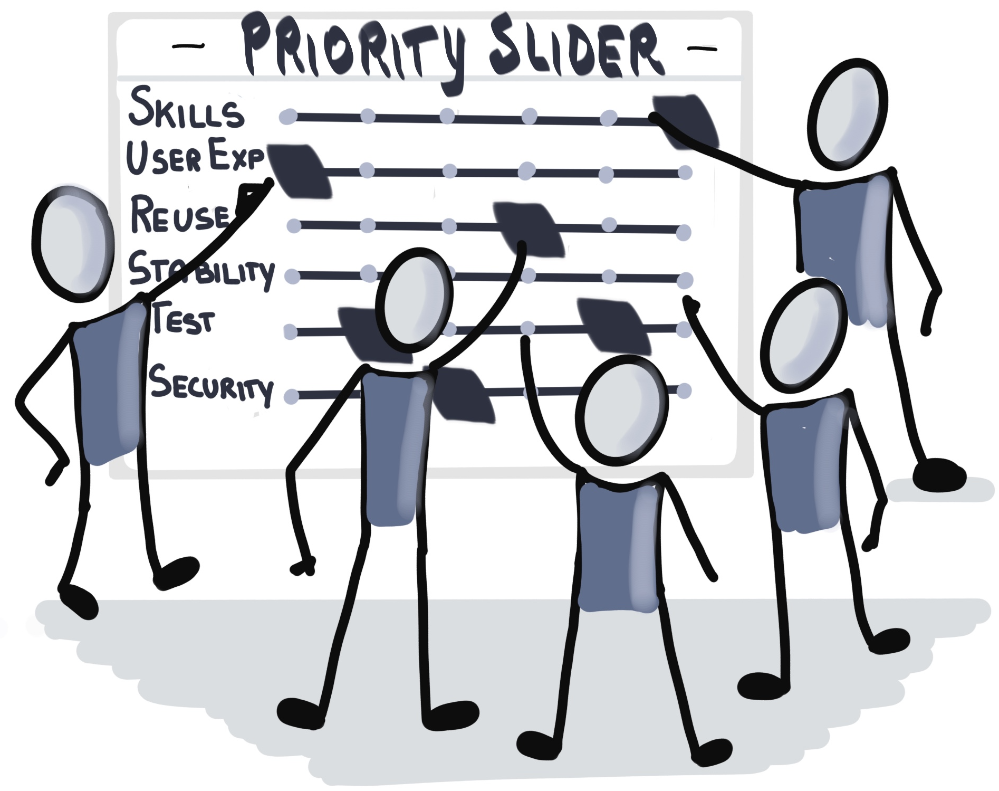
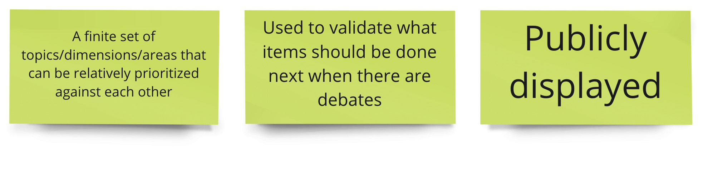
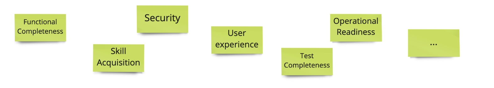
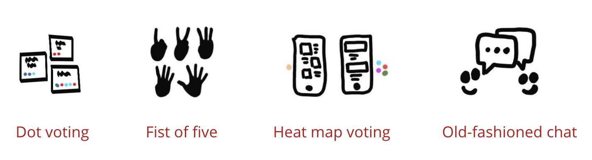

<!-- .slide: data-background-image="images/RH_NewBrand_Background.png" -->
## DevOps Culture and Practice <!-- {.element: class="course-title"} -->
### Priority Sliders (Trade Off Sliders)<!-- {.element: class="title-color"} -->
TL500 <!-- {.element: class="title-color"} -->

<!-- .slide: data-background-size="stretch" data-background-image="images/opl-logo.png", class="white-style" -->

  <h2>Open Practice Library</h2>
  

  <h2>Priority Sliders</h2>
  

  <h2>Priority Sliders</h2>
  

#### <!-- .element: class="title-bottom-left" -->
<!-- .slide: data-background-size="contain" data-background-image="images/priority-sliders/example-who.png", class="white-style" -->

#### <!-- .element: class="title-bottom-left" -->
<!-- .slide: data-background-size="contain" data-background-image="images/priority-sliders/example-priority-sliders.jpg", class="white-style" -->

#### _What is it?_
_Priority Sliders are a visual tool for helping teams to agree about which work items are the most important by trading one item against another using a scale from <strong>least</strong> to <strong>most</strong> important._

 <!-- .element: style="max-width: 60%;" -->

### Effective Priority Sliders

<!-- .element: class="image-no-shadow image-full-width" -->
<!-- 
- Used to validate which items should be completed next when there is debate
- Publicly displayed
- A finite set of topics/dimensions/areas that can be relatively prioritized against each other
-->

### Why use Priority Sliders?
_A practice that increases the autonomy of teams_
- Enables alignment and consensus about areas of focus
- Drives agreement, which is key because projects often involve trade-offs.
- Provides clarifications of motivations and desires across stakeholder groups 
- Useful as a filtering mechanism for later prioritization and for decision-making

### How do we do it?
<!-- .slide: data-background-size="contain" data-background-image="images/priority-sliders/blank-sliders.png", data-background-opacity="1" -->

### How do we do it?
1. In a small area on a whiteboard, brainstorm around key topics of focus for your engagement. For example: <!-- .element: class="fragment" -->
<!-- .element: class="image-no-shadow image-full-width" -->
2. Introduce the priority sliders canvas by explaining the grid. Place the topics at the head of each row. <!-- .element: class="fragment" -->
<!-- .slide: data-background-size="contain" data-background-image="images/priority-sliders/blank-sliders.png", data-background-opacity="0.2" -->

### How do we do it?
3. Individually, each person writes down the number that they would assign each header based on where they would place it on the scale (~5 min). After time is up, everyone puts their stickies on the canvas <!-- .element: class="fragment" -->
4. Consider each heading (one-by-one) and review as a team while having a discussion about alignment. Slide the priorities left to right and drive toward an agreement. There can be no two headings with the same priority! <!-- .element: class="fragment" -->
<!-- .slide: data-background-size="contain" data-background-image="images/priority-sliders/blank-sliders.png", data-background-opacity="0.1" -->

### Exercise - Priority Sliders
In this exercise you will create a priority slider canvas for Pet Battle.
#### *In your team*
1. Choose roles for the team members to role play (1 min): 
   * Head of Architecture
   * Head of Security
   * Head of Business
   * Everyone else is a cross-functional team member

### Exercise - Priority Sliders
#### *In your team*
2. Define the topics (*max of five*) that are relevant for the Pet Battle use case and place those topics in the row headings.
3. Individually write down the priority number for each heading
4. Try to come to consensus by sliding the priorities against one another.

# Exercise Wrap Up
Q & A / Feedback

How did you reach consensus?
<!-- .element: class="image-no-shadow image-full-width" -->

#### Facilitation Tips
* Topics are not product features but product area or team-building topics.
* Bring priority slider artifacts to sprint planning to use when prioritizing items in the backlog.
* The Customer team defines the priorities.
* Prioritization is not static. Although the work we are doing takes us towards one priority, things can change. Treat this as a dynamic artifact.

<!-- .slide: data-background-image="images/book-background.jpeg", class="black-style"  data-background-opacity="0.3" -->
### Related & Used Practices
- [Priority Sliders](https://openpracticelibrary.com/practice/priority-sliders/)
- [Voting](https://openpracticelibrary.com/practice/) - eg Dot Voting, Heat Map, etc
- Any other prioritization tools eg Impact / Effort Matrix
- [Sprint Planning](https://openpracticelibrary.com/practice/iteration-planning) - this practice provides a useful input in the depth of task writing and definition
