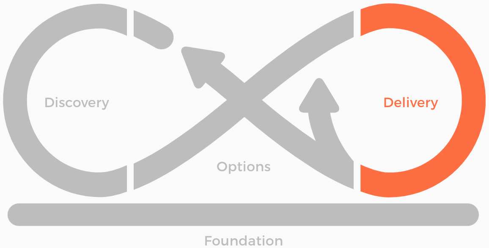
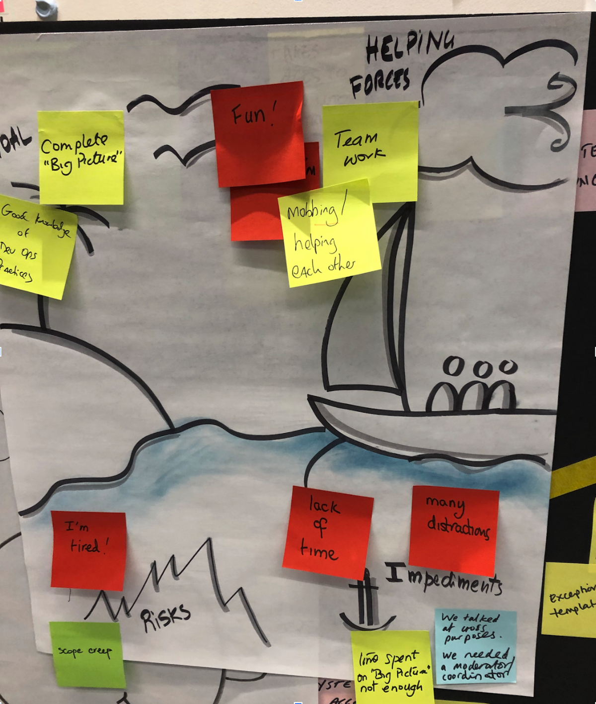
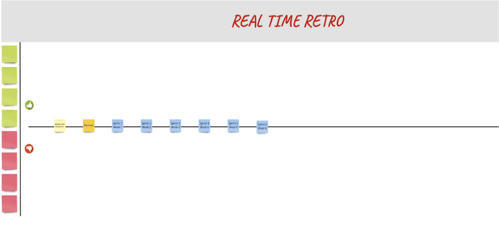
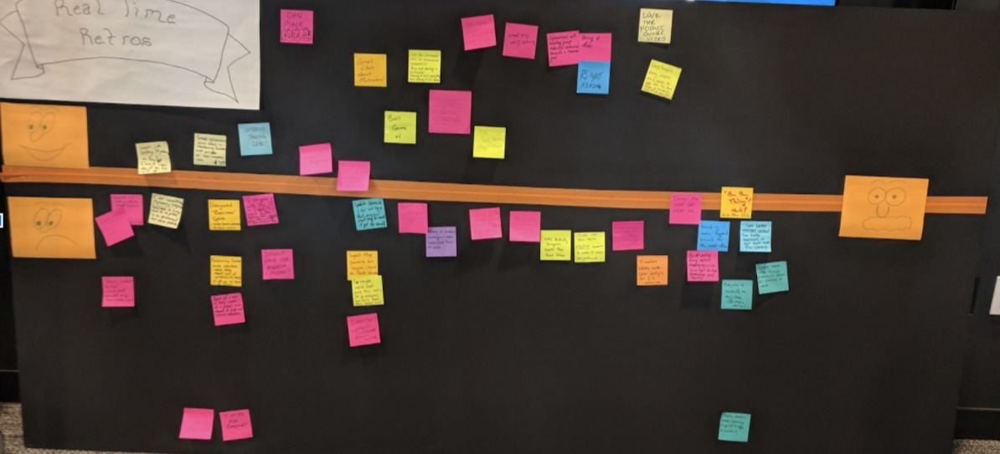
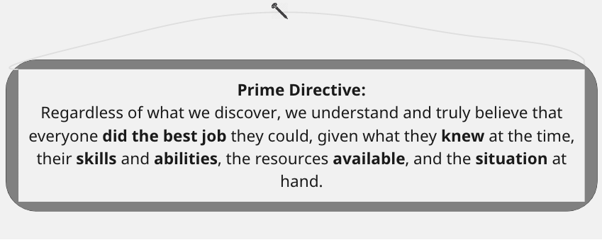
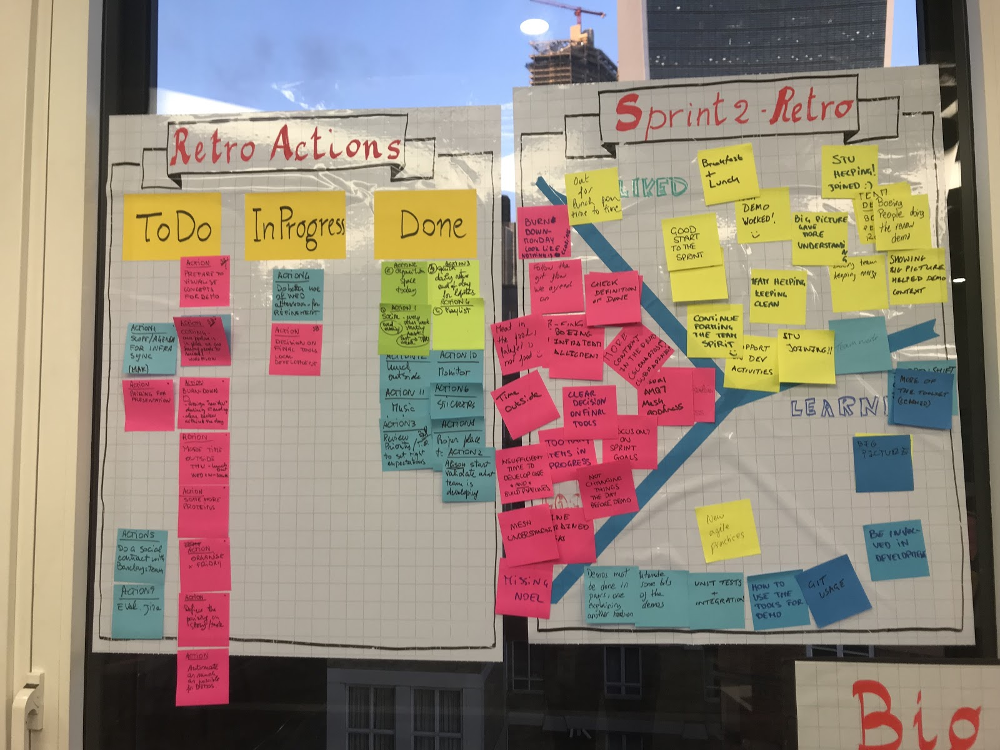
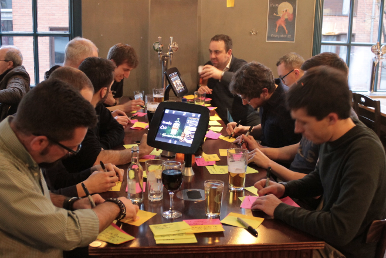
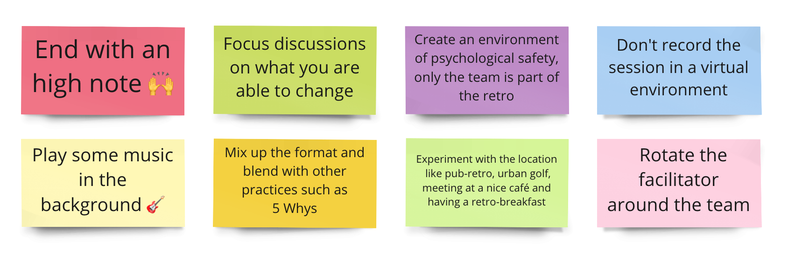

<!-- .slide: data-background-image="images/RH_NewBrand_Background.png"  -->
## DevOps Culture and Practice <!-- {.element: class="course-title"} -->
### Retrospectives <!-- {.element: class="title-color"} -->
TL500 <!-- {.element: class="title-color"} -->

<!-- .slide: data-background-size="stretch" data-background-image="images/opl-logo.png", class="white-style" -->

  <h2>Open Practice Library</h2>
  

  <h2>Retrospectives</h2>
  

  <h2>Realtime Retrospective</h2>
  

#### Example - WHO<!-- .element: class="title-bottom-left" -->
<!-- .slide: data-background-size="contain" data-background-image="images/retrospectives/example-who.png", class="white-style" -->

#### Example - WHO<!-- .element: class="title-bottom-left" -->
<!-- .slide: data-background-size="contain" data-background-image="images/retrospectives/example-who-2.png", class="white-style" -->

### Retrospectives

#### _What is it?_

Retrospectives are a practice used by teams to **reflect** on their way of working and **continuously become better** at what they do. Retrospectives help teams **keep improving.**

"At regular intervals, the team reflects on how to become more effective, then tunes and adjusts its behavior accordingly." <!--{.element: style="font-size: smaller; font-weight: 100;"} -->
  
_- 12th Principle of the Agile Manifesto_

### Retrospectives
 <!-- {.element: class="inline-image"} -->
 
* Creates the foundation and culture of collaboration
* Helps the team identify some issues to continuously improve
* Provides a great opportunity for the group to inspect and adapt to changes, potentially adding new ideas or improvements
* Occurs at the end of a sprint most often, but can be scheduled at any time

### Realtime Retrospectives

### Realtime Retrospectives
<!-- {.element: class="inline-image"} -->
* Enables faster, more accurate, and more direct feedback from everyone involved.
* Has a more continuous and "always on" self-service approach to capturing feedback
* Provides a simple, visual tool for anyone to add retrospective feedback on any item at any time, both positive and negative

#### _Why use it?_
Retrospectives improve:
- **Productivity** - _helping teams to assess their situation and reduce waste_
- **Capability** - _sharing knowledge and setting goals for other team members to learn_
- **Quality** - _writing better code means less rework and fewer bugs_
- **Capacity** - _determining optimal solutions for choosing features that add value_
- **Camaraderie** - _providing a constructive environment for a good team dynamic_
- **Team Data** - _capturing measure-and-learn data from incremental delivery_
- **Visualisation** - _enabling a cycle of inspection and adaptation for understanding team sentiment, feedback, and ideas for improvements_

#### _Why use it?_
Realtime Retros are particularly useful because you don't want to learn feedback at the end of the week/project/workshop (or even the end of one of the days) that a simple improvement or resolution could have been applied much earlier.<!--{.element: style="font-size: smaller; font-weight: 100;"} -->

<!-- {.element: class="" style="border:none; box-shadow:none; max-width:40%;" } -->

For long running days or weeks with multiple sessions or activities, you can visibly see people's moods or grasp the information in real time.<!--{.element: style="font-size: smaller; font-weight: 100;"} -->

And most importantly, you can respond to the feedback sooner!

#### _Retrospective Anti-Patterns_
 <!-- {.element: class="inline-image"} -->
  
**Teams do not have them**

_so they never improve_

OR  

**Teams have them**

_But they are done poorly and teams do not follow up on identified items_

#### The Retrospective Prime Directive

 <!-- {.element: class="image-no-shadow image-full-width"} -->

~ Norm Kerth, Project Retrospectives: A Handbook for Team Review 

### Retrospectives
#### _Guidelines_
* Choose the format of the retrospective session before the session, make ground rules visible, and ensure everyone understands them.
* Update the previous retrospective backlog.
* Dedicate time to think and write feedback individually; start by allowing a few minutes for everyone to silently write down their feedback.
* Share as a team and group by affinity, leaving time for comments and questions.
* Agree on the corrective actions that come out of the Retrospective, prioritize them, and agree on owners to take them forward.

#### Real World Examples

<!-- {.element: class="" style="border:none; box-shadow:none; height:300px; float:right;"} -->
<!-- {.element: class="" style="border:none; box-shadow:none; height:300px; float:left;"} -->

#### Popular Formats <!-- .element: class="text-center" -->
<!-- .slide: data-background-size="contain" data-background-image="images/retrospectives/popular-formats.png", class="white-style" -->

### Retrospectives
#### _The Retrospective Safety Check_

- Ask participants to choose a number between 1 and 5 that indicates how safe they feel within the group.
  - 5 - *No Problem, I’ll talk about anything.*
  - 1 - *I’ll smile and be calm, pretend that everything is great, and agree with the managers.*
- The numbers should be gathered anonymously.
- Acknowledge the result and decide what comes next.

### Exercise - Daily Retrospective
Reflect on the first day of class and make adjustments to continuously improve.

#### Facilitation Tips
 <!-- {.element: class="image-no-shadow image-full-width"} -->
<!-- * End with an high note
* Focus discussions on what you are able to change
* Create an environment of psychological safety, only the team is part of the retro
* Don't record the session in a virtual environment
* Play some music in the background
* Mix up the format
* Experiment with the location  like pub-retro, urban golf, meeting at a nice café and having a retro-breakfast
* Rotate the facilitator around the team -->

<!-- .slide: data-background-image="images/book-background.jpeg", class="black-style"  data-background-opacity="0.3" -->
### Related & Used Practices
* [Retrospectives](https://openpracticelibrary.com/practice/retrospectives/)
* [Realtime Retrospective](https://openpracticelibrary.com/practice/realtime-retrospective/)
* [Social Contract](https://openpracticelibrary.com/practice/social-contract)
* [Backlog](https://openpracticelibrary.com/practice/)