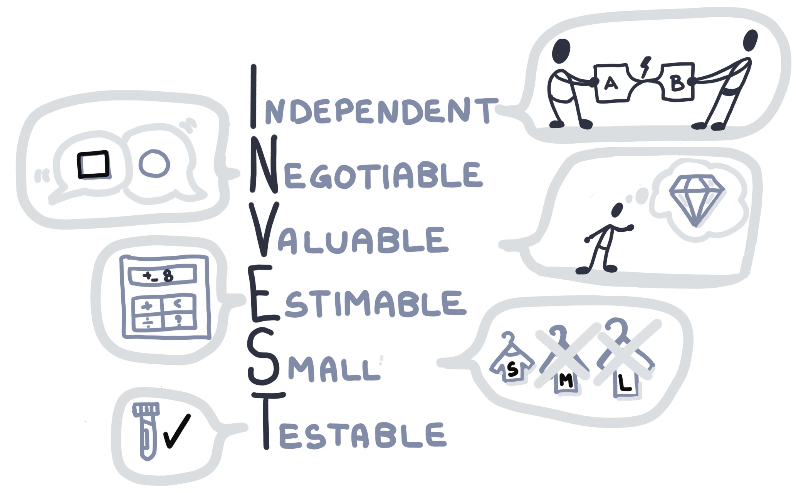

<!-- .slide: data-background-image="images/RH_NewBrand_Background.png" -->
## DevOps Culture and Practice <!-- {.element: class="course-title"} -->
### Scrum <!-- {.element: class="title-color"} -->
TL500 <!-- {.element: class="title-color"} -->

  <h2>Open Practice Library</h2>
  

  <h2>🤼 Scrum 🏉</h2>
  

##### Example - WHO<!-- .element: class="title-bottom-left" -->
<!-- .slide: data-background-size="contain" data-background-image="images/scrum/who-scrum.png", class="white-style" -->

#### _What is it?_
When you hear someone say that they are now doing agile, their team is using agile, or their organization has adopted agile, there's a very strong chance that what they are actually doing is some form of Scrum.

#### Scrum is not the same as agile. 
Agile is an ideology. It is underpinned by those values and principles set out in the Agile Manifesto. Scrum is one of several frameworks that instantiates Agile and makes the principles a reality through a group of practices. It is also, by far, the most popular Agile framework.

#### Being Vs Doing Agile <!-- .element: class="title-bottom-left" -->
<!-- .slide: data-background-size="contain" data-background-image="images/scrum/being-vs-doing.png", class="white-style" -->

### Origins of Scrum
 <!-- {.element: class="inline-image"} -->
* Rugby term: used to restart play
* 1986 Hirotaka Takeuchi and Ikujiro Nonaka published [The New New Product Development Game](https://hbr.org/1986/01/the-new-new-product-development-game)
* 1990 Jeff Sutherland and Ken Schwaber used scrum for software development

<!-- .element: class="image-no-shadow image-full-width " -->

#### _Why use it?_
Because of its simplicity! 
Often people confuse the many (now hundreds) of practices associated with Agile as being Scrum. In fact, Scrum has very few practices. We tend to describe them as 3-5-3 (which sounds a bit like a formation for a sports team!). 

### The 3-5-3 Formation 
_The 3-5-3 formation represents 3 roles, 5 events (previously known as ceremonies), and 3 artifacts._

#### 3 Key Roles in Scrum
* **Product Owner** - Conveys the message of envisioned product and sets priorities for team
* **Scrum Master** - Coaches team on Scrum process and helps iterate towards a productive environment
* **Development Team Members** - Self-organize to transform backlog items into a potentially releasable product increment

#### 5 Events in Scrum
| Scrum Event | Purpose |
| --- | --- |
| **Sprint Planning** | Commit to a set of defined work as a team for the upcoming sprint cycle. The end result is the Sprint Backlog. |
| **Daily Standup** | Daily sync to share common understanding of the goals, coordinate the team effort, report on progress of work, and to communicate problems and improvements. |
| **Sprint Review** | Review what was completed during the sprint with all relevant stakeholders to collect feedback. |
| **Sprint Retrospective** | Help teams reflect on their internal team process with the goal to continuously improve. |
| **Sprint** | A time boxed event that brings the team towards the goal set for that iteration and ends with reviewing the product increment. |

#### 3 Key Artifacts in Scrum
* **Product Backlog** - Set of all baseline requirements prioritized for the team
* **Sprint Backlog** - Subset of the Product Backlog the team agreed to pull into the Sprint to work on
* **Product Increment** - The most important artifact that is produced at the end of each Sprint

#### _How can it be used?_
<!-- {.element: class="" style="border:none; box-shadow:none; max-width:30%; float:right;" } -->
1) Follow the **INVEST** guidelines for good user stories
2) Individually capture, using stickies everything you do in the process you are mapping and add all activities to the story map. Visualise everything
3) Identify and remove duplicates
4) Cluster similar activities and capture a theme title
5) Slice out high value to form incremental release strategy. Filter and maintain focus on delivering valuable outcomes

<!-- .element: class="image-no-shadow image-full-width " -->

### Exercise - The Ball Game (Setup)

#### In Your Groups
1. Draw a table with two columns and three rows.
2. Record your estimate for an iteration.
3. Pass the balls for one minute.
4. Record the actual score.
5. Reflect on your group strategy.

### Exercise - The Ball Game 
#### Rules
1. Pass as many ping pong balls through all the team members.
2. There must be "air time" between each pass.
3. You cannot use any artificial containers.
4. If you drop a ball, you lose a point.

### Real World Examples 

#### Scrum Board - Pet Battle

### Facilitation Tips
* A single slice doesn't mean in scope and out of scope
* Same slice size doesn't mean each slice is the goal of a sprint
* If possible add target outcomes as grouping for the Value slice, it gives the benefit to be linked to business goals

<!-- .slide: data-background-image="images/chef-background.png", class="white-style" -->
### Related & Used Practices
- [Sprint Planning](https://openpracticelibrary.com/practice/iteration-planning/)
- [Daily Scrum (often known as the Daily Stand-Up)](https://openpracticelibrary.com/practice/daily-standup/)
- [Sprint Review (sometimes called the Showcase)](https://openpracticelibrary.com/practice/showcase/)
- [Sprint Retrospectives](https://openpracticelibrary.com/practice/retrospectives/)
- [Sprint itself as a fixed time-box container](https://openpracticelibrary.com/practice/)
- [Product Backlog Refinement](https://openpracticelibrary.com/practice/backlog-refinement)
- [Definition of Ready](https://openpracticelibrary.com/practice/definition-of-ready/)
- [Definition of Done](https://openpracticelibrary.com/practice/definition-of-done)
- [Burndown](https://openpracticelibrary.com/practice/burndown/)
- [Burnup](https://openpracticelibrary.com/practice/)
- [User Stories](https://openpracticelibrary.com/practice/user-story-mapping)
- [Story Points](https://openpracticelibrary.com/practice/)
- [Confidence voting](https://openpracticelibrary.com/practice/confidence-voting)