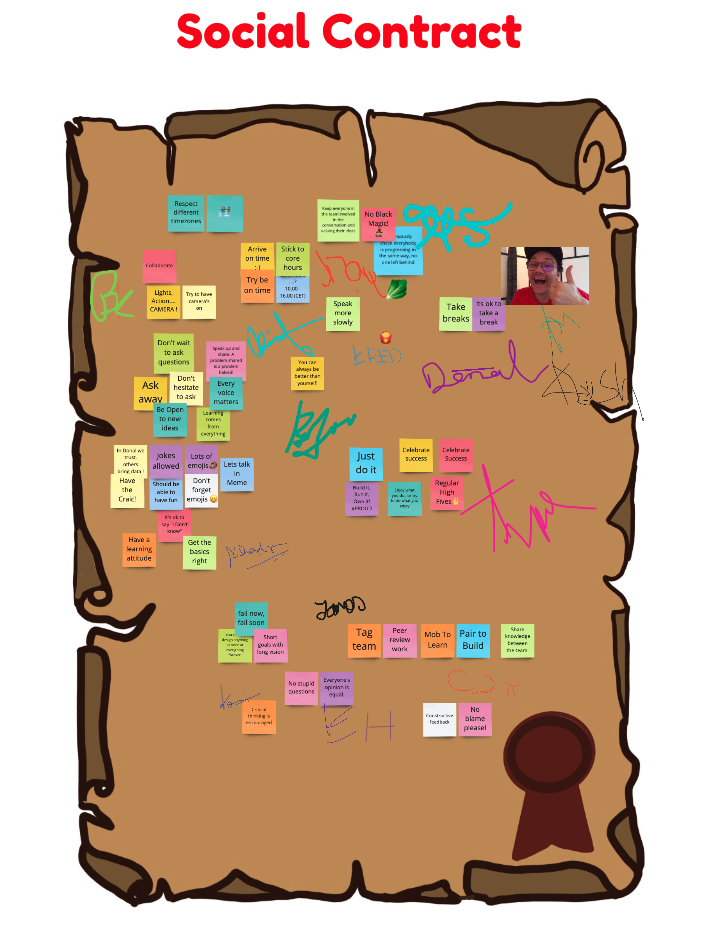

<!-- .slide: data-background-image="images/RH_NewBrand_Background.png" -->
## DevOps Culture and Practice <!-- {.element: class="course-title"} -->
### Social Contracts <!-- {.element: class="title-color"} -->
TL500 <!-- {.element: class="title-color"} -->

<!-- .slide: data-background-size="stretch" data-background-image="images/opl-logo.png", class="white-style" -->

  <h2>Open Practice Library</h2>
  

  <h2>Social Contracts📜</h2>
  

<!--.slide: id="social-contract" -->
##### Real Life Example <!-- .element: class="title-bottom-left" -->
<!-- .slide: data-background-size="contain" data-background-image="images/social-contracts/example-1.png", class="white-style" -->

#### What is Team Identity?
* Shared bond and hared purpose
* Critical for team's success
* Creates culture
* Enables psychological safety
* Converts groups of individuals into high performing teams 

#### Examples of Strong Team Identity
* Team name
* Team logo
* Common mission statement
* Team swag!
* A social contract

The Social Contract is a simple, yet highly effective manner to enable team autonomy and self accountability for engagements.<!--{.element: style="font-size: smaller; font-weight: 50;"} -->
#### A Social Contract codifies behavior and expectations of the team between its members
 <!-- {.element: class="inline-image"} -->
_Effective Social Contracts are:_
- Publicly displayed
- Revisited regularly and amended if required
- Binding on *all* parties
- Signatories hold each other accountable

#### _Why use it?_
* Provide a quick means to clearly determine team dynamics and expectations
* Promote autonomy and self governing of team behavior
* Keep the team consciously aware of how they work together
* Establish empathy and context for future conversations between team members

#### _How do we use it?_
1) Establish your team name
2) Write individually how you expect to work together
3) Review and group topics
4) Agree on topics
5) Sign the contract
6) Display the contract in a visible place
7) If you will work in multiple teams think about what are the aspects of your Social Contract that are appropriate for the entire group, so you can write the group social contract

#### _Exercise - Social Contract and Team Identity_
 <!-- {.element: class="inline-image"} -->
1. In table groups, work together to:
  - Establish a team name
  - Talk about how you want to work together this week
  - Write your Social Contract
  - Record your team button
2. Think about any aspects of your Social Contract that are appropriate for the entire class so we can write the class Social Contract

#### Social Contract Examples
<!-- {.element: class="" style="border:none; box-shadow:none; max-width:45%; float:left;" } -->

   

* Core hours
* No blame culture
* No Rock Stars!
* Timebox debates
* Celebrate success!

<!-- .slide: data-background-image="images/chef-background.png", class="white-style" -->
### Related & Used Practices
* [Social Contract](https://openpracticelibrary.com/practice/social-contract/)
* [Affinity Mapping](https://openpracticelibrary.com/practice/affinity-mapping/)
* [Voting (fist of five, dot voting, ..)](https://openpracticelibrary.com/practice/confidence-voting/)
* [Retrospective](https://openpracticelibrary.com/practice/retrospectives/)
