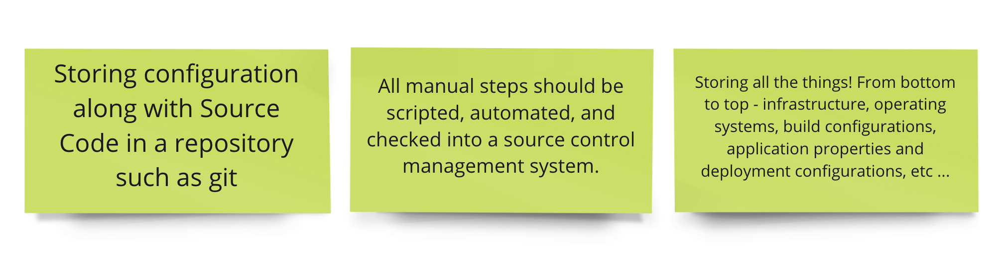

<!-- .slide: data-background-image="images/RH_NewBrand_Background.png" -->
### DevOps Culture and Practice <!-- .element: class="course-title" -->
## Tech Exercise I <!-- .element: class="title-color" -->
TL500 <!-- .element: class="title-color" -->

  <h2>Open Practice Library</h2>
  

  <h2>🔥 Everything as code 🦄</h2>
  

### Tech Exercise I
[The Manual Mennace](https://starwarsintrocreator.kassellabs.io/?ref=redirect#!/DMqYlqu9pjOZKwUq1zvZ)

##### The Big Picture <!-- .element: class="title-bottom-left" -->
<!-- .slide: data-background-size="contain" data-background-image="https://rht-labs.com/tech-exercise/1-the-manual-menace/images/big-picture-tools.jpg", class="white-style" -->

#### 🧑‍🏫 Learning outcomes 🧑‍💻
As a learner, by the end of this exercise I ...
* can deploy helm charts manually
* can do everything as code 
* can articulate the benefits gained from GitOps
* can drive tool installations through GitOps
* can deploy the labs accelerator - 🔥🦄
<!--
--->

#### What is it?
Everything as Code is the practice of treating all parts of the system as code. This means:
 <!-- .element: class="image-no-shadow image-full-width" -->
<!--
* Storing configuration along with Source Code in a repository such as git
* All manual steps should be scripted, automated, and checked into a source control management system.
* Storing all the things! From bottom to top - infrastructure, operating systems, build configurations, application properties and deployment configurations, etc ...
--->

### Why do we do it?
* **Traceability**: Having your environment descriptions and structure stored in a version control system allows us to audit changes made to the system, tracked to the individual who made them
* **Repeatable**: Moving from one cloud provider to another should be a simple task. Picking a deployment target should be like shopping around for the best price that week. By storing all things as code, systems can be re-created in moments in various providers
* **GitOps**: A single source of the truth means no more tribal knowledge or experts needed to set up cables or attach hard drives

### Why do we do it?
* **Phoenix Server**: No more fears of configuration drift. If a server needs to be patched or randomly dies, that's OK. Just create it again from scratch using the stored configuration
* **Cross-functional Teams**: Writing all things as code improves collaboration between silos in an organization. The development team is able to contribute to the environment creation or can recreate their own like-for-like environments in a sandbox
* **De-risking**: Changes can be applied to environments or application deployments and reverted to previous states quickly, thus de-risking big upgrades of any kind.

#### How do we do it?
1. Select automated tools for provisioning and configuration eg Ansible, templating, bash, etc
2. Write installation and configuration sequences as code
3. Design configuration options as templates
4. Check source configuration code into a source control repository
5. Use the automated tools to apply your configs

## Exercise Instructions

_In this exercise, we will use GitOps to set up our working environment._

_We will set up Git projects, create dev, test and stage projects in OpenShift, and deploy tools like **Jenkins** and **Nexus** and ***ArgoCD*** to enable CI/CD in the next exercise. In order to do that, we’ll utilize a very popular approach: GitOps_

### 💥 Mob to Learn 💥
* Begin with the [pairing and mobbing](/slides/content/?name=pairing-and-mobbing) exercise (if not already done)
* In your table teams, form a mob to complete the exercise. Working together as a team to deploy your shared tooling and infrastructure!
* Rotate the `driver` a the end of the section to give everyone a go at getting their hands dirty with code!
* If you finish early, try your hand at the `Here be dragons` section
* Your tutor will share links to the instructions, OpenShift Console, CRW and GitLab server

### 💥 CodeReadyWorkspaces 💥 <!-- .element: class="title-bottom-left" -->
<!-- .slide: data-background-size="contain" data-background-image="images/tech-exercise-i/crw.png", class="white-style" data-background-opacity="1"	 -->

### 💥 Logging in to OpenShift 💥 <!-- .element: class="title-bottom-left" -->
<!-- .slide: data-background-size="contain" data-background-image="images/tech-exercise-i/oc-login.png", class="white-style" data-background-opacity="1"	 -->

### 💥 Setup the instructions site 💥 <!-- .element: class="title-bottom-left" -->
<!-- .slide: data-background-size="contain" data-background-image="images/tech-exercise-i/instructions.png", class="black-style" data-background-opacity="1"	 -->

# Exercise Wrap Up

#### Feedback
* Q&A
* Real World Stories
* Pull Requests Welcome 🦄
