<!-- .slide: data-background-image="images/RH_NewBrand_Background.png" -->
### DevOps Culture and Practice <!-- .element: class="course-title" -->
### Tech Exercise II - Attack of the Pipelines<!-- .element: class="title-color" -->
### CI, CD & CD2<!-- .element: class="title-color" -->

TL500 <!-- .element: class="title-color" -->

  <h2>Open Practice Library</h2>
  

  <h2>🚚 Attack of the Pipelines 📦🔨</h2>
  

### Tech Exercise II
[Attack of the Pipelines](http://rht-labs.com/StarWarsIntroCreator/#!/AN-PlEbtXFRFZTnFznwc)

#### What Is a Pipeline?
<!-- .element: class="image-no-shadow image-full-width" -->

  
  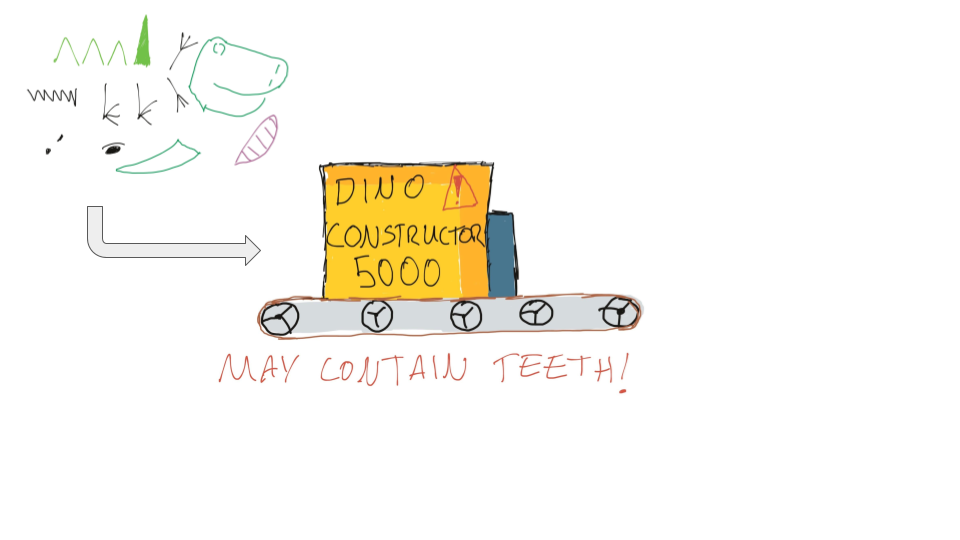
  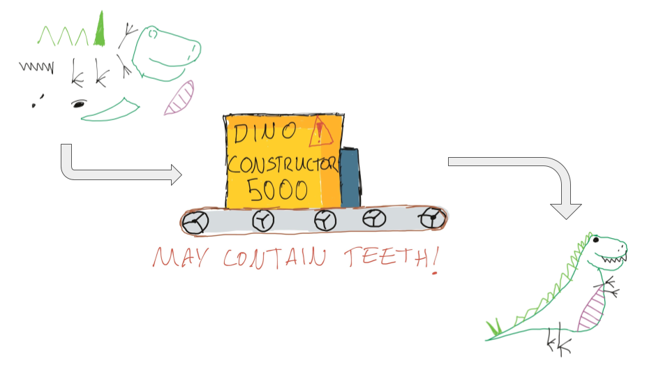

  
  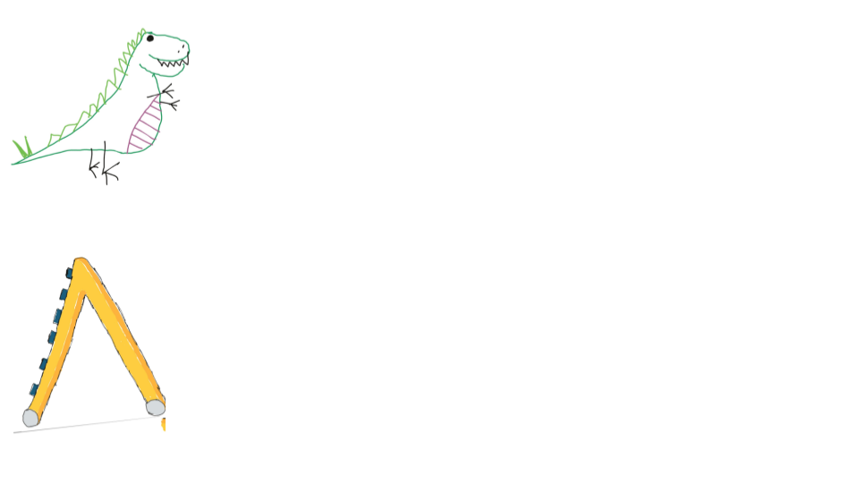
  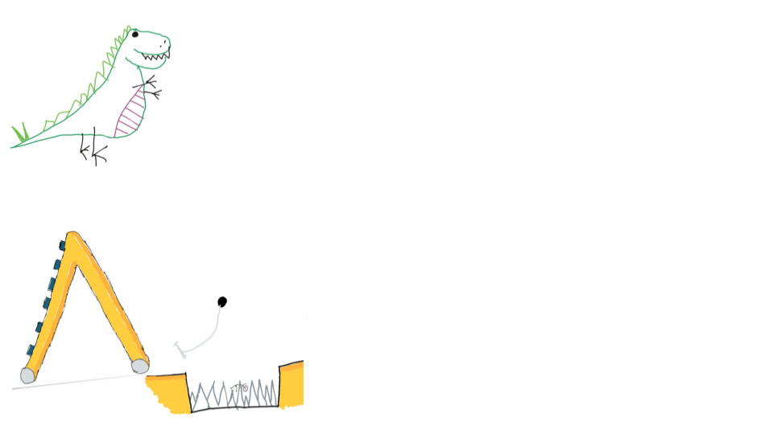
  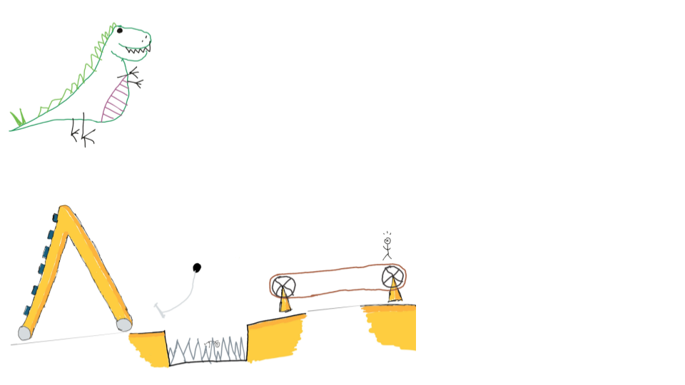
  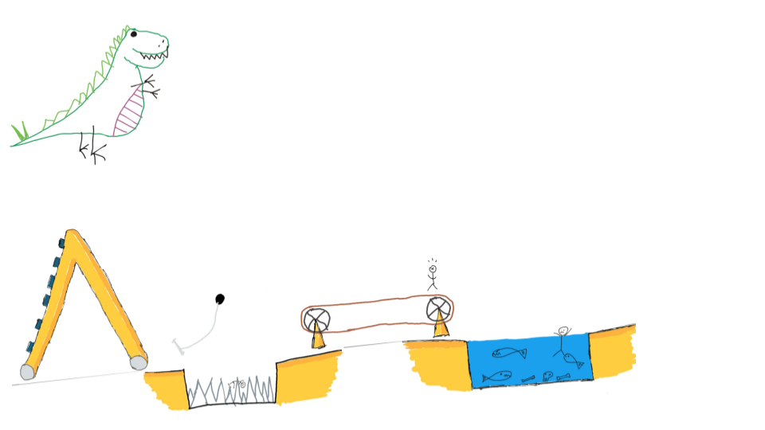
  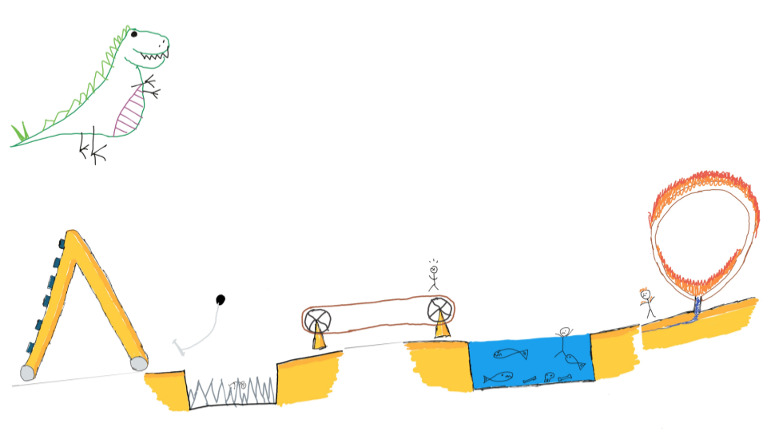
  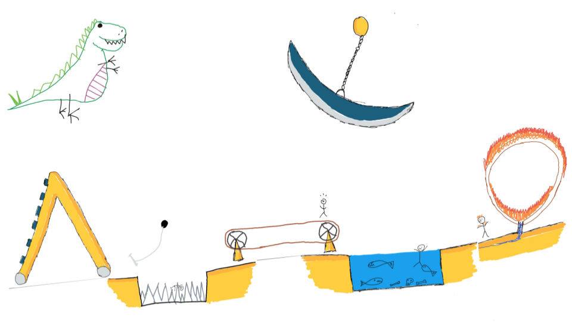

  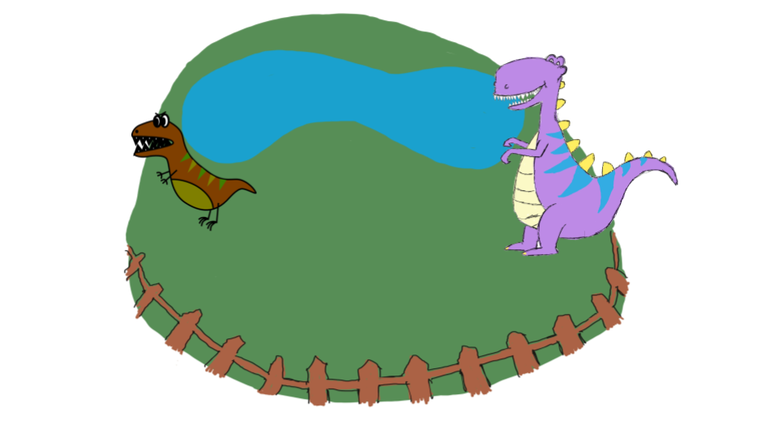
  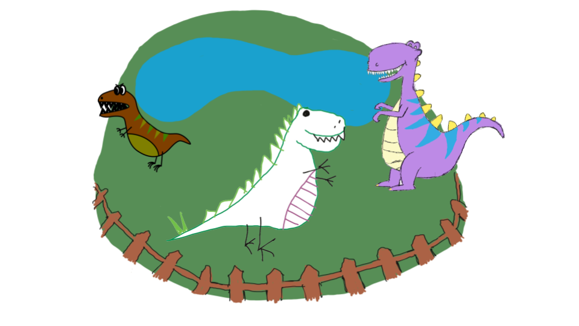
  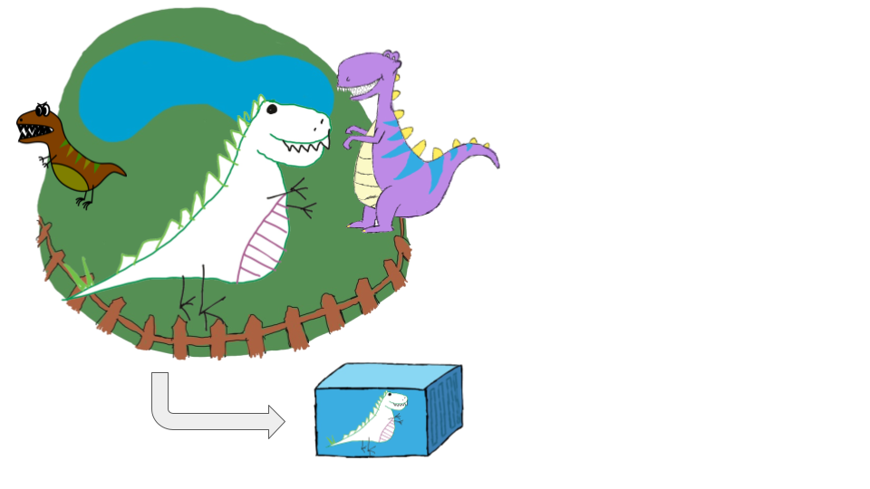
  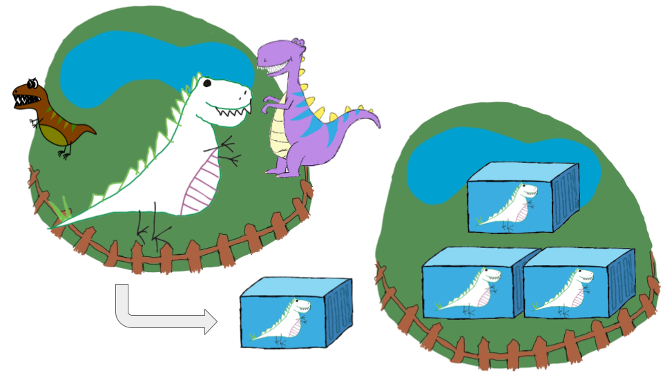

_The purpose of a pipeline is to prove that your code is **not** ready for production._

## Continuous Integration

### Continuous Integration
Continuous Integration (**CI**) is a development practice where developers integrate code into a shared repository frequently, preferably several times a day.

These actions are repeated often to ensure that the code base can **continuously integrate**.

## 
<!-- .slide: data-background-size="contain" data-background-image="images/tech-exercise-ii/ci.jpg", class="white-style" data-background-opacity="1"	 -->

### Continuous Integration
#### _Why do it?_
* Automated testing reduces busy work and improves software quality.
* Small, regular code commits reduce the number of integration problems.
* Rapid feedback loops make it easier for new contributors to get started.
* Shipping of functional software in small increments is more enjoyable than waiting for someone to manually test a giant code change.

### Continuous Integration
#### _How do we do it?_
* Developers submit **small and frequent changes** to the source code.
* **Automated** build and test steps are run to ensure code works as expected.
* Developers are notified if anything fails and can react quickly to fix it.
* The tests and build steps are typically run on an automation server (for example, Tekton, Jenkins, GitLab CI/CD, Apache Airflow).

#### Jenkins Pipeline - Pet Battle
 <!-- .element: class="image-no-shadow image-full-width" -->

#### Tekton Pipeline - Pet Battle API
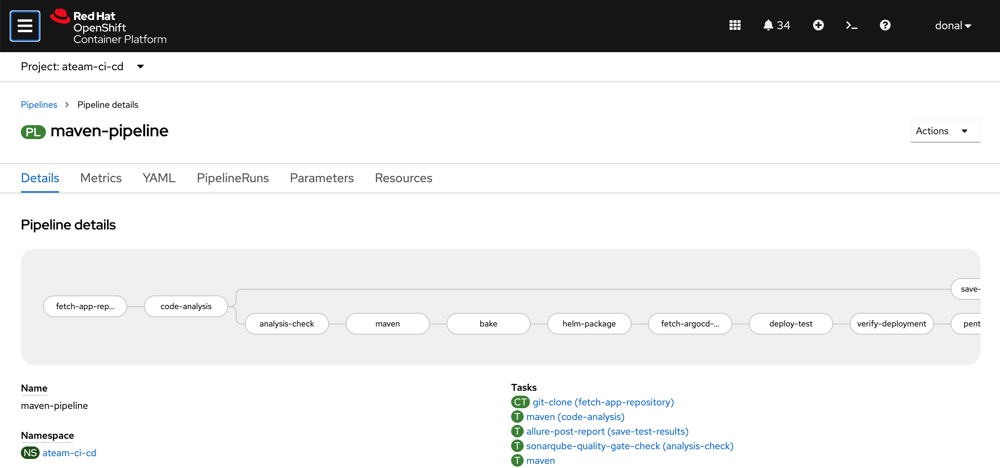 <!-- .element: class="image-no-shadow image-full-width" -->

<!-- .slide: id="continuous-delivery"-->
## Continuous Delivery

### Continuous Delivery
Continuous delivery (**CD**)  is an extension of continuous integration because it automatically deploys all code changes to a testing and/or staging environment after the build stage.

This delivers our software to the doorway of production.

## 
<!-- .slide: data-background-size="contain" data-background-image="images/tech-exercise-ii/cd.jpg", class="white-style" data-background-opacity="1"	 -->

### Continuous Delivery
#### _What is it?_
* A software engineering practice
* Each change can be **potentially** ready for release to production
* Builds upon the **continuous integration** practice
* Consider automating release to a "demo" area
* Typically implemented with an automation server such as Jenkins or Tekton

### Continuous Delivery
#### _Why do it?_
* Automation reduces the manual work required to perform a release.
* Results in faster feedback cycles from quality engineers, product owners, and stakeholders.
* Produces a happier operations team.
* Prepares the way for push button deployments.

<!--.slide: id="continuous-deploymen" -->
## Continuous Deployment

### Continuous Deployment
Continuous deployment (**CD**) is a strategy for software releases whereby any code that has been committed and passes the automated testing phase is automatically released into the production environment making the changes visible to the software's users.

## 
<!-- .slide: data-background-size="contain" data-background-image="images/tech-exercise-ii/cd-squared.jpg", class="white-style" data-background-opacity="1"	 -->

### Continuous Deployment
#### _What is It?_
* A software development practice
* The development team maintains software so that it can be **released to production** at any moment.
* Builds upon the practices of **continuous integration** and **continuous delivery**.
* Software configuration and deployment orchestration becomes a part of the
development team's duty to maintain the software.

### Continuous Deployment
#### _Why do it?_
* Helps the team maintain deployable code and configuration over new features
* Provides fast feedback from end users
* Enables pushing features out after completion
* Enforces a best practice of **eveything as code**
* Includes configuration and deployment orchestration as part of automation
* Enables quick rollbacks and recovery from failures

### Continuous Deployment
#### _How do we do it?_
* Collaborate closely with everyone involved in the deployment and delivery of software to production.
* Automate everything as much as possible.
* Build "feature toggles" or "dark launches" to allow for quick rollback if needed.
* Provide adequate automated monitoring of the application.

#### 🧑‍🏫 Learning Outcomes 🧑‍💻
As a learner, I can perform the following tasks by the end of this exercise:
* Manage Application Configs via git
* Automatically build / bake / deploy software by using Jenkins or Tekton
* Store secrets used by my pipeline securely in git

##### The Big Picture <!-- .element: class="title-bottom-left" -->
<!-- .slide: data-background-size="contain" data-background-image="https://rht-labs.com/tech-exercise/2-attack-of-the-pipelines/images/big-picture-first-pipeline.jpg", class="white-style" -->

## Exercise Instructions

_By separating CI from CD, we will first deploy Pet Battle and its supporting infra (Keycloak) from Git by using ArgoCD's App of Apps pattern._

_With this in place, we will create two pipelines, one for the front end and one for the API._

_The front end (AngularJS) will use Jenkins and the back end (Quarkus with MongoDB) will use Tekton._

### 🐙 App of Apps 🐙 <!-- .element: class="title-bottom-left" -->
<!-- .slide: data-background-size="contain" data-background-image="https://rht-labs.com/tech-exercise/2-attack-of-the-pipelines/images/test-pet-battle-apps.png", class="black-style" data-background-opacity="1"	 -->

### 💥 Mob to Learn 💥
* Ensure that you have completed at least the [Extend the UJ](https://rht-labs.com/tech-exercise/#/1-the-manual-menace/4-extend-uj?id=extend-uj-with-a-another-tool-eg-nexus) exercise from Lab 1.
* Continue to Mob for the first two parts of this exercise.
  * Sealed Secrets - adding secrets that are used by the pipeline with GitOps
  * Application of Applications - setting up the config repo with which the pipeline will integrate.

### 💥 Pair to build 💥
Split into 2 groups within your team for [The Pipelines](https://rht-labs.com/tech-exercise/#/2-attack-of-the-pipelines/3-the-pipelines) section.

* 🐈‍⬛ Jenkins Group 🐈‍⬛	will automate the front end components of Pet Battle.
* 🐅 Tekton Group 🐅 will automate the back end components of the Pet Battle API.

Choose your own adventure, but both groups must be successful to finish the exercise!

# Exercise Wrap Up

#### Feedback
* Q & A
* Real World Stories
* Pull Requests Welcome 🦄

#### WHO - Pipelines <!-- .element: class="title-bottom-left" -->
<!-- .slide: data-background-size="contain" data-background-image="images/tech-exercise-ii/who-pipeline-1.png", class="black-style" data-background-opacity="1"	 -->

#### WHO - App of Apps <!-- .element: class="title-bottom-left" -->
<!-- .slide: data-background-size="contain" data-background-image="images/tech-exercise-ii/example-who.png", class="black-style" data-background-opacity="1"	 -->

#### WHO - App of Apps <!-- .element: class="title-bottom-left" -->
<!-- .slide: data-background-size="contain" data-background-image="images/tech-exercise-ii/example-who-2.png", class="black-style" data-background-opacity="1"	 -->

### Summary
* **Continuous Integration**: Integrate several changes into a shared repository and rely heavily on testing to make sure that the changes and commits work and have passed all tests (unit testing / code quality / code conduct).
* **Continuous Delivery**: The goal is to have a working artifact that's ready to be deployed at any time. It relies on testing and automation to make sure that it has passed all functional tests and can be manually deployed (push button).
* **Continuous Deployment/Release**: A further step, now that we are sure this artifact is ready to deploy to production, is to rely on features toggle, dark launches, or other deployment strategies to promote this artifact to other critical environments. By using these techniques for the new features/fixes, we can release them immediately without risking the operation.

### Summary

<!-- .slide: data-background-image="images/book-background.jpeg", class="black-style"  data-background-opacity="0.3" -->
### Related & Used Practices
- [The Big Picture](https://openpracticelibrary.com/practice/teh-big-picture)
- [Pair Programming](https://openpracticelibrary.com/practice/pair-programming)
- [Mob Programming](https://openpracticelibrary.com/practice/mob-programming)
- [Pipelines As Code](https://openpracticelibrary.com/practice/)
- [Continuous Integration](https://openpracticelibrary.com/practice/continuous-integration/)
- [Continuous Delivery](https://openpracticelibrary.com/practice/continuous-delivery)
- [Everything as Code](https://openpracticelibrary.com/practice/everything-as-code/)
- [Information Radiators](https://openpracticelibrary.com/practice/visualisation-of-work/)
