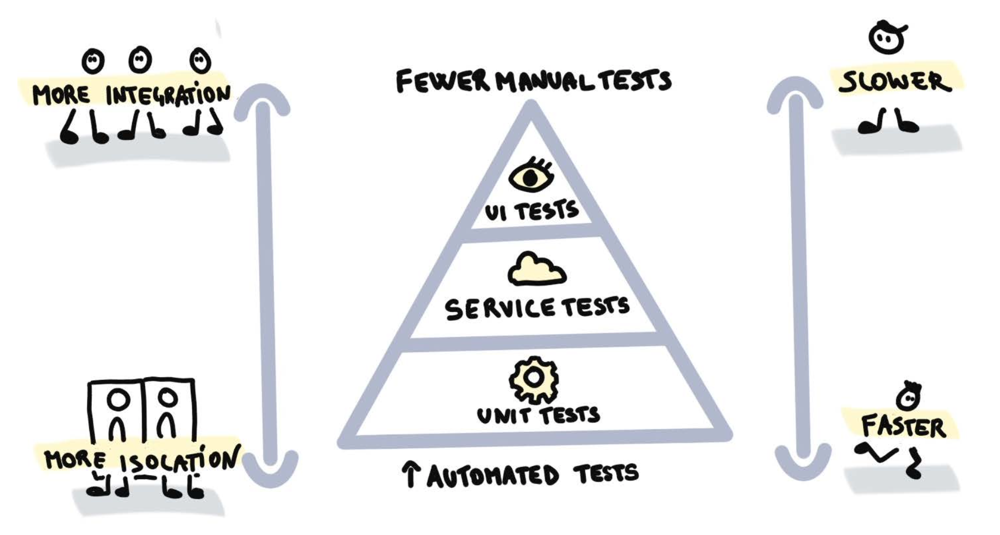
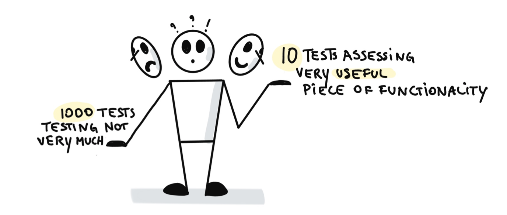

<!-- .slide: data-background-image="images/RH_NewBrand_Background.png" -->
### DevOps Culture and Practice <!-- .element: class="course-title" -->
## Tech Exercise III <!-- .element: class="title-color" -->
### Automate All the Testing <!-- .element: class="title-color" -->
TL500 <!-- .element: class="title-color" -->

  <h2>Open Practice Library</h2>
  

  <h2>Testing Testing Testing 🔨🔨</h2>
  

### Tech Exercise III
[Revenge of the Automated Testing](http://rht-labs.com/StarWarsIntroCreator/#!/AN-Pm81Gmfs0g0ioQHfw)

### Tech Exercise III - Extended Edition 
[A Secure Hope](http://rht-labs.com/StarWarsIntroCreator/#!/AN-Pmtuc82D6y3UWPCWq)

#### What is it?
AUTOMATE ALL THE THINGS 💥🔨
* Unit Tests & Integration tests
* Static Code Analysis
* Configurations and policy checks
* Security (dependencies, vulnerabilities. and pen tests)

#### Testing Pyramid

#### Measuring Test

Answering the age old question, "How do I know if my tests are any good?"
* Code Coverage
* Static Code Analysis

#### Why do it?
* Improved quality: Applying patterns like TDD or BDD drives up shared understanding
* Deliver reliably at speed: As features are produced, you can confidently release without a large manual regression each time
* Fewer bottlenecks: Without automated tests, queues form in front of testers

#### 🧑‍🏫 Learning Outcomes 🧑‍💻
As a learner, I can perform the following tasks by the end of this exercise:
* Add security gates to the pipeline
* Add testing gates to the pipeline
* Add static code analysis gates to the pipeline
* Add image signing to the pipeline
* Add load testing to the pipeline
<!--
--->

##### The Big Picture <!-- .element: class="title-bottom-left" -->
<!-- .slide: data-background-size="contain" data-background-image="https://rht-labs.com/tech-exercise/3-revenge-of-the-automated-testing/images/big-picture-pipeline-complete.jpg", class="white-style" -->

## Exercise Instructions

### 💥 Choose your own adventure 💥 <!-- .element: class="title-bottom-left" -->
<!-- .slide: data-background-size="contain" data-background-image="images/tech-exercise-iii/team-backlog.png", class="black-style" data-background-opacity="1"	 -->

### 💥 Prioritize your work 💥 <!-- .element: class="title-bottom-left" -->
<!-- .slide: data-background-size="contain" data-background-image="images/tech-exercise-iii/priority-matrix.png", class="black-style" data-background-opacity="1"	 -->

### 💥 Prioritize your work 💥 <!-- .element: class="title-bottom-left" -->
<!-- .slide: data-background-size="contain" data-background-image="images/tech-exercise-iii/impact-effort.png", class="black-style" data-background-opacity="1"	 -->

### 💥 Prioritize your work 💥 <!-- .element: class="title-bottom-left" -->
<!-- .slide: data-background-size="contain" data-background-image="images/tech-exercise-iii/how-now-wow.png", class="black-style" data-background-opacity="1"	 -->

### 💥 Build your Kanban 💥 <!-- .element: class="title-bottom-left" -->
<!-- .slide: data-background-size="contain" data-background-image="images/tech-exercise-iii/team-kanban.png", class="black-style" data-background-opacity="1"	 -->

#### 💥 Tech Exercise 💥
* In mobs / pairs work through your tasks
* If in pairs, continuously playback what you accomplish to the others
<!--TechEdit: I commented on this "playback" verbiage in another section. It's an odd term without a clear meaning to me. In the previous instance it seemed to mean "read aloud", but not sure if that makes sense in this context because I'm not sure what the instruction means. 
I assume the tasks will be obvious or assigned (although this is vague), but the second bullet - "in pairs, continuously playback (review? read out?) to what others? If I'm in a pair, then there ar only two of us, right? Please clarify-->

# Exercise Wrap Up

#### Feedback
* Q & A
* Real World Stories
* Pull Requests Welcome 🦄

#### Sam's Code <!-- .element: class="title-bottom-left" -->
<!-- .slide: data-background-size="contain" data-background-image="images/tech-exercise-iii/sams-code1.jpg", class="black-style" data-background-opacity="1"	 -->

#### Sam's Code - Strikes Back 🕺 <!-- .element: class="title-bottom-left" -->
<!-- .slide: data-background-size="contain" data-background-image="images/tech-exercise-iii/sams-code2.jpg", class="black-style" data-background-opacity="1"	 -->

#### BDD Syntax - Gov Customer <!-- .element: class="title-bottom-left" -->
<!-- .slide: data-background-size="contain" data-background-image="images/tech-exercise-iii/bdd-example.png", class="black-style" data-background-opacity="1"	 -->

<!-- .slide: data-background-image="images/book-background.jpeg", class="black-style"  data-background-opacity="0.3" -->
### Related & Used Practices
- [Test automation](https://openpracticelibrary.com/practice/test-automation/)
- [Impact & Effort Prioritization (Matrix)](https://openpracticelibrary.com/practice/impact-effort-prioritization-matrix/)
- [How-Now-Wow Prioritization (Matrix)](https://openpracticelibrary.com/practice/how-now-wow-prioritization-matrix/)
- [Kanban](https://openpracticelibrary.com/practice/kanban/)
