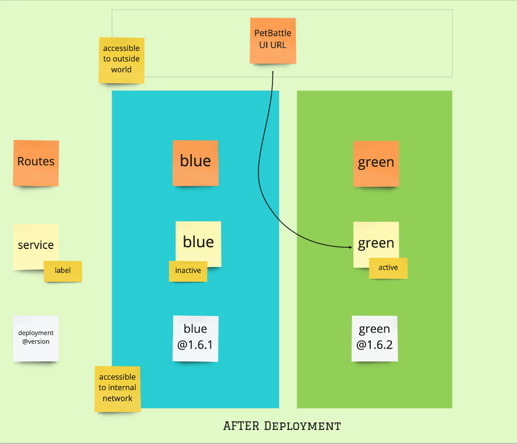
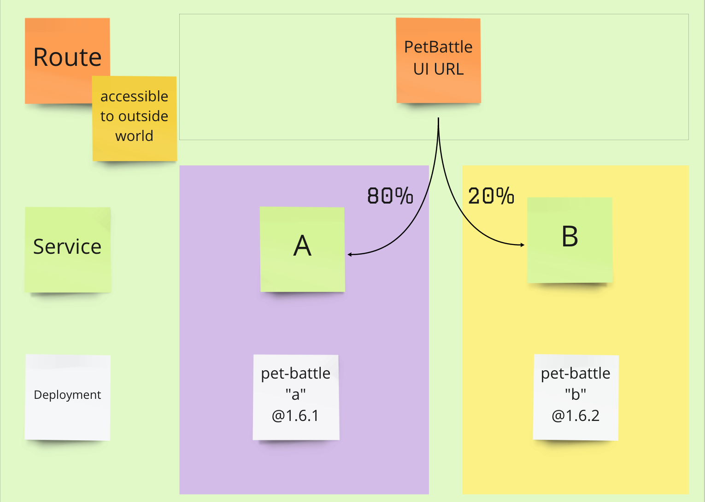

<!-- .slide: data-background-image="images/RH_NewBrand_Background.png" -->
### DevOps Culture and Practice <!-- .element: class="course-title" -->
### Tech Exercise V - The Deployments Strike Back  <!-- .element: class="title-color" -->
### Advanced Deployments & Scalability <!-- .element: class="title-color" -->
TL500 <!-- .element: class="title-color" -->

  <h2>Open Practice Library</h2>
  

  <h2>🚚 Advanced Deployments 📦</h2>
  

### Tech Exercise V
[The Deployments Strike Back](http://rht-labs.com/StarWarsIntroCreator/#!/AN-PogOik9g8YPNIt5-l)

#### What is it?
Advanced Deployments 🚚📦📦📦👷
* Autoscaling - horizontally scale applications based on observed metrics.
* Blue / Green Deployments - release, validate and switch.
* A/B Deployments - great for testing new features in small groups. One release with traffic routing between each.
  * Don't forget to take measures!!
* Canary Release - Like a canary in the mines ... Exposing a small number of real users to a new version.
* Feature Toggling (Flags) - modifying system behaviors without changing the code.

#### Blue/Green Deployments

  
  

#### Design of Experiments
All our ideas about new products, new services, new features, and changes that we can introduce to make things better (growth, revenue, experience, etc.) start as an idea, a hypothesis, or an assumption.

The Design of Experiments is the practice we use to turn ideas, hypotheses, and assumptions into a concrete, well-defined set of experiments that can validate those ideas, hypotheses, and assumptions, providing valuable learning.

#### Why do it?
Design of Experiments
* Is a fail safe way to advance a solution and learn fast
* Can provide a quick way to evolve a product
* Helps drive innovation in new and existing products
* Enables an autonomous team to deliver on leadership intent by placing small bets
* Is essential to realizing the Build-Measure-Learn loop

#### Split Testing
Using the platform to support running an experiment.

## Exercise Instructions

### 💥 Choose your own adventure 💥 <!-- .element: class="title-bottom-left" -->
<!-- .slide: data-background-size="contain" data-background-image="images/tech-exercise-v/tasks.png", class="black-style" data-background-opacity="1"	 -->

### 💥 Prioritize and extend your Kanban 💥 <!-- .element: class="title-bottom-left" -->
<!-- .slide: data-background-size="contain" data-background-image="images/tech-exercise-iii/team-kanban.png", class="black-style" data-background-opacity="1"	 -->

#### 🧑‍🏫 Learning Outcomes 🧑‍💻
As a learner, I can perform the following tasks by the end of this exercise:
* Enable the Horizontal Pod Autoscaler for my applications
* Add a Blue/Green deployment method to the pipeline
* Run a split test on OpenShift with GitOps - splitting traffic between two tests 
<!--
--->

##### The Big Picture <!-- .element: class="title-bottom-left" -->
<!-- .slide: data-background-size="contain" data-background-image="https://rht-labs.com/tech-exercise/5-the-deployments-strike-back/images/big-picture-matomo.jpg", class="white-style" -->

#### 💥 Tech Exercise 💥
* In mobs / pairs, work through your tasks.
* If in pairs, continuously playback what you accomplish to the others.
<!--I've commented on the verbiage playback before, it's odd. Which others? If I am in a pair, do you mean my partner?-->

# Exercise Wrap-up

#### Design of Experiments - From Value Slice <!-- .element: class="title-bottom-left" -->
<!-- .slide: data-background-size="contain" data-background-image="images/tech-exercise-v/pet-battle-experiment.png", class="black-style" data-background-opacity="1"	 -->

#### Design of Experiments - Implementation <!-- .element: class="title-bottom-left" -->
<!-- .slide: data-background-size="contain" data-background-image="images/tech-exercise-v/pet-battle-example.png", class="black-style" data-background-opacity="1"	 -->

#### Design of Experiments - Measure <!-- .element: class="title-bottom-left" -->
<!-- .slide: data-background-size="contain" data-background-image="images/tech-exercise-v/pet-battle-matomo.png", class="black-style" data-background-opacity="1"	 -->

<!-- .slide: data-background-image="images/book-background.jpeg", class="black-style"  data-background-opacity="0.3" -->
### Related & Used Practices
- [Lean UX](https://openpracticelibrary.com/)
- [Split Testing](https://openpracticelibrary.com/)
- [Dark Launches](https://openpracticelibrary.com/)
- [Feature Toggling](https://openpracticelibrary.com/)
- [Canary Release](https://openpracticelibrary.com/)
