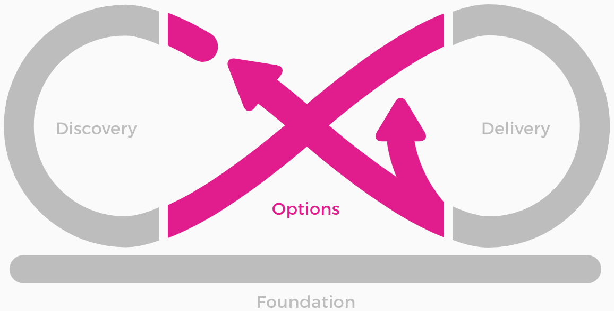
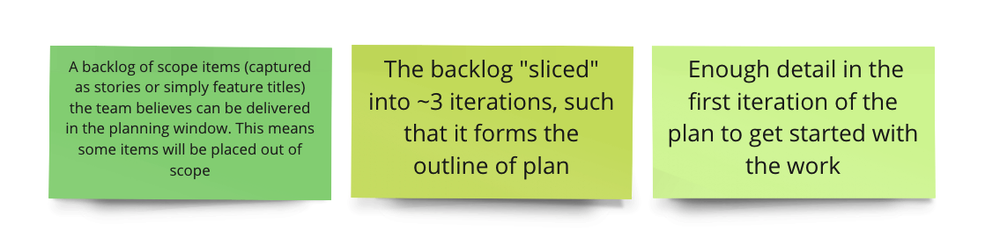

<!-- .slide: data-background-image="images/RH_NewBrand_Background.png" -->
## DevOps Culture and Practice <!-- {.element: class="course-title"} -->
### User Story Mapping and Value Slicing <!-- {.element: class="title-color"} -->
TL500 <!-- {.element: class="title-color"} -->

<!-- .slide: data-background-size="stretch" data-background-image="images/opl-logo.png", class="white-style" -->

  <h2>Open Practice Library</h2>
  

  <h2>User Story Mapping & Value Slicing</h2>
  

##### Example - WHO<!-- .element: class="title-bottom-left" -->
<!-- .slide: data-background-size="contain" data-background-image="images/user-story-mapping-and-value-slicing/example-who.png", class="white-style" -->

### User Stories	&#8800;
As a < type of user >, I want < some goal > so that < some reason >
#### As a learner, I want to stay awake so that I can be attentive and listen to teacher

User Story Mapping is an effective practice for creating lightweight release plans that can drive standard Agile delivery practices. At the end of user story mapping, you should have:
<!-- .element: class="image-no-shadow image-full-width" -->

#### Shared Documentation &#8800; Shared Understanding

<!-- {.element: class="" style="border:none; box-shadow:none; max-width:100%; float:left;" } -->

User Story Mapping

* Frame the opportunity, goal, outcome, and value
* Tell the story of the product from left to right (user steps)
* Go back and talk about and capture the details of each step
* Use value driven outcomes to slice out valuable release plans

### User Story Mapping
> **User Story Mapping is about having a good old-fashioned conversation and then organizing it in the form of a map.**
> > -Jeff Patton

> **User Story Mapping is a visualisation tool that drives groups towards a shared understanding.**
> > -Me

### User Story Mapping
#### _What is It?_
* Frame the opportunity, goal, outcome, and value
* Tell the story of the product from left to right (user steps)
* Go back and talk about and capture the details of each step

### Exercise -  Mapping Stories for "getting to work"
*Scenario* -> You woke up late and you must get to an early morning meeting at work
and cannot miss it. What **must** you do to prepare for work and get there on time?
1. As an individual, capture on stickies things you do from the moment you wake up until you arrive at work<!-- {.element: class="fragment"  data-fragment-index="1"} -->
2. As a team, add all activities to the story map and remove duplicates. If some are similar but slightly different, do not remove as duplicates<!-- {.element: class="fragment"  data-fragment-index="2"} -->
3. Cluster similar activities and capture themes above them<!-- {.element: class="fragment"  data-fragment-index="3"} -->

<!-- .slide: id="value-slicing" -->
## Value Slicing

#### PRODUCT SLICING GONE BAD!

### Value Slicing
#### _What Is It?_
The goal of **value slicing** is to divide user stories into iterations such
that it forms the outline of a plan. Usually the first iteration builds a
minimally viable product.

<video width="320" height="240" controls>
  <source src="images/user-story-mapping-and-value-slicing/value_slicing.mp4" type="video/mp4">
</video>

### Exercise - Value Slicing for "getting to work"
*Scenario* -> You woke up late and you must get to an early morning meeting at work
and cannot miss it. What **must** you do to prepare for work and get there on time?

1. As a team, draw a line on the user story mapping board representing what
must be done<!-- {.element: class="fragment"  data-fragment-index="1"} -->
2. Discuss which stories are absolutely necessary given the scenario<!-- {.element: class="fragment"  data-fragment-index="2"} -->
3. Move stories below the line that are not absolutely necessary based on
consensus of the team<!-- {.element: class="fragment"  data-fragment-index="3"} -->

<!-- .slide: data-background-image="images/chef-background.png", class="white-style" -->
### Related & Used Practices
- [Start At the End](https://openpracticelibrary.com/practice/start-at-the-end/)
- [User Story Mapping & Value Slicing](https://openpracticelibrary.com/practice/user-story-mapping/)
- [Backlog Refinement](https://openpracticelibrary.com/practice/backlog-refinement/)
