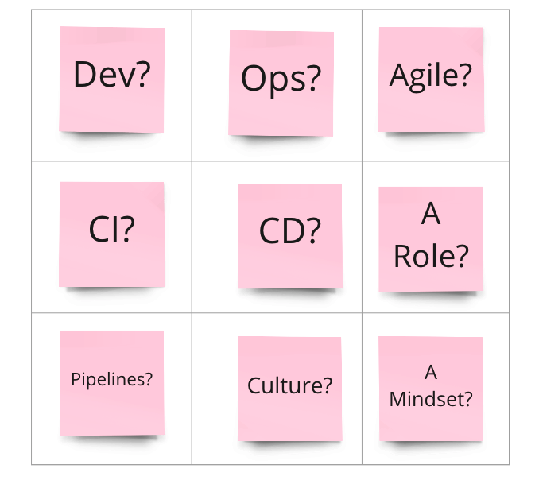
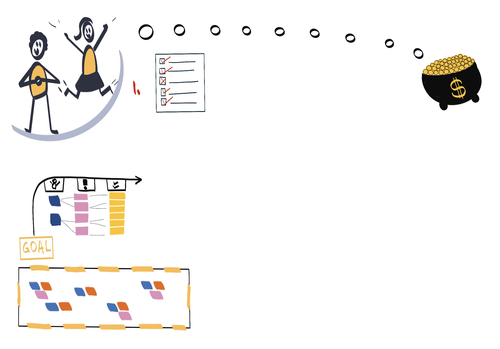
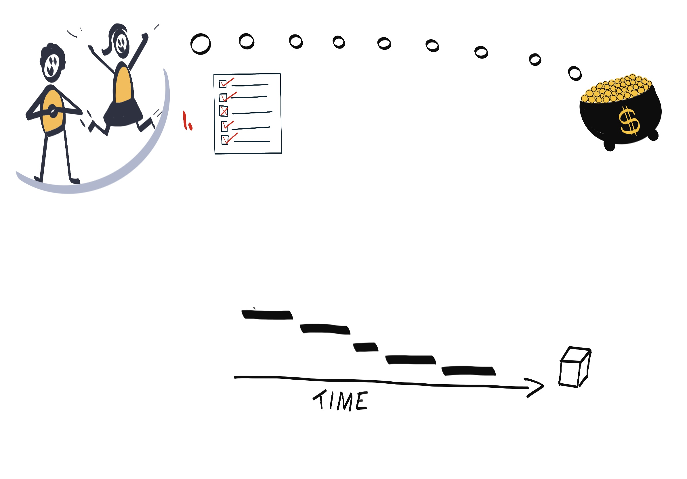
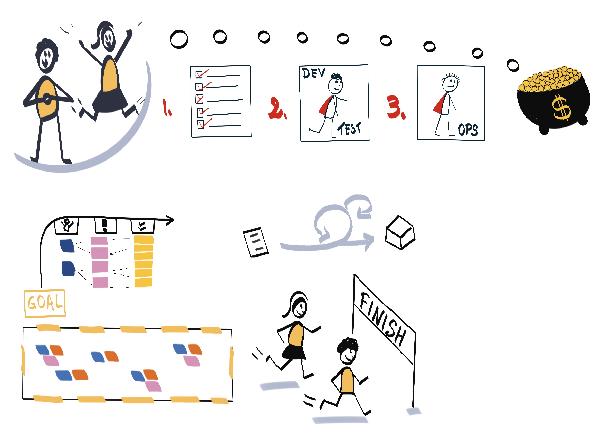
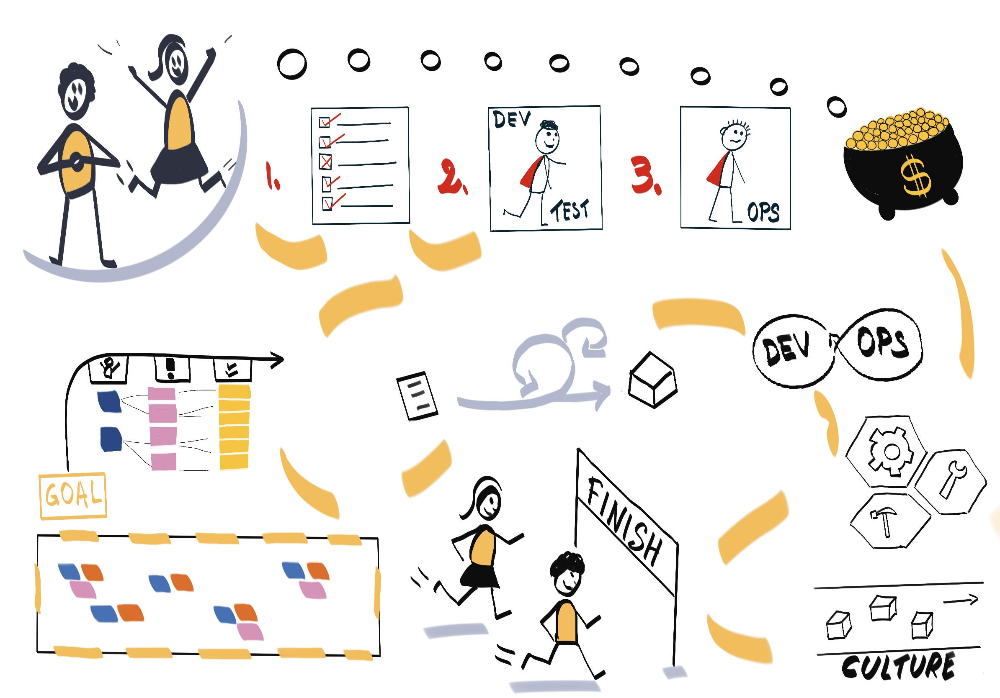
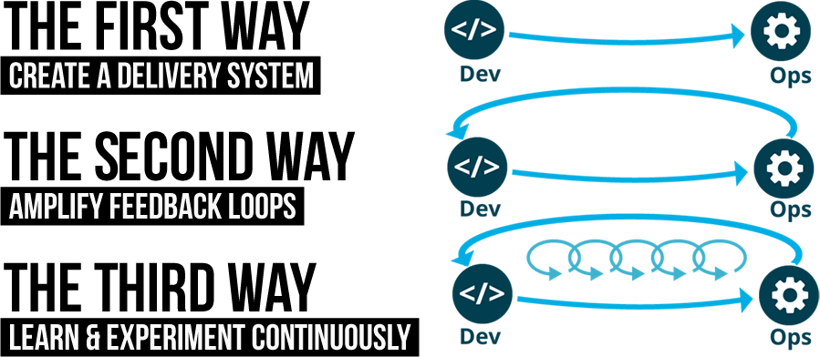
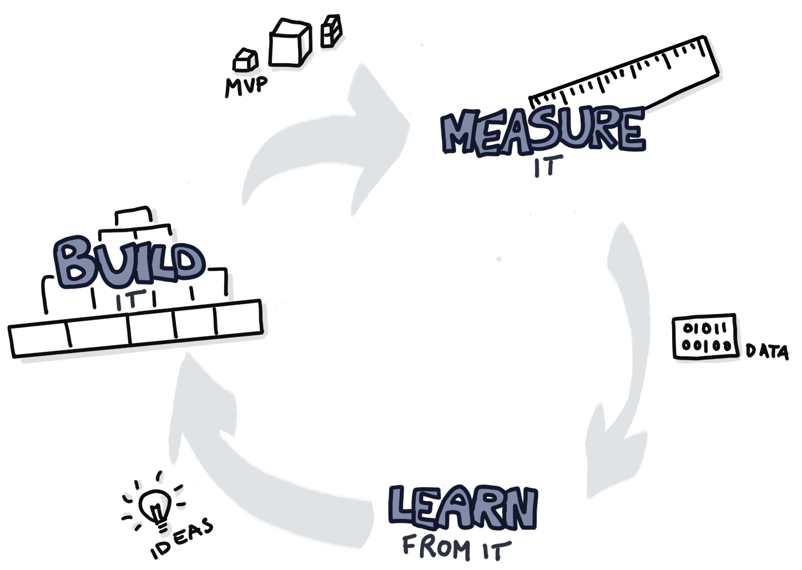

<!-- .slide: data-background-image="images/RH_NewBrand_Background.png" -->
## DevOps Culture and Practice <!-- {.element: class="course-title"} -->
### What is DevOps? <!-- {.element: class="title-color"} -->
TL500 <!-- {.element: class="title-color"} -->

#### _Choose one of the two exercises that you like most :)_
## Exercise - DevOps is...
_Complete the sentence "DevOps is..."_
1. Everyone grab one sticky note.
2. Complete the sentence "DevOps is ..." with one or two words that first
come to mind.
3. Add your sticky to the wall.

## Exercise - What is DevOps?
* Create a 3 x 3 table on a paper sheet.
* Fill each of your nine squares with a term, phrase, or idea related to DevOps.
* Yell out "Bingo!!!" when you match a row up, down, or diagonal during this presentation.

<!-- {.element: class="" style="height:450px"} -->

<!--.slide: id="dev-ops" -->
## DevOps Culture and Practice

  

    
 Happy customers - The ultimate goal of organizations

    
  

  

    
 Profit - A common goal of every commercial organization

    
  

  

    
Customers dreaming of the pot of gold

    
  

  

    
 First Gap - Understanding and collecting customer requirements

    
  

  

    
Using human-centered practices to understand customer needs

    
  

  

    
Second Gap - Traditional deliverables with its drawbacks failed to achieve customer satisfaction

    
  

  

    
 Implementation of DevOps practices leading to faster and better products

    
  

  

    
Plugging the gaps in the software delivery process

    
  

### The Three Ways of DevOps
#### _The DevOps Handbook_
#### by Gene Kim, et. al.

### The Three Ways of DevOps
<!-- .element: class="image-no-shadow image-full-width " -->

The First Way emphasizes the performance of the entire system, as opposed to the performance of a specific silo of work or department. This can be as large as a division or as small as an individual contributor. <!-- {.element: class="medium para"} -->

_The DevOps Handbook_ <!-- {.element: class="small" style="text-align: right;"} -->

### The Three Ways of DevOps
<!-- .element: class="image-no-shadow image-full-width " -->
* The Second Way is about creating more frequent feedback loops.

* The goal of almost any process improvement initiative is to shorten and amplify feedback loops so necessary corrections can be continually made.

* The outcomes of the Second Way include:
  * Understanding and responding to all customers, internal and external.
  * Shortening and amplifying all feedback loops
  * Embedding knowledge where we need it

_The DevOps Handbook_ <!-- {.element: class="small" style="text-align: right;"} -->

### The Three Ways of DevOps
<!-- .element: class="image-no-shadow image-full-width " -->
* The Third Way is about creating a culture that fosters two things:
  * Continual experimentation, taking risks and learning from failure
  * Understanding that repetition and practice is the prerequisite to mastery

* Experimentation and taking risks are what ensures that we keep pushing to improve.

* The outcomes of the Third Way include:
  * Allocating time for the improvement of daily work
  * Creating rituals that reward the team for taking risks
  * Introducing faults into the system to increase resilience

_The DevOps Handbook_ <!-- {.element: class="small" style="text-align: right;"} -->

<!-- .element: class="image-no-shadow image-full-width " -->

### DevOps as It Relates to Agile

### Core Competencies of DevOps
* Test Driven Development and Automated Tests
* Configuration as Code
* Continuous Integration
* Continuous Delivery
* Continuous Deployment
* Continuous Improvement

### Summary
#### _Defining DevOps_
"I know it when I see it."

<!-- .slide: data-background-image="images/book-background.jpeg", class="black-style"  data-background-opacity="0.3" -->
### Related & Used Practices
- [Continuous Integration](https://openpracticelibrary.com/practice/continuous-integration/)
- [Continuous Delivery](https://openpracticelibrary.com/practice/continuous-delivery/)
- [Continuous Deployment](https://openpracticelibrary.com/practice/continuous-deployment/)
