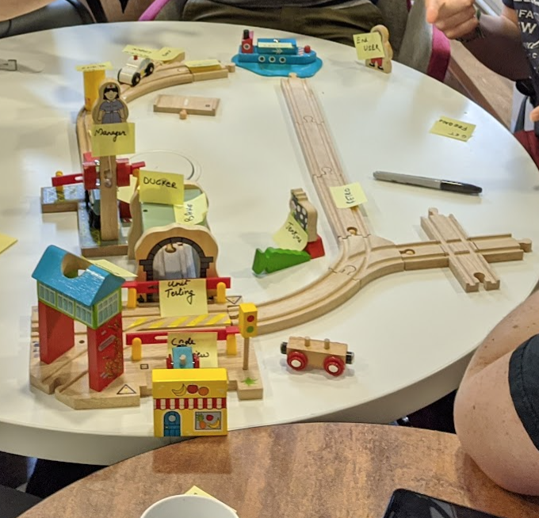
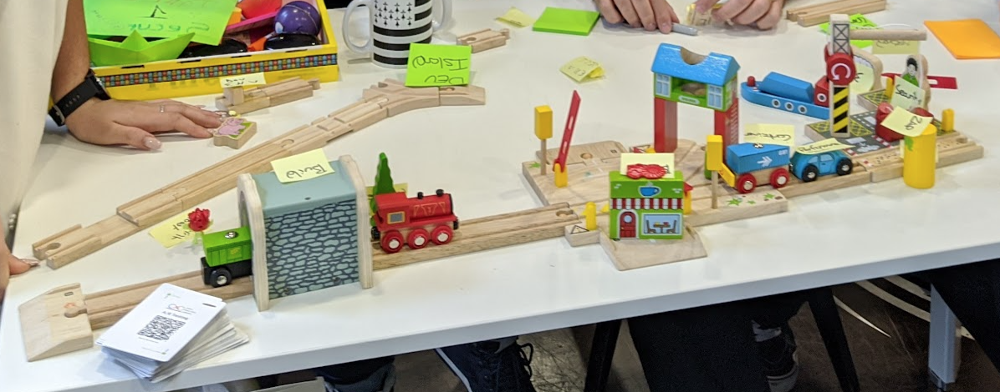
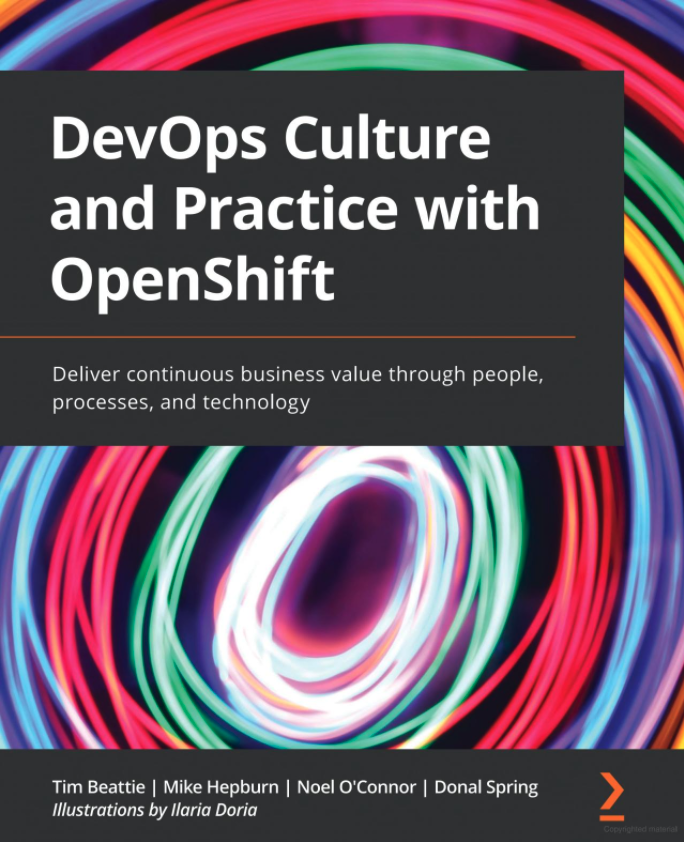

<!-- .slide: data-background-image="images/RH_NewBrand_Background.png"  -->
## DevOps Culture and Practice <!-- {.element: class="course-title"} -->
### Wrap-Up <!-- {.element: class="title-color"} -->
TL500 <!-- {.element: class="title-color"} -->

### Unlearn
<iframe width="560" height="315" src="https://www.youtube.com/embed/MFzDaBzBlL0" title="YouTube video player" frameborder="0" allow="accelerometer; autoplay; clipboard-write; encrypted-media; gyroscope; picture-in-picture" allowfullscreen></iframe>

### Team Walk the Walls 
#### Pet Battle Industries
In your table groups, run a mini Walk the Walls session, just like we did each morning. 

Pick the practices that you have created throughout the week and discuss them in your teams.

### Mini Big Picture 🚂🚂
With only the items in the bags given to you by your instructor, recreate as many elements on the Big Picture as you can. You get one point for every item on the Big Picture. <!--{.element: style="font-size: smaller; font-weight: 400;"} -->

 <!-- {.element: class="" style="border:none; box-shadow:none; width:300px; float:left;"} -->
<!-- {.element: class="" style="border:none; box-shadow:none; height:200px; float:right;"} -->

## The Open Practice Library 🌀
[> Slide Deck](https://rht-labs.com/tech-exercise/slides/content/?name=open-practice-library)

#### The Last Unicorn Developer
[The Last Unicorn Developer](http://rht-labs.com/StarWarsIntroCreator/#!/AN-PpWgIVFQMee1wAWI_)

### _Lean Coffee_ or _Tech Mobbing_
#### Choose your fighter for the next hour

* Lean Coffee ☕☕ - Take the Car Park, your coffee, and any other burning questions to the lean coffee event. Topics will be voted and discussed within a time box.
* Tech Mobbing 👩‍💻👨‍💻 - Continue working through the tech exercise as a group and have an open chat about all things techie.

# Let's Recap

### What did we do?
* Team Forming
* Discovery, Delivery, and Foundational practices
* Hands-on technical exercises
* Built two visualizations useful for any project
  * Practice Corner
  * The Big Picture

### Delivery Showcase & Demo Day

### The Showcase
#### _What is it?_
* An event where stakeholders and interested parties are given a demonstration of
recent work performed by a team
* The latest increment of the product is showcased with new features built by the team
* Provides an opportunity to review culture and practices used by the team
* It is often performed at the end of an iteration, but can be performed at key
milestones in the life of the product

### The Showcase
#### _Why use it?_
The showcase provides a critical feedback loop for products being incrementally
and iteratively built. Stakeholders can give feedback on the features as they
are developed, suggest improvements, give ideas for new features, and catch
problems early. <!--{.element: style="font-size: smaller; font-weight: 400;"} -->

#### _Other benefits_
* Provides an open forum for channeling feedback from stakeholders to product
leadership so that priorities and future work can be adapted accordingly
* Enables collaboration across all interested parties on a regular basis

### Demo Day
#### _What is Demo Day about?_
* Demo Day is the culmination of a trip around the Practice Loop.
* There will be several showcases or product increments that feed into the demo day.
* The team can showcase their work from a particular time period.
* Key stakeholders get to see the results.
* Provides an opportunity to discuss "what's next" and how do to adapt the team culture for the next round.
* A celebration !

### Demo Day
#### _Tips_
* "Show" NOT "Tell"
* Take this opportunity to drive excitement around the product **and** culture.
* The demo should include not only the product of a sprint or release, but also the **culture** and **philosophy** used to produce it.

### Choose your own adventure - Exercise A or B

### Exercise A: The Successful Demo Day 
#### In teams, take some time to brainstorm
* What have you taken away from this week's set of sessions and activities?
  * People, processes, **and** technology
* What did you learn about your team, class, or instructors?
* What did you enjoy?

### Exercise B: The Success Factors and the Anti-Patterns
#### In teams, take some time to brainstorm
* Demo Day - What are the things you would bring and show during a Demo Day?
* Success Factors - What are things or people who could help drive this new way of working and help with adoption?
* Anti-Patterns - What are the things that would hinder you or prevent you from succeeding? 

### Closing
* Closing comments round
* High Five
* CSAT
* SWAG
* Sharing social contacts

### Call to Action
* Use what you have learned.
* Reach out to your classmates and instructors.
* Use the resources shared during the class.
* Download a copy of `DevOps Culture and Practice with OpenShift` ebook.💰💰

#### 📗🐛 Get a copy of our Bookie Wookie 🍪🍪

<!-- {.element: class="" style="max-height: 600px!important;" } -->

### Related & Used Practices
* Tech exercises: https://rht-labs.com/tech-exercise
* Slides: https://rht-labs.com/tech-exercise/slides
* GitHub repository: https://github.com/rht-labs/tech-exercise
* Open Practice Library: https://openpracticelibrary.com/
* Ubiquitous Journey🔥🦄: https://github.com/rht-labs/ubiquitous-journey
* DevOps Culture and Practice with OpenShift book
  * Download the [ebook chapters](https://www.redhat.com/en/engage/devops-culture-practice-openshift-ebooks)
  * You can obtain the [physical book](https://www.packtpub.com/product/devops-culture-and-practice-with-openshift/9781800202368) on Pack editor or Amazon

<!-- .slide: data-background-size="" data-background-image="images/wrap-up/may-the-force-be-with-you.jpeg", class="black-style" data-background-opacity="1"	 -->
